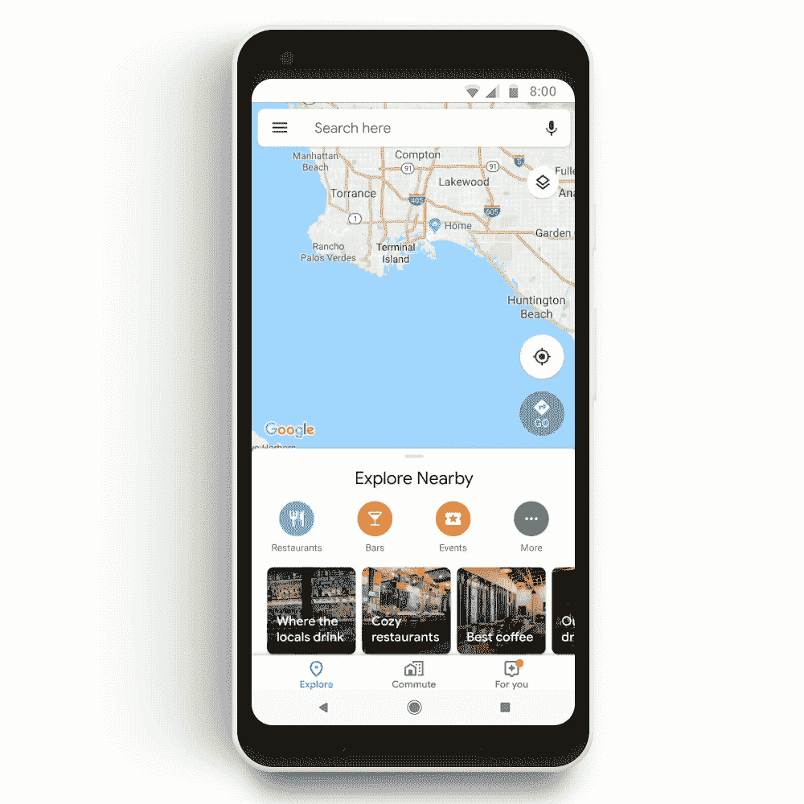
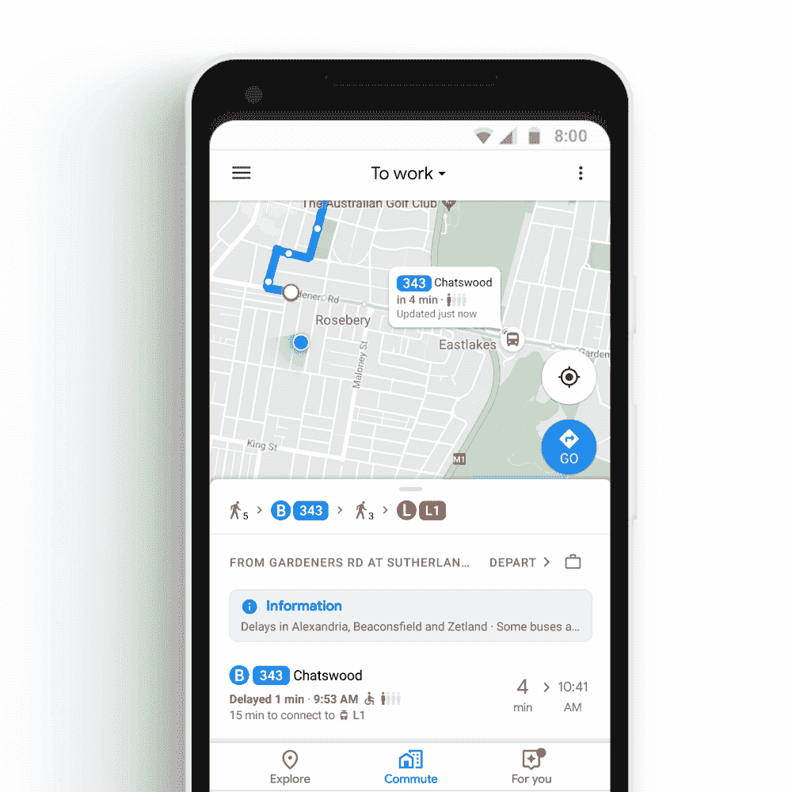
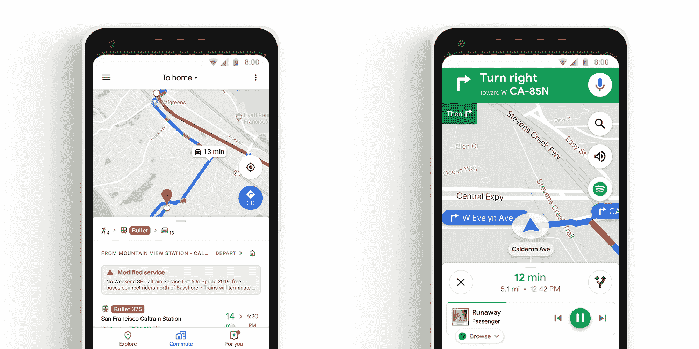

# 谷歌地图增加了“通勤”标签和音乐控制 

> 原文：<https://web.archive.org/web/https://techcrunch.com/2018/10/01/google-maps-adds-commute-tab-and-music-controls/>

谷歌[刚刚宣布了安卓和 iOS 版谷歌地图的](https://web.archive.org/web/20221025221959/https://www.blog.google/products/maps/take-control-your-commute-google-maps/)新功能。更新将于本周推出，并增加了一系列新功能，重点是通勤、音乐和从你那里获取更多个人数据。

虽然谷歌地图对公路旅行和度假特别有用，但该应用对压力大的通勤也很有用。谷歌正在用一个新的“通勤”标签重新展示其中的一些功能。

在设置好你的家庭和工作地址后，该应用程序将帮助你知道早晚要发生什么。如果你开车去上班，谷歌地图现在会告诉你需要多长时间，以及是否有任何替代路线。它的工作原理很像 Waze 的 ETA 屏幕，告诉你它在 30 分钟或一个小时内是快还是慢。

如果你乘公共汽车或火车去上班，谷歌地图可以帮助你找到你应该什么时候离开。该应用程序考虑到步行或开车到车站。这些公共交通功能与城市地图软件 T4 直接竞争，并且很可能依赖于大量的公开数据。

谈到公共交通，你可以在地图上看到你的公共汽车或火车，慢慢地向你靠近。这款应用还会告诉你要等多久。该功能将在全球 80 个地区提供。在悉尼，这款应用会告诉你下一班公交车会有多满。

不幸的是，这个更新带有隐私缺陷。直到最近，你还可以在谷歌地图中将你的家庭和工作地址与你的谷歌账户联系起来。

现在，你需要激活“web & app activity”，这是臭名昭著的无所不包的隐私破坏者——我过去常常存储我的家庭和工作地址，如果不启用它，我再也不能更改这些地址。如果你激活该设置，谷歌将收集你的搜索历史，你的 Chrome 浏览历史，你的位置，你的[信用卡购买](https://web.archive.org/web/20221025221959/https://techcrunch.com/2018/08/31/google-and-mastercard-reportedly-partner-to-track-offline-purchases/)等等。

谷歌会一直提醒你激活这个“功能”。例如，你需要打开“网络和应用活动”才能在安卓设备上使用谷歌助手。很明显，谷歌正在利用你的数据来实现其最新功能的货币化。

另一方面，谷歌也在谷歌地图中加入了音乐控制。你将能够控制 Spotify、Apple Music 和 Google Play 音乐。看起来该公司正在利用更高的屏幕，在屏幕底部附近添加一个横幅，上面有当前歌曲，并可以跳过歌曲或暂停音乐。

右边会有一个新按钮来打开你的音乐应用。Android 上的 Spotify 用户也可以直接从谷歌地图上浏览 Spotify 图书馆。

