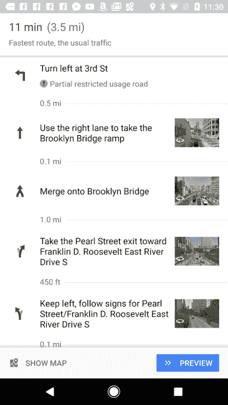
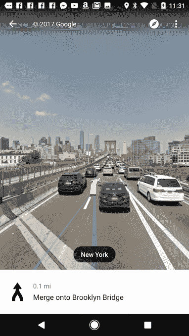

# Android 版谷歌地图在导航中添加了街景图像，以显示您的转弯 

> 原文：<https://web.archive.org/web/https://techcrunch.com/2017/05/12/google-maps-for-android-adds-street-view-images-in-navigation-to-show-your-turns/>

# 谷歌地图 Android 版在导航中添加了街景图像，以显示你的转弯

谷歌地图(Google Maps)悄悄推出了一项新功能，这将让你在使用逐路段导航时更容易看到你需要去的地方:方向屏幕上集成的街景图像。虽然该应用程序始终允许您查看即将到来的转弯以及它们之间的距离的概览，但新功能引入了一个选项，可以点击以查看相关的街景图像。

这一变化首先被安卓警察发现，他认为这一变化在过去几天里会在更大范围内出现。我们联系了谷歌进行进一步确认，该公司表示，该功能自 5 月初以来已广泛可用，现在向全球安卓用户提供。

然而，该功能尚未进入谷歌地图应用的 iOS 版本，谷歌也无法确认何时会进入该平台。

用户无需做任何改变就能看到这些图像——你只需像往常一样输入你的当前位置和目的地，然后查看路线。以前你只会看到一系列的转弯，现在你会注意到很多转弯旁边会有一个照片缩略图。点击这个缩略图，你会被带到一个全屏 360 度街景体验，它是针对你要去的方向正确定向的。

在这里，你可以通过拖动手指来平移屏幕，就像在街景中一样。您的路线将会以蓝线标示，如果您愿意，您可以点击继续前进，或者您可以返回主方向屏幕。

将街景与地图整合的想法是谷歌以前尝试过的。正如 Android Police 指出的，谷歌早在 2008 年就首次在网络上推出了类似的功能。其他用户注意到，像这样的选项也出现在最初的 Droid 上。然而，目前还不清楚谷歌为什么没有继续将其包括在所有版本的移动谷歌地图中。

一些用户可能比其他人更早看到街景的变化，因为该功能似乎是远程激活的展示。

谷歌地图是在谷歌 Play 商店上免费下载的。