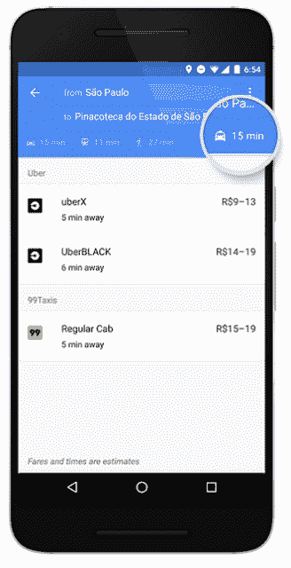

# 谷歌地图超越了优步，在其应用程序 中增加了 Ola、Hailo 和更多汽车服务

> 原文：<https://web.archive.org/web/http://techcrunch.com/2016/03/15/google-maps-goes-beyond-uber-to-aggregate-ola-hailo-gett-and-more-car-services-into-its-app/>

据报道，谷歌正在努力打造自己的优步竞争对手，尽管一些人认为这将以自动驾驶汽车车队的形式出现，但对于谷歌如何在优步的世界中更突出地定位自己，还有一个更直接的选择:通过搜索和聚合更广泛的按需交通领域所能提供的一切。

今天，谷歌[宣布](https://web.archive.org/web/20230404212439/https://maps.googleblog.com/2016/03/your-car-has-arrived-more-ways-to-get.html)其导航应用谷歌地图将增加一个新的汽车服务标签，作为其步行、驾驶和公共交通方向的补充。它将显示除优步之外的许多提供商的票价和骑行选择。

新的合作伙伴包括巴西的 99Taxis、印度的 Ola Cabs、英国和西班牙的 Hailo、德国和西班牙的 mytaxi 以及英国的 Gett。它们将与来自优步的列表放在一起，这是 2014 年[全球第一个集成到谷歌地图应用中的服务](https://web.archive.org/web/20230404212439/https://techcrunch.com/2014/05/06/google-maps-on-mobile-gets-uber-integration-and-more/)。

谷歌表示，新的集成将首先在 Android 上推出，并“很快”会在 iOS 上推出。

虽然谷歌地图应用程序的早期版本基本上是在一长串旅行路线的底部提供优步选项，但谷歌表示，现在这些服务将显示在应用程序中专门的“出租车”标签上。

看起来添加这些新服务背后有两个动机。

首先，它有助于将谷歌地图定位为计划去某个地方旅行的人的一体化选择。通过向他们提供私人租车选项，他们更有可能会留在应用程序中，而不是离开它去做其他事情，可能永远不会再回到谷歌地图。

“当你下班去见朋友吃晚饭时，你可以很容易地比较你的选项，找到最快的方式，而不必打开多个应用程序，”谷歌工程师霍尔格·弗利尔写道。

这是谷歌已经制定了一段时间的策略，同时还有其他增强功能，包括搜索地点的选项、[阅读和发布评论](https://web.archive.org/web/20230404212439/https://techcrunch.com/2016/03/08/google-reviews-netherlands/)，甚至预订餐厅的桌子。

看起来汽车服务并不需要付费才能出现在谷歌地图中，但是，就像谷歌的搜索业务一样，你可以想象围绕这一长期目标建立的收入流。

其次，这是谷歌为自己定位为交通服务的首选资源打下更多基础的一种方式。类似于[通用汽车和 Lyft 推出的 Express Drive](https://web.archive.org/web/20230404212439/https://techcrunch.com/2016/03/14/lyft-gm-express-drive/) 租赁将有助于两家公司为未来的自动驾驶车队奠定基础设施，谷歌正在帮助塑造用户行为，它可能会也可能不会决定在未来利用自己的更多服务。

谷歌在优步进行了投资，但它自己在汽车领域的进步，以及它希望如何发展自己业务的更大计划，可能会让谷歌与这家交通运输新贵展开更直接的竞争。因此，分散赌注，提供不仅仅是优步的运输选择，让谷歌作为看门人的地位更强。

这是一个谷歌甚至可能选择扩大其角色的地方。“当有意义时，我们还会在查看步行和交通方向的地图时显示乘车服务的可用性，以及每个提供商的多个乘车服务选项——如果它们存在的话，”弗利尔指出。

另一个有趣的细节是谷歌在应用程序中使用深度链接。弗利尔指出，如果你已经在手机上安装了该提供商的应用程序，你就可以看到费用估计和取车时间。“选择一项服务，我们将带您直接进入他们的应用程序，您只需轻轻一点就可以预订旅程。”这也意味着来自特定服务的更多数据，例如优步，在那里你现在可以获得从 uberX、uberXL 到 UberBLACK 的所有车辆的选项。