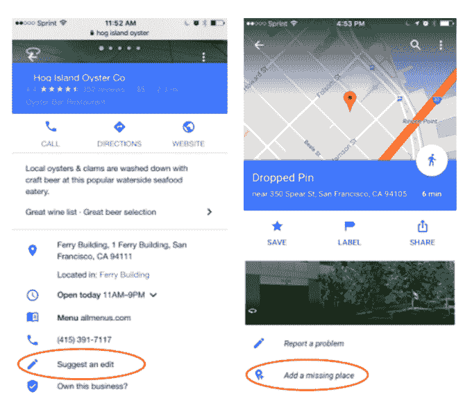

# 谷歌地图正在将其超过 10 亿的用户转变为编辑 

> 原文：<https://web.archive.org/web/https://techcrunch.com/2016/07/21/google-maps-is-turning-its-over-a-billion-users-into-editors/>

谷歌公司[今天早上宣布](https://web.archive.org/web/20230128092559/https://maps.googleblog.com/2016/07/more-ways-to-share-your-street-smarts.html)，谷歌已经开始进一步挖掘大众的力量，以改进其谷歌地图应用。这是通过引入一些功能来实现的，这些功能将允许用户更容易地共享位置细节，以及确认他人建议的编辑。许多用户已经看到了这些变化的推出，但今天谷歌将它们正式化——这表明更广泛的推出正在完成。

虽然谷歌说它每天对地图进行“数百万次”更新，但这仍然不足以确保每个位置都有最准确、最详细的信息。这就是为什么它转向用户来帮助它改善地图服务。

该公司通过其谷歌地图 iOS 和 Android 应用程序，以及谷歌搜索，扩大了用户在谷歌地图上添加缺失地点或纠正商业信息的能力。例如，你可能已经注意到“建议编辑”或“添加缺失的地方”的选项，这些选项允许你做出贡献。

然而，这些编辑不会立即上线，因为仅仅一个用户的输入不足以确定编辑的准确性。

取而代之的是，当有一个地方正在等待编辑时，谷歌地图会弹出通知，告诉你“有人建议了新信息”当您点击通知时，您可以验证编辑。当足够多的人验证相同的信息时，它就会发布到地图上。然而，这个选项目前只在谷歌地图应用的 Android 版本上可用，以及在 iOS 和 Android 上的移动谷歌搜索。

该公司还在努力收集更多关于企业的信息，这些信息超出了地址或营业时间等基本事实细节。

如今，谷歌地图还被用于发现旅游景点——包括餐馆，这种方式与 Yelp 形成了竞争。一段时间以来，谷歌一直在构建其餐馆功能集，帮助人们根据时间、价格、菜单、氛围等因素找到最佳就餐地点。

现在，谷歌地图应用程序还将允许任何人通过点击对某个地方的描述来贡献他们对该地方的了解，例如，它是否提供“欢乐时光饮料”，或者菜单上是否有“健康”或“素食”选项。除了手机上的谷歌搜索之外，这第三个功能仅在 Android 上的谷歌地图上可用。

这不是谷歌第一次利用众包来改善和扩大其商业数据收集。去年，[开始奖励其“当地导游”额外津贴，并提供](https://web.archive.org/web/20230128092559/https://techcrunch.com/2015/11/13/google-crowdsources-business-listing-corrections-map-edits-with-expanded-local-guides-program/)定期审查业务，以及编辑、修改和提供商业信息。

从那时起，它一直在扩大这些众包工作的范围，将普通用户也包括在内。谷歌地图拥有超过 10 亿的用户，如果他们愿意，现在可以成为编辑。如果你还没有看到这些选项出现在谷歌地图或谷歌搜索中，你应该很快就会看到了。