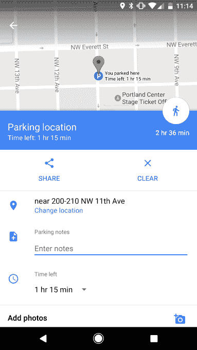
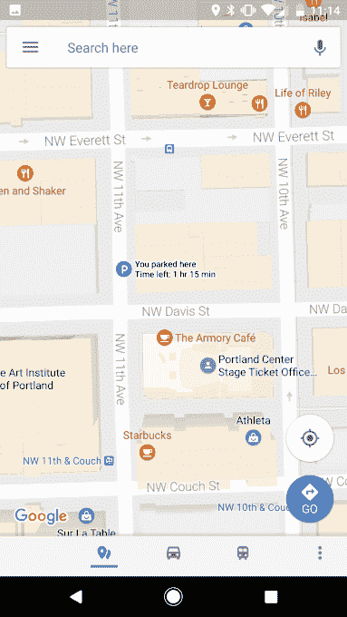

# 谷歌地图让你记录你的停车位置，停车时间 

> 原文：<https://web.archive.org/web/https://techcrunch.com/2017/03/20/google-maps-lets-you-record-your-parking-location-time-left-at-the-meter/>

谷歌地图刚刚增加了一个方便的功能，可以帮助用户记住他们停车的地方。当你点击蓝点时，这将作为一个新的菜单选项出现，并将在地图上放置一个“P”图标，这样你就可以找到回到你的地点的路。自从 iOS 10 发布以来，[苹果地图已经记住了你的停车位置，而](https://web.archive.org/web/20221006181216/http://appleinsider.com/articles/16/06/14/inside-ios-10-apple-maps-will-remember-where-you-parked-your-car)谷歌的实现更加强大。

有了 iOS 10，当你[把你的 iPhone 从蓝牙或 CarPlay](https://web.archive.org/web/20221006181216/https://support.apple.com/en-us/HT207227) 上断开时，苹果地图会用大头针标记你的车的位置。你还可以在地图上编辑车辆的位置，并通过苹果的停车位置功能添加注释或照片。

如果你的手机没有通过 CarPlay 或蓝牙连接，你可以使用苹果的[标记位置功能](https://web.archive.org/web/20221006181216/https://support.apple.com/kb/PH20138?locale=en_US&viewlocale=en_US)来代替。

与此同时，谷歌已经通过 Google Now 推出了自己的主动停车节省功能[，但它的工作原理是接入你手机的传感器，并确定你最有可能将车停在了一个给定的位置。](https://web.archive.org/web/20221006181216/http://www.theverge.com/2014/5/1/5671238/google-now-remembers-where-you-parked-car)

有时候，你可能会看到这些信息在没有根据的情况下出现——比如你下了公交车或者下了出租车，谷歌[说](https://web.archive.org/web/20221006181216/https://support.google.com/websearch/answer/6015842)。

谷歌地图的新功能需要手动输入，但这实际上比 Google Now 的猜测有一点优势，因为它允许你输入更多关于你所在地点的信息。

像苹果地图一样，你可以添加关于你停车位置的注释——比如，有助于记下十字路口或者你在车库的哪一层。但谷歌地图也支持添加多张你的停车位置的照片——这是人们经常注意到车库中停车位数量的一种常见方式，然后通过单独拍摄，为车库层本身添加楼层、行、过道和/或颜色代码。

此外，谷歌的停车位置保护程序可以让你输入你在这个地方还剩下多少时间。如果你在一个临时停车区(例如“两小时停车”)，或者在一个有收费表的停车位，这是很方便的。剩余时间会显示在地图上，当到期时，谷歌地图会通过推送通知提醒你。

早些时候,[安卓警察](https://web.archive.org/web/20221006181216/http://www.androidpolice.com/2017/03/18/google-maps-v9-49-beta-adds-a-manual-parking-location-tracker-weather-indicator-for-mass-transit-navigation-and-more-apk-download-teardown/)发现了地图的附加功能。这在市区尤其有用，或者当你知道你的车停了很长时间可能会忘记的时候——比如在机场。

谷歌没有正式宣布停车保护程序，可能是因为停车点保护程序还没有进入 iOS 系统。但该公司向我们证实了这确实是新的。

该功能目前在 Android 上的谷歌地图上可用(9.49 版)。