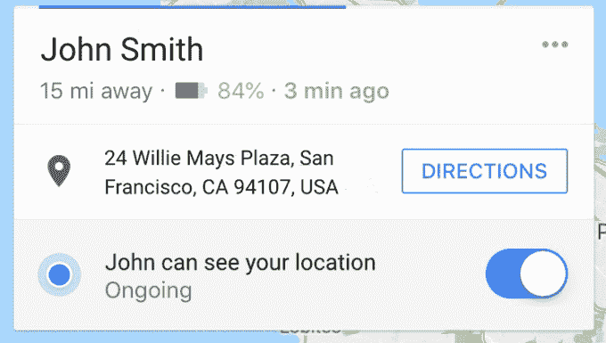

# 谷歌地图的位置共享现在也能分享你手机的电池状态

> 原文：<https://web.archive.org/web/https://techcrunch.com/2018/08/02/google-maps-location-sharing-will-now-share-your-phones-battery-status-too/>

# 谷歌地图的位置共享现在也能分享你手机的电池状态

2017 年初，谷歌[为谷歌地图](https://web.archive.org/web/20221209061151/https://techcrunch.com/2017/03/22/google-maps-now-lets-you-share-your-location-with-friends-and-family-for-a-specific-period-of-time/)增加了一项功能，让你可以选择与你的密友和家人(近)实时分享你的位置。现在他们用另一个重要的小细节充实了这一信息:你手机的剩余电量。

看起来是这样的:

想知道为什么有人会关心你的电池状态吗？

如果你试图定位某人的位置，而他的手机却没电了，那么应用程序就无能为力了。大多数位置共享应用程序只会坐在那里旋转，等待某种响应，让你担心他们的手机可能无法响应当前位置的所有原因。他们失去信号了吗？有人偷了他们的手机吗？

通过提示你某人的手机是否就要没电了，你至少可以更好地了解当更新停止时发生了什么。

AndroidPolice 的人在二月份的一次谷歌地图 APK 拆回中发现了这个[，所以我们知道它正在路上。一些人提到看到它在他们的设备上弹出(包括只在电池电量低时显示的变体)，但今天它似乎已经面向更多的观众推出。](https://web.archive.org/web/20221209061151/https://www.androidpolice.com/2018/02/10/google-maps-9-71-beta-prepares-show-battery-stats-location-sharing-make-several-improvements-mass-transit-apk-teardown/#Location_sharing_will_display_battery_stats)

虽然这个功能很聪明，但谷歌并不是第一个想到它的人。例如:去年被 Snapchat 收购的社交地图应用 Zenly 在 2016 年推出时就有类似的功能。