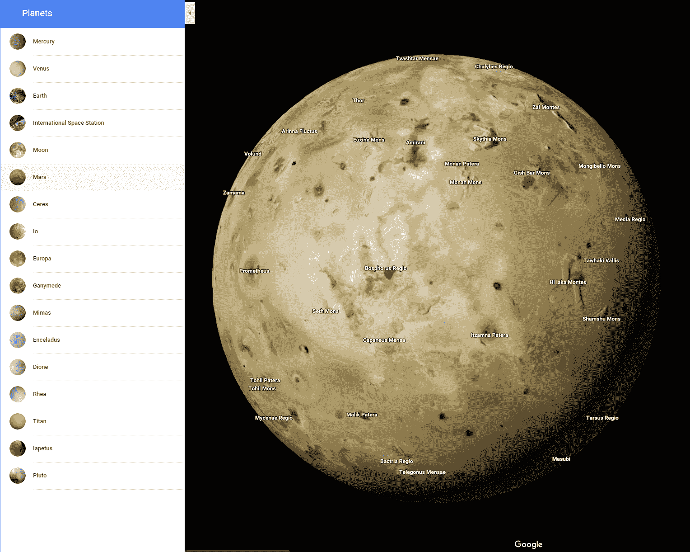

# 谷歌地图现在可以让你探索当地的行星和卫星

> 原文：<https://web.archive.org/web/https://techcrunch.com/2017/10/16/google-maps-now-lets-you-explore-your-local-planets-and-moons-too/>

# 谷歌地图现在也能让你探索当地的行星和卫星

谷歌今天[宣布了](https://web.archive.org/web/20230307213332/https://www.blog.google/products/maps/space-out-planets-google-maps/)一个有趣的谷歌地图更新，将允许你虚拟地访问我们太阳系中的十几个额外的行星和卫星。该公司已经增加了冥王星、金星和几个卫星的图像，并且使在地图上找到它们变得更加容易。总的来说，谷歌地图现在有 16 个天体的图像。

值得注意的是，虽然谷歌长期以来一直提供关于[火星](https://web.archive.org/web/20230307213332/https://www.google.com/mars/)和地球[月球](https://web.archive.org/web/20230307213332/https://www.google.com/moon/)的详细图像，但这些并不能从地图界面直接访问。因此，如果你曾经想在谷歌地图中访问土星的第三大天然卫星[土卫二](https://web.archive.org/web/20230307213332/https://www.google.com/maps/space/enceladus/@0,-122.7994824,22671583m/data=!3m1!1e3)、[土卫四](https://web.archive.org/web/20230307213332/https://www.google.com/maps/space/dione/@0,-122.7994824,22671583m/data=!3m1!1e3)或[伊帕托斯](https://web.archive.org/web/20230307213332/https://www.google.com/maps/space/iapetus/@0,-122.7994824,22671583m/data=!3m1!1e3)，你的机会来了。

该公司指出，它与天文艺术家[比约恩·约翰逊](https://web.archive.org/web/20230307213332/http://bjj.mmedia.is/)合作，为其服务带来了各种卫星和行星的[行星地图](https://web.archive.org/web/20230307213332/http://bjj.mmedia.is/data/planetary_maps.html)。

要访问这个新的图像，你可以缩小地面谷歌地图视图，直到你到达外太空——或者你可以点击这个链接[这里](https://web.archive.org/web/20230307213332/https://www.google.com/maps/space/earth)。

一旦你探索完所有这些星球，你还可以在最近加入谷歌街景计划的[国际空间站](https://web.archive.org/web/20230307213332/https://techcrunch.com/2017/07/20/google-street-view-now-lets-you-explore-the-international-space-station/)短暂停留。

