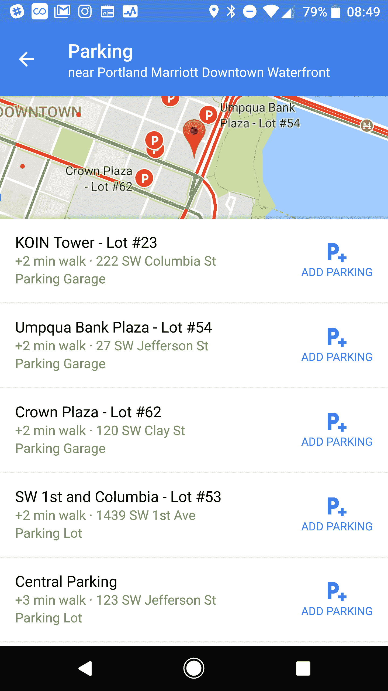

# 谷歌地图现在让寻找停车场变得更加容易

> 原文：<https://web.archive.org/web/https://techcrunch.com/2017/08/29/google-maps-now-makes-it-easier-to-find-parking/>

 谷歌[今天宣布](https://web.archive.org/web/20230205181048/https://www.blog.google/products/maps/put-it-park-new-features-google-maps/)谷歌地图的更新，这将使其用户在开车进城时更容易找到停车场。

由于谷歌地图目的地卡上的“[停车困难](https://web.archive.org/web/20230205181048/https://www.blog.google/products/maps/know-you-go-parking-difficulty-google-maps/)”图标，美国的谷歌地图用户已经能够知道在目的地停车是否会很困难。这项功能现在扩展到美国以外的 25 个城市，包括阿姆斯特丹、伦敦、马德里、莫斯科、巴黎、罗马、圣保罗、多伦多和温哥华。

然而，美国的谷歌地图用户正在获得一个更有趣的新功能:他们现在可以很容易地找到目的地附近的停车场，并自动将它们添加到他们的行程中。这些车库的列表还包括到你的[最终目的地](https://web.archive.org/web/20230205181048/http://www.gstatic.com/tv/thumb/movieposters/25022/p25022_p_v8_aa.jpg)的步行时间，尽管遗憾的是，它没有告诉你在一个给定的车库里停车会有多贵，或者还有多少停车位可用(这是一些专用停车应用程序——特别是在欧洲——可以做到的)。很容易想象，随着时间的推移，谷歌将增加这一功能，以及在车库中预订停车位的能力。

以下是目前提供这一新功能的 25 个美国城市:亚特兰大、波士顿、夏洛特、芝加哥、克利夫兰、达拉斯/沃斯堡、DC、丹佛、底特律、休斯顿、洛杉矶、迈阿密、明尼阿波利斯/圣保罗、纽约市、奥兰多、费城、凤凰城、匹兹堡、波特兰、圣地亚哥、萨克拉门托、旧金山、西雅图、圣路易斯和坦帕。