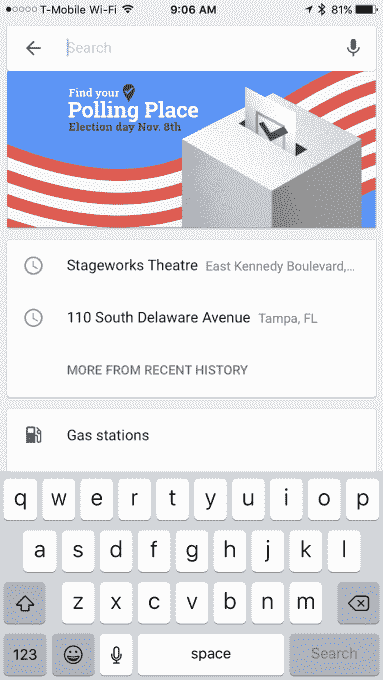

# 谷歌地图敦促用户使用其新的投票站搜索器 TechCrunch 投票

> 原文：<https://web.archive.org/web/https://techcrunch.com/2016/11/08/google-maps-urges-users-to-vote-with-its-new-polling-place-finder/>

谷歌在这次选举中一直致力于使[投票](https://web.archive.org/web/20230129215952/https://techcrunch.com/2016/08/16/google-search-now-includes-info-on-how-to-vote/) [信息](https://web.archive.org/web/20230129215952/https://techcrunch.com/2016/07/18/google-launches-voter-registration-assistance-in-its-search-results/)更容易获取，今天，谷歌地图的整合将继续帮助用户找到他们的投票地点。当你在网上或手机上启动谷歌地图，并准备在搜索框中输入时，屏幕上方会弹出一条横幅，上面写着:“找到你的投票地点。”

点击这个横幅会将你重定向到一个定制的谷歌搜索查询，专为选举日而建，有自己的标签。

“我在 2016 年美国大选中去哪里投票”这个问题有点罗嗦——毕竟，你今天可以通过谷歌搜索获得同样的信息，例如，只需输入“去哪里投票”，甚至只是“投票”。谷歌还为这个搜索查询添加了一个标签“Everyonein2016”

这是谷歌在美国选举日之前的几天里一直在使用的查询和标签，包括昨天谷歌涂鸦中的[，它将你带到同一个结果页面，以及现在谷歌网站上无处不在的弹出窗口，它提醒你“今天是选举日”，以防你忘记了。](https://web.archive.org/web/20230129215952/http://www.businessinsider.com/where-to-vote-in-the-2016-presidential-election)

这家搜索公司在今年的选举年大力推广选民资源，谷歌地图的整合只是另一个例子。今年到目前为止，谷歌已经提供了许多选民指南，从旨在增加[登记](https://web.archive.org/web/20230129215952/https://techcrunch.com/2016/07/18/google-launches-voter-registration-assistance-in-its-search-results/)的指南到帮助你弄清楚[投票](https://web.archive.org/web/20230129215952/https://techcrunch.com/2016/08/16/google-search-now-includes-info-on-how-to-vote/)要求的指南，以及[谁在选票上](https://web.archive.org/web/20230129215952/https://techcrunch.com/2016/10/14/google-adds-ballot-information-to-search-results/)和问题。它还推出了西班牙语版本的选民信息。

今天，它甚至用自己的 YouTube doodle，或“Yoodle”来标记 YouTube 点击后，它会给你一个特殊的视频，提醒你投票，并再次将你重定向到谷歌搜索查询，帮助你找到你需要的相关信息。

虽然该公司在过去几年中一直提供类似的选民援助，但这一次，谷歌在敦促美国用户投票方面有点咄咄逼人，Google.com 主页广告、Gmail 顶部的横幅、在谷歌上搜索时弹出的窗口，以及现在谷歌地图中的投票站搜索器。

这些努力的最终结果有望对选民投票率产生影响。正如谷歌早些时候指出的，与 2012 年选举相比，谷歌发现“如何投票”一词的搜索流量增加了 233%。

谷歌昨天还宣布，投票结束后，今天的选举结果将立即显示在谷歌搜索结果中。