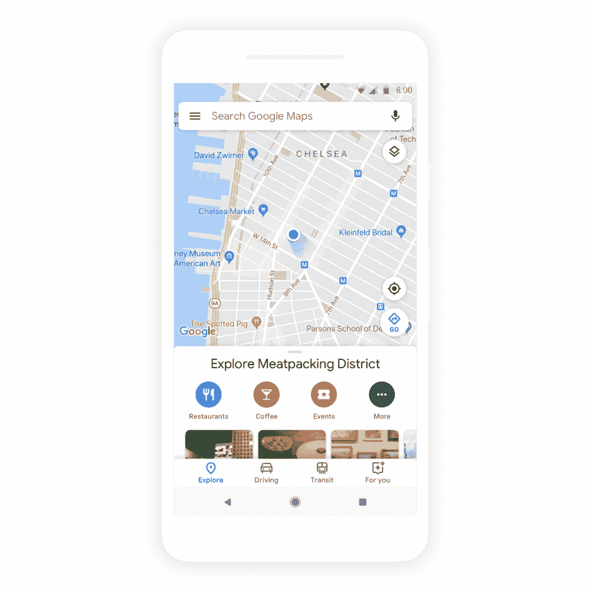
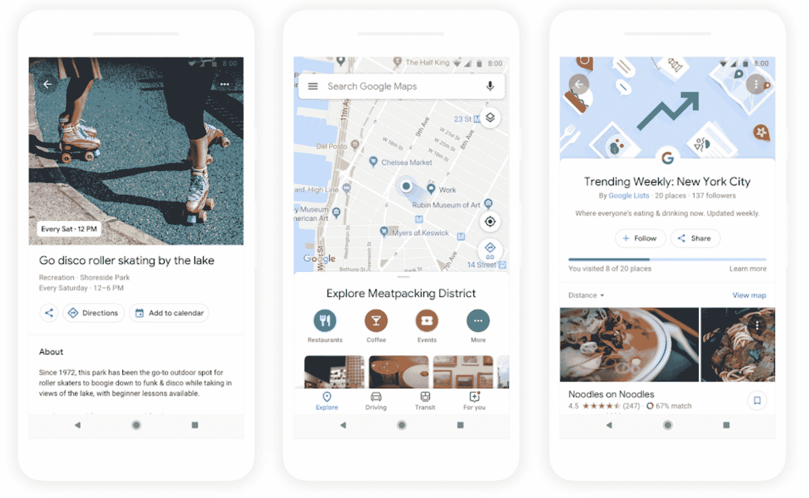

# 谷歌地图很快会给你更好的建议 

> 原文：<https://web.archive.org/web/https://techcrunch.com/2018/05/08/google-maps-will-soon-give-you-better-recommendations/>

# 谷歌地图很快会给你更好的推荐

谷歌将很快推出新版本的谷歌地图，给你比以前更多的个性化推荐。谷歌长期以来一直致力于使地图看起来更加个性化，但由于地图现在不仅仅是方向，该公司正在引入新的功能，为你提供更好的当地推荐。

谷歌工程和产品管理副总裁 Jen Fitzpatrick 在今天的主题演讲中指出:“今天，我们的用户不仅要问去一个地方的最快路线，还要问他们周围发生了什么，有哪些新地方，以及当地人在他们的社区里做了什么。”

实现这一点的第一个新功能是“为您”选项卡。谷歌地图的这一新部分将从你的个人偏好中学习，并告诉你你的邻居(或你正在关注的其他邻居)有什么新消息。也许有一家新的咖啡馆或餐馆。

在过去的几年里，谷歌地图的评论也变得越来越重要。但是四星的评价到底意味着什么呢？因此，今后，谷歌地图将利用这些评论，并将其与它所知道的关于你的信息相结合，根据你的背景和兴趣给你一个更个性化的分数。

谷歌在地图上增加的另一个与人工智能无关的功能是一个新的群体规划功能，允许你长按一个地方，然后将他们添加到一个可共享的列表中。

