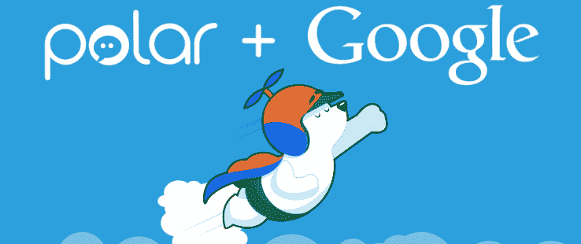

# 投票网站 Polar 终究没有死(或被谷歌收购)

> 原文：<https://web.archive.org/web/https://techcrunch.com/2015/02/24/google-never-actually-acquired-social-polling-startup-polar/>

# 投票网站 Polar 终究没有死(或者被谷歌收购)

几个月前， [TechCrunch](https://web.archive.org/web/20221006185343/https://beta.techcrunch.com/2014/09/11/google-acquires-opinion-poll-service-polar-for-google/) 、[、【华尔街日报】和其他一些](https://web.archive.org/web/20221006185343/http://blogs.wsj.com/digits/2014/09/11/googles-deal-for-polar-shows-it-has-not-given-up-on-google/)[出版物](https://web.archive.org/web/20221006185343/http://www.techmeme.com/140911/p18#a140911p18)报道称，谷歌已经收购了社交民调初创公司 [Polar](https://web.archive.org/web/20221006185343/http://www.polarb.com/) ，其创始人将加入 Google+团队。

事实证明，这个故事只有一半是真的。谷歌只雇佣了极地团队，包括知名设计专家卢克·乌鲁布莱夫斯基和他的联合创始人杰夫·科尔——但没有雇佣产品或其装饰。

当然，新员工是旧金山创业生态系统的一个主要组成部分。但即使这些收购主要是为了人才，通常也至少涉及一些知识产权。事实显然并非如此，因为 Polar 现在由 Polar 的早期投资者之一 Holly Dodge 所有。

Polar 的前发言人道奇告诉我们，他现在是“Polar Polls LLC 的创始人兼总裁”，我们听说，他“致力于支持 Polar 用户社区，并继续为(其)出版商提供免费的投票服务。”

在被“收购”后，Polar 告诉我们，它将在 2014 年底关闭，现有用户应该下载他们的投票数据。现在，看起来 Polar 已经开始运行了，就像什么都没发生过一样。

当我们要求谷歌发表声明时，它告诉我们，“Polar 团队将帮助我们使 Google+尽可能地美观和简单易用，特别是在移动设备上。”

正如硅谷的许多事情一样，并非所有事情都像人们所说的那样。但是嘿，如果你真的对 Polar 的死感到惋惜，至少你现在还能继续使用它。