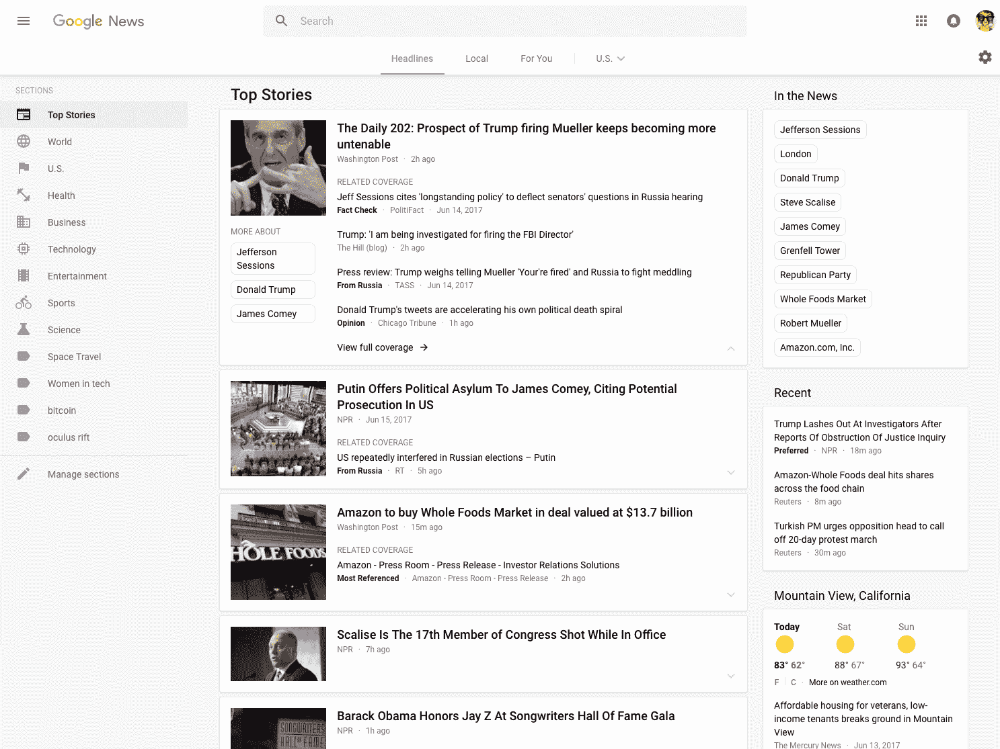
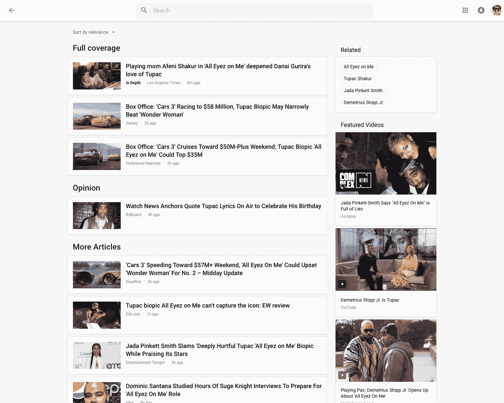

# 谷歌新闻获得一层新的油漆

> 原文：<https://web.archive.org/web/https://techcrunch.com/2017/06/27/google-news-gets-a-fresh-coat-of-pain/>

谷歌新闻今天看起来有所不同。这是因为谷歌今天对其新闻聚合网站进行了重大重新设计，使其与其他服务保持一致，并消除了多年来积累的大量混乱。

在多年坚持基本相同的设计后，没有人会指责谷歌新闻看起来很现代。虽然该公司的其他投资组合近年来进行了重大翻新，但谷歌新闻开始看起来有点被忽视(而且杂乱)。今天一切都改变了。

【T2

谷歌新闻的产品经理阿南德·卡帕告诉我，重新设计背后的指导思想是建立一个整洁的用户界面，使产品更容易被主流新闻消费者接受。

例如，为了做到这一点，该团队为主要新闻流采用了基于卡片的界面，并添加了标签，将当天的主要标题与本地新闻和个性化新闻订阅分开。旧设计中突出的大部分较长的文本片段也不见了，还有脸书、Twitter 和(gasp！)当你悬停在一个故事上时，Google+会淡入(这些已经被一个现代的分享按钮取代)。

 不过，就核心特性而言，你看不出这两个版本有什么大的区别。谷歌近年来增加的所有新工具，包括实时报道、事实核查和对视频的支持，仍然存在。事实上，该团队扩大了视频在谷歌新闻中的使用，这是有意义的，因为现在有许多最近的故事都围绕着视频。

卡帕认为，谷歌的用户已经熟悉了卡片界面，所以这对大多数用户来说不应该是太大的飞跃。和旧设计一样，你可以点击这些卡片来查看故事的扩展视图，有更多的来源，如果有保证的话，还有视频、事实核查文章等等。

该团队决定给本地新闻一个自己的标签，因为它希望随着时间的推移有空间扩展这一部分。“我们正在为下一阶段做准备，”卡帕解释道。在我们的谈话中，卡帕多次提到这一点。这里的想法显然是给产品团队迭代这种设计的能力，卡帕还指出，在接下来的几个月里，我们会看到相当多的 A/B 测试，因为团队会看看什么可行，什么不可行。

顺便说一句，出版商不必对他们如何向谷歌新闻提交故事做任何改变。这次更新没有为他们引入任何变化，因为所有的更新都发生在发布索引之上。不过，对视频的重新重视可能会推动更多出版商投资这方面的业务。

