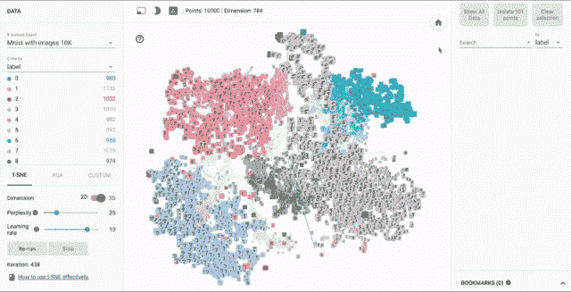

# 谷歌开源嵌入投影仪使高维数据更易管理 

> 原文：<https://web.archive.org/web/https://techcrunch.com/2016/12/07/google-open-sources-embedding-projector-to-make-high-dimensional-data-more-manageable/>

# 谷歌开源嵌入投影仪让高维数据更易管理

今天早上， [Google 宣布开源其数据可视化工具](https://web.archive.org/web/20221225030652/https://research.googleblog.com/2016/12/open-sourcing-embedding-projector-tool.html)，嵌入式投影仪。该工具将帮助机器学习研究人员可视化数据，而不必安装和运行 TensorFlow。

我们大多数人都不容易理解维度和向量。问题是我们都生活在一个三维的世界里。我们被教导长度、宽度和高度，所以我们努力想象第四维、第五维或第六维可能是什么样子——这就是为什么我们大多数人在电影《星际穿越》中发现克里斯托弗·诺兰的[对额外维度的描述不可靠。](https://web.archive.org/web/20221225030652/https://qph.ec.quoracdn.net/main-qimg-5f48d8daf87ff55bd5d230b42939cc7c?convert_to_webp=true)

不要去想我们所知道的世界的维度，试着去想纯粹的数据。如果我让你比较两栋房子，你可以先列出区分这两栋房子的标准。这个清单可以包括颜色，大小，屋顶风格和庭院形状。这个模型可以被认为是一个四维模型。

您可以选择在表格中显示这些数据，或者尝试将其表示为图片。要到达那里，你必须使用向量。对于一个简单的两栋房子的四维模型，除了气泡大小和气泡颜色等特性之外，您还可以使用传统的 X 轴和 Y 轴测量值在 PowerPoint 中创建一个图表。

对于一个有数千个维度的复杂得多的模型，传统的工具开始失效。这就是谷歌嵌入式投影仪的用武之地。

如果你曾经使用过 Spotify 的 Discover Weekly，你就已经一头扎进了嵌入，只是你不知道而已。在高级机器学习级别，向量映射可以表示歌曲的属性。根据单个听众的偏好映射整个音乐集合，使用户能够获得个性化的、准确的音乐推荐——这在 PowerPoint 中是行不通的。