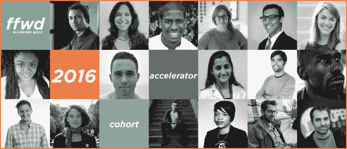

# Google.org，奥米迪亚网络支持快进，科技非营利组织的加速器 

> 原文：<https://web.archive.org/web/https://techcrunch.com/2016/06/29/google-org-omidyar-networks-backing-fast-forward-the-accelerator-for-tech-non-profits/>

一家帮助科技非营利组织开发产品和筹集资金的加速器 [Fast Forward](https://web.archive.org/web/20221006141046/http://www.ffwd.org/) 已经吸引了 125 万美元的慈善资金。

支持者包括风险投资和科技领域的知名人士。Google.org 和贝莱德捐赠的份额最大，其次是 AT & T、纳西里基金会和丽塔·艾伦基金会。

Fast Forward 将在未来两年使用这笔资金支持加速器中的科技非营利组织，但也经营自己的业务。除了加速器，以及随之而来的所有指导、招聘和活动，Fast Forward 还维护着一个全面的科技非营利组织在线目录。

一般来说，在加速器或愿意帮助他们的投资者方面，科技创业公司拥有压倒性的资源——只要它们是盈利的。但是科技非营利组织面临资源匮乏。

Y Combinator 于 2013 年开始接纳非营利组织加入其加速器，但非营利组织在那里是少数。然后，有非营利企业的利基孵化器，但它们允许通过传统服务做好工作的非营利组织，以及缺乏技术重点和专业知识的非营利组织。

这就是为什么凯文·巴伦布莱特和香农·法利在 2014 年 1 月共同创立了快进，为科技非营利组织带来一个适合他们需求的项目。《快进》杂志最近接纳了第三批公司。

*FFWD.org 加速器的 2016 年非营利性科技创业公司。*

这些企业家旨在通过应用程序、数据分析和其他技术，结束警察暴力，改善教育，帮助寄养儿童等。

巴伦布莱特说，在该项目的申请人中，今年有更多的科技非营利组织致力于健康、教育和公民问题，但致力于解决环境问题的却很少。

通常不会投资 100 万美元以下赠款或早期科技非营利组织的慈善组织，能够通过快进来实现这一目标。

“如果他们的目标是每年投资数亿美元，他们不会也不可能一点一滴地分配资金，”法利解释说。“当你的专长是生态、教育或当地社区的问题，而不是技术时，也很难找到非营利的科技创业公司，并找出在这个领域可能会成功的东西。”

去年，Google.org 向非营利组织捐赠了超过 1 亿美元的赠款和 10 亿美元的技术资源，以及 8 万小时的谷歌员工志愿者服务。

Google.org 校长布里吉特·霍耶·戈瑟林克在谈到快进时说，“我们真的不插手。我们相信他们的选择。但当然，如果他们提出要求，我们可以为非营利性科技创业公司的尽职调查提供帮助。”

当被问及为什么创业公司应该使用非营利商业模式，而不是跟随谷歌的营利性脚步时，Gosselink 说:

“在非营利组织工作让人们能够更深入地积极影响世界上的弱势群体。很难做到这一点，同时也会影响投资者对创业公司的收入和盈利目标。”

除了向快进提供现金捐助，包括 Google.org 在内的捐助者还在旧金山湾区提供会议场所，非营利技术创始人可以在这里开会，快进可以在这里举办研讨会和其他活动。

迄今为止，快进[校友非营利组织](https://web.archive.org/web/20221006141046/http://www.ffwd.org/purpose/)已经影响了 470 万人的生活，并在加速器后筹集了 1600 万美元的慈善资金。有趣的是，79%的快进非营利组织是由女性和有色人种创建的。超过一半的人建立了非营利组织来解决影响他们个人或职业生活的问题。