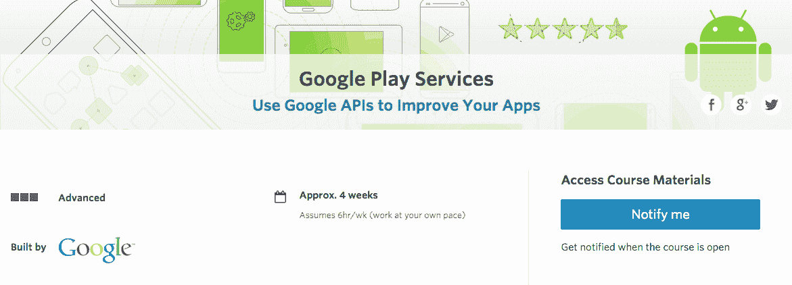

# 谷歌与 Udacity 合作推出 Android 开发 nano degree 

> 原文：<https://web.archive.org/web/https://techcrunch.com/2015/05/28/google-partners-with-udacity-to-launch-android-development-nanodegree/>

在三藩市的 I/O 开发者大会上，谷歌今天宣布，它已经与 [Udacity](https://web.archive.org/web/20221205111503/https://www.udacity.com/) 合作，推出了一个六门课程的 Android 开发 [nanodegree](https://web.archive.org/web/20221205111503/https://www.udacity.com/nanodegree) 。

这里的想法是帮助开发者学会如何“以正确的方式”为谷歌的移动操作系统编写应用程序，直到他们有可能被谷歌自己雇佣。显然，这不是一个初学者的课程，而是为高级开发人员谁想要添加

就像 Udacity 的其他学位课程一样，学生可以免费观看所有的视频内容，但如果他们想获得证书并获得教学助理，他们必须支付费用，这门课程每月 200 美元。

正如 Udacity 的联合创始人兼首席执行官巴斯蒂安·特龙在宣布之前告诉我的那样，开发者必须完成 6 门课程和许多项目才能获得学位。例如，其中一门课程会要求学生在应用程序中使用 Spotify API。与 Udacity 的许多其他项目一样，这里的重点是实用知识，在许多方面，项目远比实际课程更重要。

“我们希望让他们能够通过自己的工作而不是多项选择测试来展示自己有多优秀，”Thrun 说。“最好把这看作是谷歌希望其开发者知道的东西。”

完成学位需要六到九个月的时间，但是开学日期已经确定，学生可以按照自己的进度完成课程和项目。

为了表明对这个项目的承诺，谷歌将在年底邀请 50 名学生参加在山景城举行的为期三天的峰会。这次峰会将包括一次黑客马拉松，以及与招聘工程师的会议，因此谷歌显然计划至少招聘一些这门课程的学生。

此外，谷歌还与埃及政府合作，将作为该学位一部分的六门 Android 课程本地化为现代标准阿拉伯语。在 Udacity 的历史上，这是第一次，这不仅仅意味着给视频添加字幕，而是实际上将所有的课程内容改编成一个特定的区域。

谷歌将为埃及的学生提供 2000 个奖学金，并为那里的学生举办招聘会和会议。Thrun 指出，Udacity 将埃及视为一块巨大的垫脚石，将这门课程带给阿拉伯语半岛周围的学生，并且带来良好的教育——以及它有望使学生获得的好工作——可以减少该地区的“战争数量”。

