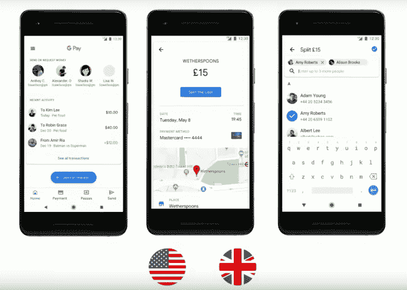
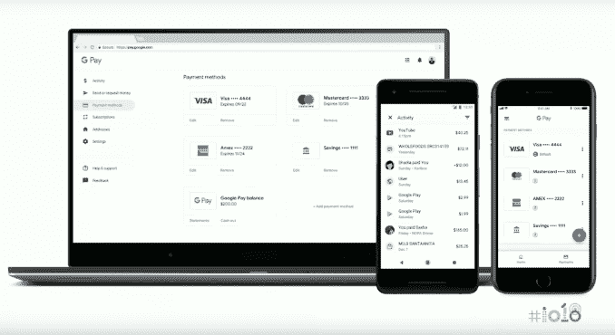
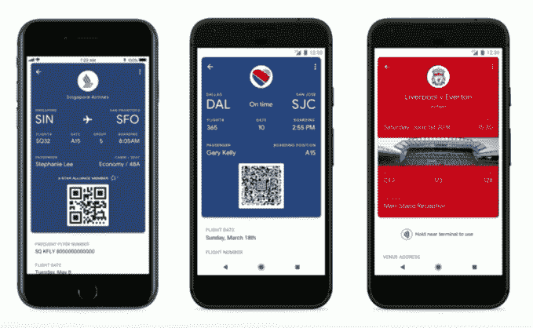

# Google Pay 的应用增加了登机牌、机票、p2p 支付等功能 

> 原文：<https://web.archive.org/web/https://techcrunch.com/2018/05/10/google-pays-app-adds-boarding-passes-tickets-p2p-payments-and-more/>

本周，Google I/O 对 Google Pay 进行了大幅升级。在一次分组会议上，谷歌宣布了其支付平台的一系列变化，最近从 Android Pay 更名为[，包括在主要的 Google Pay 应用程序中支持点对点支付；所有浏览器都支持在线支付；能够在一个地方看到所有的支付，而不仅仅是店内的支付；以及在 Google Pay 的 API 中支持机票和登机牌，等等。](https://web.archive.org/web/20221208005250/https://techcrunch.com/2018/02/20/say-goodbye-to-android-pay-and-hello-to-google-pay/)

Google Pay 的一些扩展之前已经宣布过了，比如它的[计划支持更多的浏览器和设备](https://web.archive.org/web/20221208005250/https://www.blog.google/topics/shopping-payments/5-ways-google-pay-can-save-you-time-and-money/)。

然而，该公司详细介绍了 I/O 的许多其他功能，这些功能现在正在 Google Pay 平台上推出。

一个值得注意的新增功能是对点对点支付的支持，这一功能正在被添加到美国和英国的 Google Pay 应用中

交易历史，以及用户的其他支付，都将被整合到一个地方。

“在即将到来的 Google Pay 应用更新中，我们将允许您管理您的 Google 帐户中的所有支付方式，而不仅仅是您过去在店内支付的支付方式，”Google Pay 产品管理主管 Gerardo Capiel 在 I/O 会议期间表示，“更好的是，我们将为您提供所有交易的整体视图，无论它们是在 Google 应用和服务上，如 Play 和 YouTube， 无论是与第三方商家，如沃尔格林和优步，还是你通过我们的点对点服务与朋友和家人进行的交易，”他说。

该公司还表示，它将允许用户发送和请求资金，管理与他们的谷歌账户相关的支付信息，并通过谷歌支付 iOS 应用程序在网上查看他们的交易历史。

因为 I/O 是一个开发者大会，所以许多新增内容都是以新的和更新的 API 的形式出现的。

首先，谷歌推出了一个新的 API，用于将 Google Pay 整合到其他第三方应用中。

“通过我们的 API，我们将使这些准备支付的用户(他们已经在 Google Pay 上存储了支付信息)也能够在你自己的应用程序和网站上快速轻松地结账，”Capiel 说。

他指出，对那些增加 Google Pay 支持的开发者来说，好处是转化率提高，货币化速度加快。

此外，Google 在 Google Pay APIs 中增加了对机票和登机牌的支持，加入了对优惠和会员卡的现有支持。

这使得 Urban Airship 或 DotDashPay 等公司能够帮助商业客户向 Google Pay 用户分发和更新他们的通行证和门票。

演示结束后，DotDashPay 的创始人兼首席执行官肖恩·阿里埃塔(Sean Arietta)告诉 TechCrunch，“这表明 Google Pay 更加坚定地致力于将数字钱包作为优先事项。”。“这也加强了他们对 DotDashPay 等合作伙伴的关注，以帮助建立消费者和品牌之间的联系。事实上，他们特别强调了从支付开始到 NFC 识别结束的完整体验，这非常强大。它让谷歌支付的故事变得完整，”他补充道。

城市飞艇[也在本周早些时候通过新闻稿宣传这些变化](https://web.archive.org/web/20221208005250/https://www.androidpolice.com/2018/05/08/boarding-passes-tickets-coming-soon-google-pay/)。

Urban Airship 首席执行官兼总裁布雷特·凯恩(Brett Caine)在一份声明中表示:“我们通过在任何数字渠道的正确时间提供正确的信息，帮助企业重塑客户体验，移动钱包在这一愿景中扮演着越来越重要的角色。”。“Google Pay 对机票和登机牌的新支持意味着客户可以随时随地在最需要的时候获得最新信息。”

谷歌在票务方面的一些早期合作伙伴包括新加坡航空公司(Singapore Airlines)、Eventbrite、Southwest 和 FortressGB，后者负责处理英国和其他地方的主要足球联赛门票。

在交通相关的公告方面，继最近在拉斯维加斯和波特兰推出后，谷歌又增加了一些合作伙伴，他们将很快采用 Google Pay 集成，包括加拿大温哥华和英国公交系统。

该公司还提供了 Google Pay 吸引力的最新情况，指出 Google Pay 应用程序在 Google Play 商店的下载量刚刚超过 1 亿次，全球 18 个市场的用户都可以使用该应用程序。

很快，谷歌表示将向全球数十亿谷歌用户推出许多核心功能和 Google Pay 应用程序。

