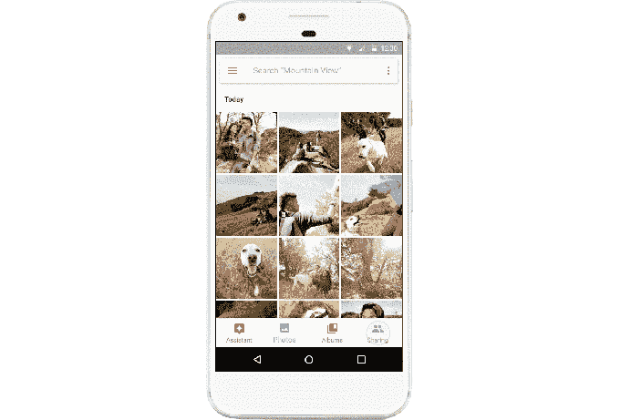
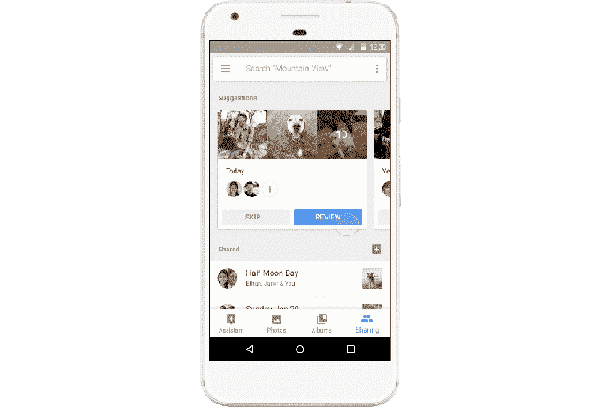
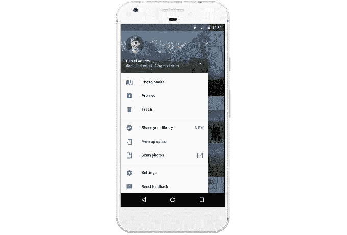

# Google 相册增加了更智能的分享、建议和共享库

> 原文：<https://web.archive.org/web/https://techcrunch.com/2017/06/28/google-photos-adds-smarter-sharing-suggestions-and-shared-libraries/>

Google today [将开始在 Google Photos 中推出新的分享功能](https://web.archive.org/web/20230321223649/https://www.blog.google/products/photos/give-and-get-photos-you-care-about/)，首先是[在五月份的公司 I/O 开发者大会上公布了](https://web.archive.org/web/20230321223649/https://techcrunch.com/2017/05/17/google-photos-upgraded-with-new-sharing-features-photo-books-and-google-lens/)。具体来说，它将推出人工智能支持的建议共享功能和共享库，这两项功能都旨在使谷歌照片应用程序成为更具社交化的体验，而不仅仅是照片记忆的个人收藏。

多年来，公司一直试图找出利用技术的方法，让用户与他人分享他们在智能手机上拍摄的照片。

像 [Flock](https://web.archive.org/web/20230321223649/https://techcrunch.com/2012/07/26/bump-flock/) (谷歌[收购了](https://web.archive.org/web/20230321223649/http://blog.bu.mp/post/71781606704/all-good-things))这样的早期应用尝试使用位置将不同的照片集合在一起，即使它们存在于不同人的手机上；其他像 [Bundle](https://web.archive.org/web/20230321223649/https://techcrunch.com/2015/05/26/bundles-new-app-automatically-organizes-photos-for-you/) 和 [Cluster](https://web.archive.org/web/20230321223649/https://techcrunch.com/2013/02/27/what-a-cluster/) 旨在更好地将照片组织到相册中，认为这样可以解决分享问题；其他人仍然试图模仿短信来改善照片分享。没有一家真的找到牵引力，甚至关门了。

相反，在这一领域取得最大进展的是脸书和谷歌等公司，这要归功于他们对面部识别和人工智能等技术的使用，以及相当大的用户群，这意味着你不必在一些初创公司的新应用程序中重建你的社交网络。

例如，脸书有 [Moments](https://web.archive.org/web/20230321223649/https://techcrunch.com/2016/09/09/facebook-photo-sharing-app-moments-expands-to-web-adds-support-for-full-res-photos/) ，它能找出你手机里的照片里有谁，把他们归类到相册里，然后提示你点击一下就可以分享这些照片。

另一方面，谷歌有 Google Photos——一种在云中备份和存储照片的工具，它还由一个强大的虚拟助手增强。该助理做的事情，如把你的照片变成拼贴画，动画和电影；创建风格化的照片；回顾过去的记忆；将照片整理成相册；还有更多。

随着建议分享功能的增加，Google 相册现在会通过向智能手机推送提醒来提示您分享您拍摄的照片。该功能将使用面部识别技术和机器学习来识别照片中的人，这有助于它了解你通常与谁分享照片等。

它还会查看您在特定地点拍摄的照片，然后通过选择最佳照片(例如，删除模糊或黑暗的照片)将它们整理到一个随时可以共享的相册中。如果您愿意，您可以编辑相册，然后与应用程序建议的人共享，移除建议或添加其他人。

即使您的朋友或家人不使用 Google 相册，您也可以通过文本或电子邮件向他们发送链接来进行分享。

这些共享选项都可以从应用程序的新标签中获得，在那里你可以看到你的建议以及你以前共享的相册，或者其他人与你共享的相册。与脸书时刻类似，当您被邀请加入共享相册时，您可以将自己的照片添加到相册中，供所有人查看。

第二个功能称为共享库，主要是为家庭或重要的其他人设计的。

这使您可以与其他人共享您的整个照片收藏，或者您可以将其配置为仅共享选定的照片，例如，您孩子的照片。儿童照片可能是该功能的最大用例，因为它可以让父母自动共享这些照片。

收件人可以选择保存此库中的部分或全部共享照片，以便在 Google 相册的应用程序中进行搜索。

更新正在 iOS、Android 和 web 上推出，据我们所知，可能会在本周末或最迟下周初完成。

在 I/O 上宣布的其他 Google 相册功能[包括已经在美国推出的 Photo Books，以及将于今年晚些时候推出的](https://web.archive.org/web/20230321223649/https://techcrunch.com/2017/05/17/google-photos-upgraded-with-new-sharing-features-photo-books-and-google-lens/) [Google Lens](https://web.archive.org/web/20230321223649/https://techcrunch.com/2017/05/17/google-lens-will-let-smartphone-cameras-understand-what-they-see-and-take-action/) 。