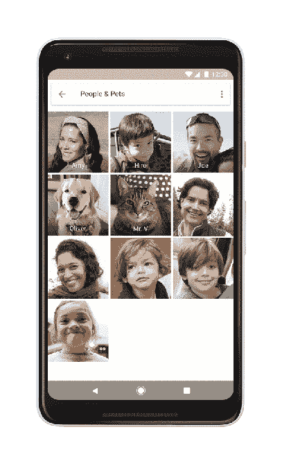

# 谷歌照片变得更加宠物友好

> 原文：<https://web.archive.org/web/https://techcrunch.com/2017/10/16/google-photos-gets-more-pet-friendly/>

# 谷歌照片变得更加宠物友好

如果你是一个使用谷歌照片的宠物主人，你可能以前输入过“狗”或“猫”,以便展示你毛茸茸的朋友的照片——例如，每当有人问你关于你的宠物的时候，这*显然*意味着他们想看毛毛先生的照片。今天，谷歌推出了一种更简单的方法来在其照片应用程序中聚合您的宠物照片——通过允许您将所有宠物的照片分组到一个地方，就在谷歌照片使用面部识别组织的[的旁边。](https://web.archive.org/web/20230402224332/https://support.google.com/photos/answer/6128838?co=GENIE.Platform%3DAndroid&hl=en)

这是对输入“狗”或另一个广义术语的改进，因为该应用程序现在只会将单个宠物的照片组合在一起，而不是返回你拍摄的所有带有“狗”的照片。

像面部分组功能一样，你可以按名字给宠物贴标签，以便更容易地在应用程序中调出它们的照片，或者使用它们的照片创建相册、电影或相册。

此外，谷歌照片可以让你输入动物的品种来搜索宠物的照片，还可以让你使用狗和猫的表情符号来搜索照片。谷歌表示，该公司今年早些时候还推出了一个[功能](https://web.archive.org/web/20230402224332/https://youtu.be/-Dwp4v7zNWA)，可以制作一部由你的宠物主演的迷你电影，但你也可以选择自己制作一部，方法是手动选择照片，然后从六首歌曲中选择一首来配合这部电影。

帮助人们拍摄宠物照片(我们应该注意，还有孩子们的照片)是拍照应用和其他摄影配件的一大卖点。例如，谷歌名为 Clips 的[新相机经过特别设计，通过捕捉没有声音的“运动照片”，然后使用机载机器学习算法来计算出哪些是最佳图像，从而自动拍摄儿童和宠物的最佳照片。](https://web.archive.org/web/20230402224332/https://techcrunch.com/2017/10/04/google-clips-is-a-new-249-smart-camera-that-you-can-wear/)

谷歌表示，谷歌照片中新的宠物友好功能将于今天在全球大多数国家推出。