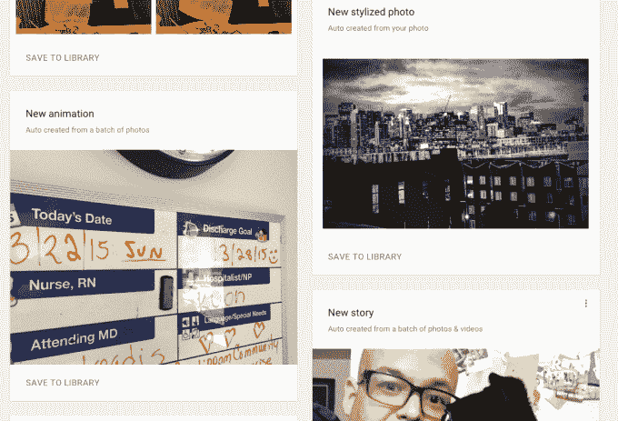
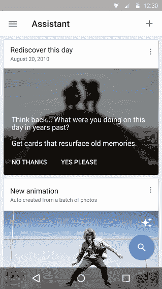

# Google 相册推出“重新发现这一天”,帮助您回忆 

> 原文：<https://web.archive.org/web/http://techcrunch.com/2015/08/20/google-photos-introduces-rediscover-this-day-to-help-you-reminisce/>

[Google 相册](https://web.archive.org/web/20230130235058/https://techcrunch.com/2015/05/28/google-photos-breaks-free-of-google-now-offers-free-unlimited-storage/)希望成为你所有照片(和视频)的家。无论你是否有 u 盘、CD、DVD 或未冲洗的胶片，团队都希望你考虑将它们上传到服务中。为什么？因为那是他们能够创造“奇迹”的时候。

现在，Google 相册将浏览你所有珍贵的图片，将它们转换成动画和故事，或者在上面添加特效。你可以在网上或者通过助手的应用程序得到提醒。这是一个很好的小通知，让你知道某样东西已经不费吹灰之力地被创造出来了。

我与谷歌照片搜索的产品负责人克里斯·佩里(Chris Perry)聊起了最新的自动照片玩具“重新发现这一天”它做你认为它会做的事情，调出三年前的照片，让你回忆过去(或者惹你生气……稍后会有更多的介绍)。)它适用于网络、Android 和 iOS 应用程序。

这有点像《时光跳跃》和《脸书的回忆》——但不尽然。它不会每天打扰你，除非你有一组值得展示的照片。

我问佩里，他们如何才能让这变得有趣，同时又不会很快变得令人讨厌(Timehop 为我做到了这一点)，他说:

> 考虑照片的视觉质量。不截图。我们将看看更长时间跨度内拍摄的照片，这更像是一个“事件”一些能引起情感共鸣的东西。我们关注地标的存在。那些被提升到拼贴画。“人”是一个强烈的信号，我们会用它来提醒您。

> “我一直支持这一功能的最大原因是我从我的分组中获得了巨大的快乐。”克里斯·佩里

所以基本上，仅仅因为一张照片是一年前的今天拍摄的，谷歌照片不一定会打扰我…因为它很可能表明以前没有有趣的事件。有道理。Perry 说这只是这类特性的第一个，还会有更多的特性。此外，您现在可以手动编辑存储在服务上的照片的时间戳，以使此类功能更加准确。

我过去曾公开问过，“[我们该如何处理所有这些照片？](https://web.archive.org/web/20230130235058/http://thenextweb.com/media/2011/10/16/calling-all-startups-what-are-we-going-to-do-with-all-of-these-photos/)“这也是这个产品想要回答的问题。佩里解释说，这个特别的功能之所以出现是因为它很有趣:“我一直支持这个功能的最大原因是我从我的分组中获得了大量的快乐。”

我在谷歌照片上存储了超过 2 万张照片，这是一项我最多每隔几周访问一次的服务。大部分原因是因为我忘记了它的存在，我不得不想象其他使用这项服务的人也会这么说。

在产品中加入小挂钩来吸引人们回来是非常聪明的，尤其是当你已经选择不再关注 Google Photos 的社交组件时，就像 Google 显然做的那样。当然，你可以与他人分享照片、动画或收藏，但这与在脸书或 Instagram 上被标记是不同的，那是保留糖果。

说到分享，谷歌照片现在可以让你将动画以 GIF 格式发布到脸书，以视频形式发布到 Instagram 和 WhatsApp。还是那句话……只是够社交而已。

不过,“重新发现”功能也有它的问题，主要是谷歌照片目前存在的问题。Google 相册搜索的一个很酷的地方是，你可以通过人、地点或事物进行搜索。搜索“狗”,然后将所有与狗相似的照片作为结果返回，这是一种很好的方式。

然而，有时有些东西或人，你宁愿不要在搜索或 Google 相册中花时间制作动画。比如说，男朋友的前女友等等。你明白了。

Perry 告诉我，这是团队正在考虑的事情，但目前还没有任何功能可以让我排除 Google 相册上的一些内容。这是任何“记忆”功能或服务的问题，因为你通常不知道什么会触发你，直到它发生。该功能是选择退出，但遗憾的是不可定制。

没有什么是完美的，对吗？不管怎样，我还能拿我所有的照片做什么呢？