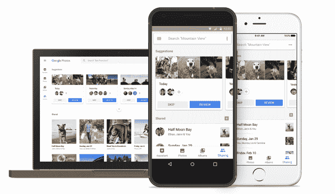
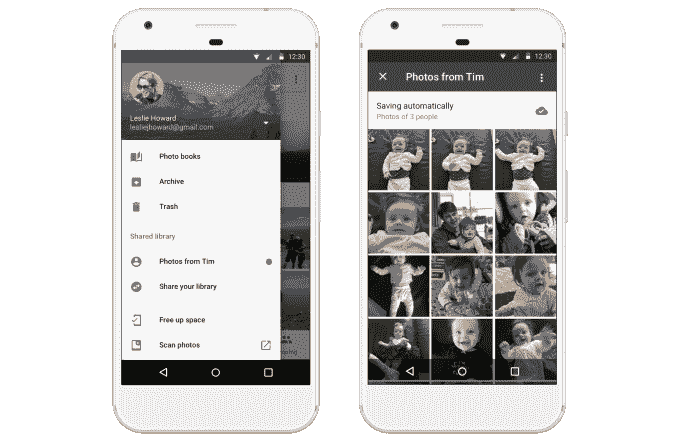
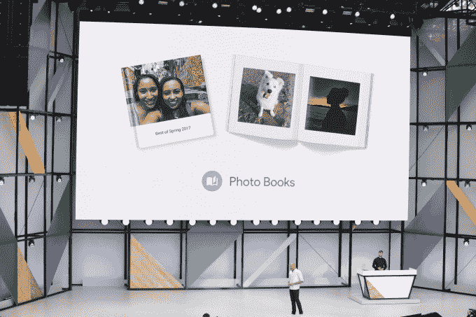
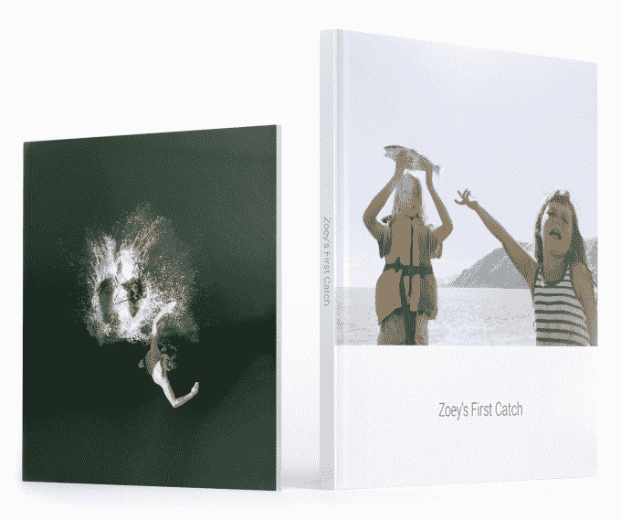
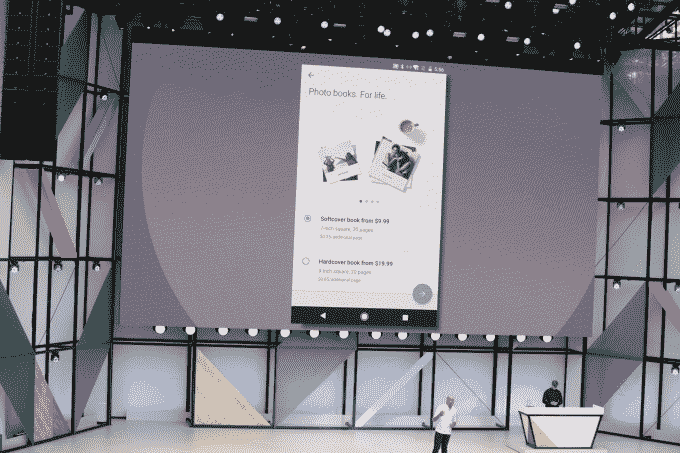

# Google 相册升级了新的共享功能、相册和 Google 镜头

> 原文：<https://web.archive.org/web/https://techcrunch.com/2017/05/17/google-photos-upgraded-with-new-sharing-features-photo-books-and-google-lens/>

谷歌今天[宣布](https://web.archive.org/web/20230321223531/https://blog.google/products/photos/google-photos-500-million-new-sharing/)对其广受欢迎的谷歌照片应用程序进行升级，现在每月有 5 亿人使用该应用程序。该应用程序现在有一个新的社交功能，称为建议共享，它使用面部识别来建议你应该向你的朋友和家人发送哪些照片。另一个名为“共享库”的选项将允许你自动与特定的人分享你的所有照片或照片的子集，例如，最好的朋友或伙伴。

该公司还宣布将提供相册，并将谷歌镜头集成到谷歌照片中。

建议分享很像今天脸书独立的私人分享应用程序脸书时刻中包含的功能。

Google Photos 应用程序将识别您的 Google 联系人中谁在您的照片中，然后轻推您，让您通过应用程序与他们共享您的照片。

谷歌的 Anil Sabharwal 在谷歌开发者大会 Google I/O 的舞台演示中展示了这项功能是如何工作的。

在你拍了一张照片后不久，会弹出一个通知，类似于*“戴夫、杰森和梅根的 5 张新照片。跟他们分享？”*

然后，您可以响应此提醒，自动共享您的照片。对于那些没有应用程序的人，Google 相册甚至会发送短信通知。

谷歌表示，你将能够在一个新的分享标签中看到你所有的分享活动和谷歌照片的分享建议，该标签将在未来几周内在 Android、iOS 和 web 上推出。

第二个功能称为共享库，旨在使您更容易与生活中与您非常亲密的人(如家庭成员、最好的朋友或合作伙伴)共享。

在 Google 相册应用中，你可以打开一个设置，自动与这些指定的联系人共享照片。但是你不必分享你的整个图书馆，Sabharwal 说。相反，您可以选择打开一个功能，让您只共享包含特定个人(或多个人)的照片。

例如，一位妻子可以自动与她的伴侣分享她两个孩子的所有照片，这些照片也会自动显示在他或她的智能手机上。

收件人也可以选择自动保存这些照片，这样它们也会出现在谷歌照片为你制作的搜索、电影、拼贴画和其他作品中。

未来几周，共享图书馆也将在安卓、iOS 和网络上推出。

第三个特色是[相册](https://web.archive.org/web/20230321223531/https://www.google.com/photos/printing)的推出，这之前已经被[彭博](https://web.archive.org/web/20230321223531/https://www.bloomberg.com/news/articles/2017-05-16/google-to-push-ai-smarts-to-iphone-new-photo-books-service)抢先报道了。

有了这次更新，Google 相册将能够识别出你最好的照片，并以纸质、印刷相册的形式提供给你。它还可能会建议你在检测到某个事件发生时购买一本书——比如你刚从家庭度假回来。

谷歌将提供 7 英寸的软皮书或 9 英寸的精装书，谷歌照片将挑选 40 张它认为最好的照片。平装书售价 9.99 美元，精装书售价 19.99 美元。默认情况下，这些书将有 20 页长。

额外的页数会更贵——平装书每增加一页 0.35 美元，精装书 0.65 美元。

相册将从现在开始在桌面上提供，并将于下周在 iOS 和 Android 上发布。

向相册的转移将挑战苹果、亚马逊和 Shutterfly 等老牌照片打印公司。苹果用户目前可以在他们的 Mac 电脑上打印照片应用程序中的书籍，8×6 英寸、20 页的软皮书起价 10 美元，13×10、20 页的定制硬皮书价格高达 50 美元，带防尘套。

亚马逊也在去年秋天推出了自己的照片打印服务，削弱了竞争对手。基本上是 Prime 会员的额外待遇，因为它要求照片存储在 Amazon Drive 中，其相册的精装书和平装书起价为 20 美元。

谷歌的相册在这两个选项上都很有竞争力。

最后，谷歌宣布谷歌镜头——告诉你你的相机正在看什么的机器学习系统——也将进入谷歌照片。

这将允许你对你已经拍过的照片提出问题。

例如，如果你正在查看一个公司网站的截屏，上面有一个电话号码，你只需点击它就可以打电话。

[gallery ids="1492432，1492430，1492428，1492427，1492426，1492424，1492423，1492422，1492421，1492420，1492415，1492413，1492410，1492409，1492407，1407