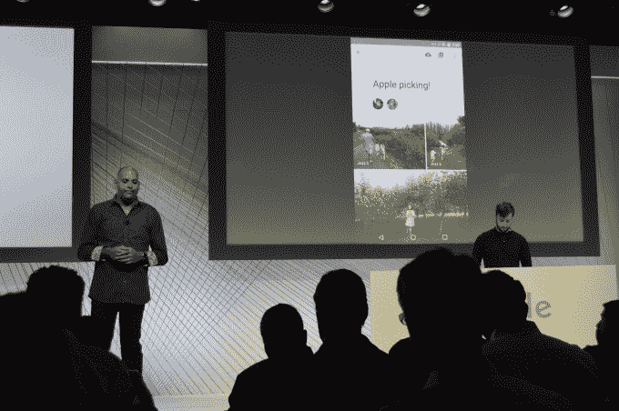

# 谷歌照片用户已经上传了 500 亿张照片和视频

> 原文：<https://web.archive.org/web/https://techcrunch.com/2015/09/29/google-photos-users-have-already-uploaded-50-billion-photos-and-videos/>

# 谷歌照片用户已经上传了 500 亿张照片和视频

今天，Google 相册宣布用户已经上传了 500 亿张照片和视频。该产品大约在四个月前推出，作为一个独立产品从 Google+中退出。该团队还宣布了三项新功能。

功能一允许人们创建图片库，并与朋友和家人分享。这是一些其他应用程序拥有的相册协作方法，但当你在 Google 相册中拥有你曾经拍摄的每张照片时……这种体验是很棒的。要查看与朋友分享的照片，人们不一定要有谷歌照片应用程序，但可以订阅电子邮件通知。这将在“今年晚些时候”推出

任何谷歌产品的伟大之处在于搜索，该团队引入了标记你生活中重要人物的功能。当照片通过并标记人们时，你可能想看到一些人而不是其他人，你可以给他们贴上任何你想要的标签。" ChubbyBunny " "妈妈"什么的。本周即将登陆 Android，稍后登陆 iOS/desktop。

最后，整个谷歌照片体验现在将在 Chromecast 上提供；您现在可以将您的 Google 相册投射到设备上。它定制了您的 Chromecast 体验，并消除了山脉的随机照片。甚至可以投动画 gif。它将于本周晚些时候在 Android 和 iOS 上发布。

