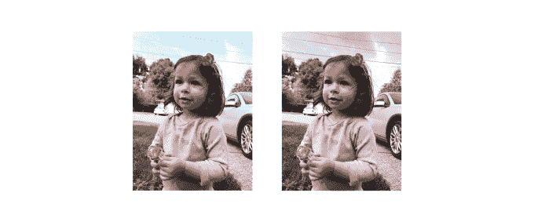
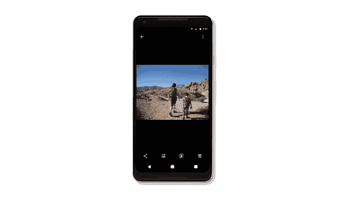

# 谷歌照片将增加更多人工智能修复，包括黑白照片的彩色化技术

> 原文：<https://web.archive.org/web/https://techcrunch.com/2018/05/08/google-photos-will-add-more-ai-powered-fixes-including-colorization-of-black-and-white-photos/>

Google Photos 已经让用户可以通过内置的编辑工具和智能的人工智能功能来自动创建拼贴画、动画、电影、风格化照片等，轻松修改他们的照片。现在，该公司正在让修复照片变得更加容易，新版谷歌照片应用程序将在你正在查看的照片下方建议快速修复和其他调整，例如旋转、亮度校正或添加颜色。

今天在谷歌 I/O 开发者大会的舞台上介绍的这些变化，是今年让人工智能技术更接近最终用户这一主题的又一个例子。

在 Google Photos 的例子中，这意味着不再只是将人工智能隐藏在“助手”标签中，而是直接放在主界面中。

该公司表示，将修复建议添加到照片本身的想法是因为他们意识到这是应用程序最活跃的地方。

谷歌照片产品负责人戴夫·利布(Dave Lieb)在早些时候接受 TechCrunch 采访时解释说:“随着谷歌照片多年来的显著发展，我们的一个见解是，人们花了很多时间来查看谷歌照片中的照片。”。“他们每天大约有 50 亿次照片浏览，”他补充道。

这让该团队认为，他们应该专注于解决人们在看照片时看到的一些问题。

谷歌照片将在本周推出的变化中开始这样做。

例如，如果你看到一张太暗的照片，你可以点击照片下方的一个小按钮来调整亮度。如果照片是侧放的，您可以按一个按钮来旋转它。当然，通过手动访问编辑工具，这些事情您以前就可以完成。但更新后的应用程序现在只需点击一下就能修复。

受谷歌 Photoscan 技术启发的新工具也将通过放大、裁剪和校正照片来修复文件和文书的照片。

一个工具将分析照片中的人，并提示你与他们分享照片，类似于之前推出的分享建议功能。另一个提示你存档旧收据的照片。还有一个叫做“彩色弹出”，它会通过将背景变成黑白来识别什么时候可以弹出前景中的人。

除了本周到来的新工具，谷歌还准备了一个“彩色化”工具，将黑白照片转换成彩色图像。这个工具也是受 Photoscan 的启发，因为谷歌发现人们在扫描旧的家庭照片，包括黑白照片。

“我们的团队想，如果我们将计算机视觉和人工智能应用于黑白照片，会怎么样？我们能重新制作这些照片的彩色版本吗？”利布说。他们想看看技术是否可以被训练来给图像重新着色，这样你就可以真正看到当时的样子，或者至少是非常接近的样子。这就是着色的工作方式，当它准备好的时候。

神经网络将试图推断照片中最合适的颜色——例如，将草地变成绿色。做好其他事情——比如肤色——可能会更棘手；因此，他们说，在“真正正确”之前，该团队不会推出这项功能。

谷歌照片的新功能是与谷歌照片库 API 的开发者预览版一起宣布的，该版本允许第三方开发者利用谷歌照片的存储、基础设施和机器智能。更多的是这里的。

