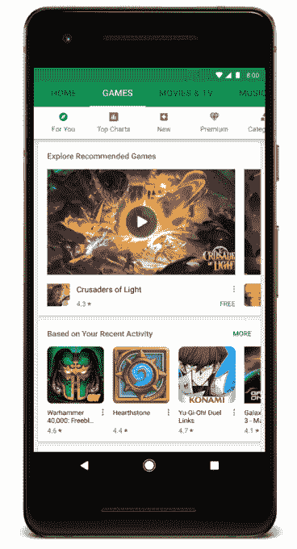
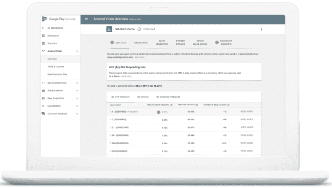

# Google Play 通过“立即尝试”按钮添加了 Android 即时应用，还有其他变化 

> 原文：<https://web.archive.org/web/https://techcrunch.com/2017/10/19/google-play-adds-android-instant-apps-via-a-try-it-now-button-among-other-changes/>

谷歌今天宣布了对其 Google Play 应用商店的一些改变，最值得注意的是一种新的方法，可以立即试用应用程序，而不必先安装在你的移动设备上。这项新功能利用了“安卓即时应用”技术——谷歌试图在移动网络世界和本地应用之间架起一座桥梁。

即时应用在去年的谷歌 I/O 开发者大会上首次推出。与必须完整下载的本地应用不同，即时应用只需点击一个 URL 即可启动。为了支持这一点，开发人员将他们的应用程序划分成小的、可运行的部分，这样他们可以在几秒钟内启动。在谷歌 2017 年 I/O 大会上宣布该技术将于今年 5 月在 T2 全面发布之前，该技术只对特定开发者开放。

谷歌表示，如今，即时应用正成为 Play Store 的一部分。通过一个新的“立即尝试”按钮，用户可以开始使用一个应用程序，而不用安装它。

现在有一个[的即时应用小集合](https://web.archive.org/web/20221205115531/https://play.google.com/store/apps/collection/promotion_3002d0f_instantapps_featuredapps?e=-EnableAppDetailsPageRedesign)，包括来自 BuzzFeed、NYTimes(纵横字谜)、Hollar、Red Bull、Skyscanner 等的应用。

该功能是谷歌今天宣传的 Play Store 的几项改进之一。

首先，改版后的[编辑选择](https://web.archive.org/web/20221205115531/https://play.google.com/store/apps/topic?id=editors_choice)栏目现已在 17 个国家上线。

它推出了一个以预告片和游戏截图为特色的游戏新家。本版块将很快推出新版块——一个是付费游戏版块(“Premium”)，另一个是即将推出的热门游戏版块(“new”))

它还扩展了“实时操作”横幅和卡片，提醒用户已经安装的游戏中的事件。该功能旨在帮助用户在初次安装后重新参与进来。

该公司还提到了其他推荐的应用程序集合。

这包括最近扩大的“Android Excellence”获奖应用的[组——那些](https://web.archive.org/web/20221205115531/https://android-developers.googleblog.com/2017/10/android-excellence-congratulations-to.html)[谷歌认为](https://web.archive.org/web/20221205115531/https://beta.techcrunch.com/2017/06/13/google-play-introduces-android-excellence-collections-that-showcase-editorially-selected-top-apps-and-games/)非常注重设计、用户体验和性能的应用——及其[独立游戏节获奖者](https://web.archive.org/web/20221205115531/https://android-developers.googleblog.com/2017/09/announcing-winners-from-indie-games.html)。(旧金山竞赛刚刚结束，谷歌已经为其欧洲对手开放了提名。)

这种对编辑建议的关注并不是谷歌独有的。苹果新的应用程序商店也是高度编辑驱动的，除了推荐之外，还有更长的功能、评论、采访、列表等等。

**Google Play 主机升级**

除了 Play Store 面向消费者的新功能，Google Play 控制台也在改进，为开发者增加了新功能。

这包括五个新的衡量标准(被称为 [Android Vitals](https://web.archive.org/web/20221205115531/https://support.google.com/googleplay/android-developer/answer/7385505) )，用于了解应用程序的技术性能；改进了面向所有开发者的发布前报告，允许他们查看他们的 alpha 和 best 应用的测试实验室结果；针对特定国家的 alpha 和 beta 版本的能力；以及对[设备目录](https://web.archive.org/web/20221205115531/https://support.google.com/googleplay/android-developer/answer/7353455)的改进，因此更容易看出为什么某个特定设备不支持你的应用。

另一组改进集中在附加订阅业务的应用程序上。这也是苹果在改进后的应用商店中改变的一个领域，在第二年，苹果与开发者的分成从 70/30 降至 85/15。([谷歌随后同意做同样的事情](https://web.archive.org/web/20221205115531/https://www.recode.net/2016/6/8/11889298/google-apple-subscription-app-revenue-share)；那也是[现在直播](https://web.archive.org/web/20221205115531/https://www.theverge.com/2017/10/19/16502152/google-play-store-android-apple-app-store-subscription-revenue-cut)今天。)

现在，谷歌表示，它正在通过 [Play Billing Library](https://web.archive.org/web/20221205115531/https://developer.android.com/google/play/billing/billing_library.html) 和[新测试工具](https://web.archive.org/web/20221205115531/https://developer.android.com/google/play/billing/billing_testing.html)简化测试成功和不成功支付的流程，让开发者更容易设置和管理订阅服务。它还允许更短的免费试用期(最少 3 天)，关于取消的可选通知；帐户持有人阻止不玩用户；和其他项目。

今天还将推出一项新的 Google Play 安全奖励计划。([更多细节在这里](https://web.archive.org/web/20221205115531/https://beta.techcrunch.com/2017/10/19/google-will-pay-you-1000-to-hack-some-of-androids-most-popular-apps))。)

鉴于 Play Store 如今在 190 个国家拥有超过 20 亿用户，像这样的 Play Store 和 Play Console 的变化具有相当大的影响。谷歌指出，仅去年一年，就有 820 亿个应用被下载，安装量超过 100 万的开发者数量比前一年增长了 35%。