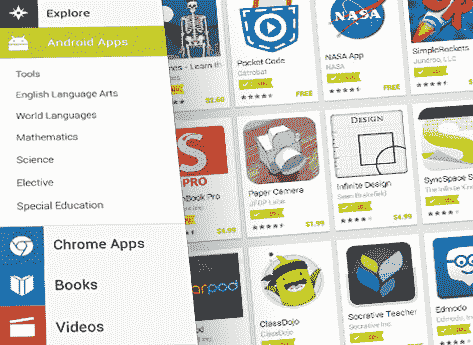

# 用于教育的 Google Play 超越了平板电脑，现在也可用于 chrome book 

> 原文：<https://web.archive.org/web/https://techcrunch.com/2014/06/25/google-play-for-education-goes-beyond-tablets-now-available-for-chromebooks-too/>

# 用于教育的 Google Play 不仅限于平板电脑，现在也可用于 Chromebooks

去年 11 月，谷歌[推出了 Google Play for Education](https://web.archive.org/web/20221210011643/https://beta.techcrunch.com/2013/11/13/google-challenges-apples-dominance-in-schools-with-google-play-for-education-now-shipping-on-new-tablets/) ，这是一个让教师和学校更容易购买 Android 应用程序、书籍和教育 YouTube 视频的门户网站，并将其分发给学生。当时，该计划仅专注于平板电脑，但从今天开始，该团队也推出了对 Chromebooks 的支持。

借助改版后的 Google Play for Education，教师现在可以让学生从一个网站访问 Android 应用程序和 Chrome 应用程序、书籍和视频。根据谷歌的数据，目前约有 1 万所学校使用 chrome book(其中一些学校同时使用 chrome book 和平板电脑)。

正如谷歌负责 Google Play for Education 的产品经理里克·博罗沃伊(Rick Borovoy)本周早些时候告诉我的那样，该团队决定从平板电脑开始，因为他们对平板电脑在课堂上的使用案例特别感兴趣。当时，Borovoy 并不完全相信学校会有兴趣让学生在 Chromebooks 上阅读书籍，或者他们会对学生的 Chrome 应用程序感兴趣。然而，老师们立即开始要求谷歌提供 Chrome OS 版本的商店，Borovoy 和他的团队在今年早些时候开始试点这个项目。

在 Chrome OS 方面，Google Play for Education 的工作方式与以前非常相似。例如，应用程序是由一组精选的教师管理的。Borovoy 指出，消费者应用商店往往为用户提供大量的选择，因此该团队希望给教师提供少量以前经过审查的应用。

就像在旧版本中一样，他们也可以访问谷歌的学校书店，然后他们可以为他们的学生租赁或购买书籍，起价为每个学生 1 美元，为期 60 天。Borovoy 指出，现在学校最感兴趣的是贸易书籍，大多数人对电子书形式的教科书并不感兴趣。

例如，学校还可以在谷歌上设立采购订单账户，这样老师就可以更容易地为他们的班级或可能对某个特定主题感兴趣的个别学生进行采购。以前，这通常意味着老师们会自掏腰包，然后设法得到补偿——这种情况并不总是发生。有了 Google Play for Education，学校可以简单地让教师能够进行购买(在设定的限额内)。

“我们的目标是找到痛点和未开发的机会，”Borovoy 告诉我。他说，通过提供对平板电脑和 Chromebooks 的支持，“学校不必首先考虑设备。”当他们想要为学生的笔记本电脑或平板电脑添加应用程序时，他们也不需要 IT 部门的参与，这可能是一个很大的麻烦，并会剥夺教师的任何自发性，特别是在 IT 部门经常人手不足的学校系统中。