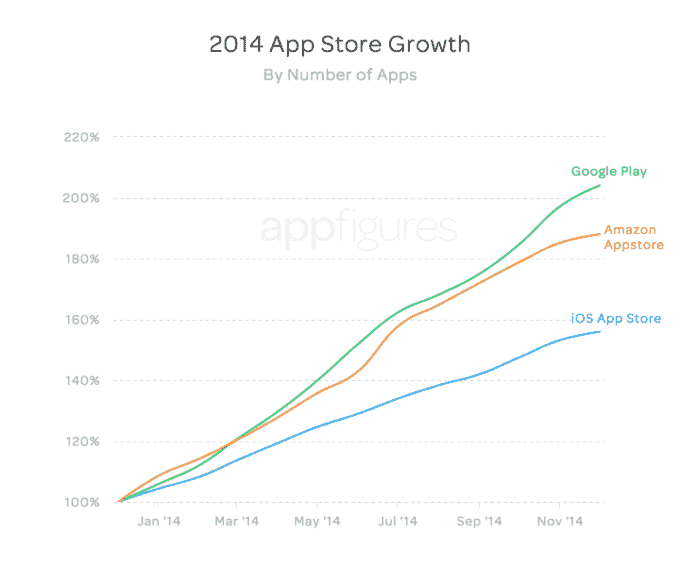
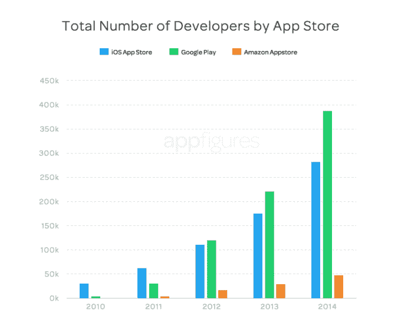
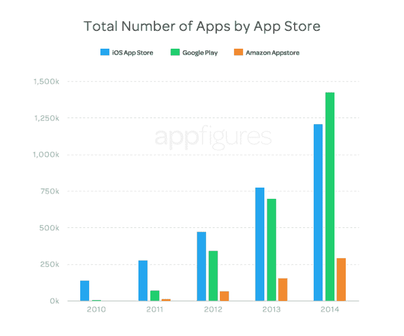
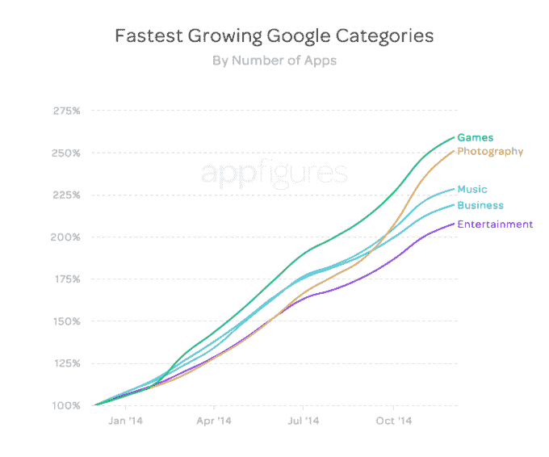

# 报告:2014 年，Google Play 的应用商店和开发者社区的增长速度超过了苹果

> 原文：<https://web.archive.org/web/https://techcrunch.com/2015/01/13/google-plays-app-store-and-developer-community-grew-faster-than-apples-in-2014/>

根据 appFigures 今天早上发布的一份新报告，Google Play 移动应用市场在 2014 年首次在新应用数量上超过了苹果，其开发者社区的增长也连续第三年超过了苹果，现在分发来自 388，000 个不同开发者的应用。报告指出，大部分增长发生在下半年，并引用了今年初夏发布的数据进行对比。

2014 年加入谷歌的开发者比苹果和谷歌加起来还多，使其超过了苹果的 282，000 名开发者和亚马逊的 48，000 名开发者。

总体而言，应用程序开发也在增长，2014 年这三个应用程序商店都增长了至少 50%。但是报告发现，谷歌商店在 T4 确实在增长。

Google Play 的应用总数也超过了苹果，其目录中有 143 万个应用，而苹果只有 121 万个。亚马逊远远落后于第三名——尽管 2014 年其目录增长了 90%，但它仍然只有 293，000 个应用。

苹果和谷歌商店规模的差异与两家公司选择管理其移动应用市场的方式有很大关系。苹果对开发者的应用程序进行更广泛的审查，而谷歌允许其开发者直接发布，只是在事后介入，以处理违反服务条款或移动恶意软件传播等问题。

此外，appFigures 报告称，2014 年增长最快的五大 iOS 应用类别分别是商务、餐饮、生活方式、社交网络和目录。在 Google Play 上，热门类别是游戏、摄影、音乐、商业和娱乐。

我们应该指出，这与本月早些时候 [Flurry 发布的年终报告](https://web.archive.org/web/20230329175244/https://techcrunch.com/2015/01/06/app-usage-grew-76-in-2014-with-shopping-apps-leading-the-way/)不同，该报告发现，2014 年增长最快的应用类别是购物、公用事业&生产力和消息。

但这里的差异可能与 appFigures 分别分析了这两个市场，同时也使用了略有不同的分组方式有关。例如，移动购物应用程序通常在生活方式类别中占主导地位，而一些消息应用程序可能会发现自己被列在社交网络下。与此同时，商业和生产力类别之间当然也有一些重叠。

换句话说，Flurry 和 appFigures 的报告不是直接比较。

就苹果 iTunes 上来自*新*开发者的应用增长而言，大多数是发布商业应用，其次是生活方式，然后是游戏。在 Google Play 上，游戏最受新开发者的欢迎，其次是商业和娱乐应用。

appFigures 报告中的数据直接来自其数据库，其中包含三个应用商店的所有应用。该公司开始分析时，按年度汇总了各个商店的应用程序。但是，由于不同的商店有不同的目录大小，它着眼于与上一年相比的增长，而不是绝对数字，使得 2013 年底的值为 100%。这意味着图表上标记为 200%的任何增长实际上都是商店翻倍。

请记住，仅仅因为谷歌在增长方面超过了苹果，这并不一定是开发者偏好的衡量标准。许多应用程序开发者仍然首先在 iOS 上启动，然后构建他们的 Android 应用程序。这是因为苹果是开发者创造大部分收入的地方。但是谷歌的增长暗示了苹果应用商店的成熟——尽管仍在增长，但与其他年份相比，部分增长已经放缓。与此同时，在 iOS 应用商店获得成功的开发者现在正在将他们的足迹扩展到 Google Play，特别是随着国际市场的开放。