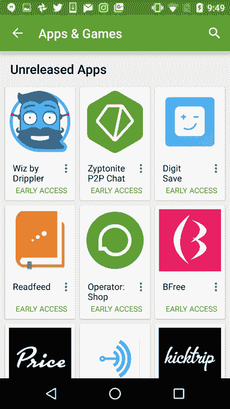
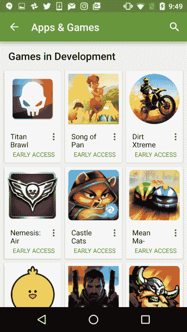

# Google Play 的测试项目“早期访问”向更多开发者开放 

> 原文：<https://web.archive.org/web/https://techcrunch.com/2016/09/01/google-plays-beta-testing-program-early-access-opens-to-more-developers/>

# Google Play 的测试项目“早期访问”向更多开发者开放

谷歌今天正在向更多的开发者开放其“早期访问”测试项目。这个名为[的项目于今年春天](https://web.archive.org/web/20221025222818/https://beta.techcrunch.com/2016/05/18/android-developers-get-new-beta-testing-analytics-and-pre-launch-tools-in-google-play/)早些时候推出，让 Android 开发者能够在公开发布之前，更好地接触到那些愿意在测试阶段试用他们应用的早期用户。通过谷歌 Play 商店上的“早期访问”部分，用户可以发现一系列有趣的新应用程序供下载。

最初，只有 29 个精心挑选的应用和游戏合作伙伴才能加入该计划，但今天谷歌正在更广泛地开放“早期访问”。

虽然谷歌已经为开发者提供了一种对他们的应用进行公开测试的方式，但在 5 月份，它开始允许开发者直接从 Play Store 登录页面注册用户进行测试。与此同时，Google Play 上的“早期访问”集合的想法是为那些还没有活跃用户社区的开发者突出显示最好的即将到来的应用。

在集合对所有 Google Play 用户开放后的一个多月内，开放测试版的安装次数超过了 100 万次。语言学习开发商 [Lingbe](https://web.archive.org/web/20221025222818/https://play.google.com/apps/testing/com.lingbe.app) 、在线图书俱乐部 [Readfeed](https://web.archive.org/web/20221025222818/https://play.google.com/store/apps/details?id=com.readfeedinc.readfeed&e=-EnableAppDetailsPageRedesign) 和 [Lego](https://web.archive.org/web/20221025222818/https://play.google.com/store/info/topic?id=lego&hl=en&e=-EnableAppDetailsPageRedesign) 等发布合作伙伴参与了“早期访问”，利用他们的位置来吸引用户，验证他们应用的概念，获得反馈，找出漏洞，测试游戏机制等。

然而，被列入“早期访问”之前是由谷歌单独决定的。没有办法申请一个位置。如今，这种情况发生了变化——谷歌为 Android 开发者引入了一个注册流程，允许他们提名自己的应用程序供考虑。

当然，这并不能保证该应用程序会被包含在“早期访问”中，但这至少是一种请求包含的方式。谷歌表示，每周都会增加新的游戏，数千名用户可以进行测试。

该计划的扩展正值谷歌(和苹果)正在努力寻找更好的方法来帮助独立开发者在已经成为相当大的移动应用市场中发现他们的应用。Google Play 现在有超过 200 万个应用程序可供下载，这意味着通过浏览排行榜或类别来寻找新的应用程序和游戏并不总是高效的。通常，用户通过应用商店搜索、广告和口碑推荐找到新应用。

能够在发布前测试应用程序以解决问题是有价值的，因为你可能[只有一次机会在下载后保持用户的兴趣](https://web.archive.org/web/20221025222818/https://beta.techcrunch.com/2016/05/31/nearly-1-in-4-people-abandon-mobile-apps-after-only-one-use/) …如果他们曾经发布过应用程序的话。