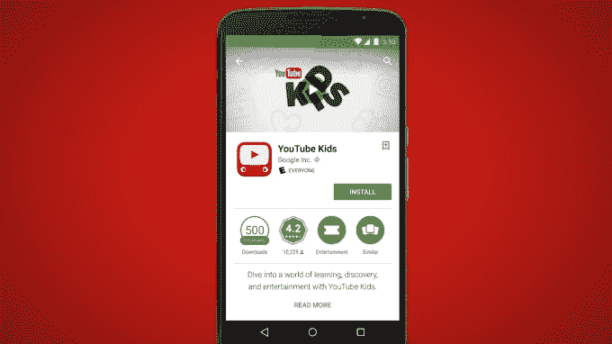

# Google Play 的新程序“为家庭设计”将突出强调预先批准的、儿童安全的应用程序 

> 原文：<https://web.archive.org/web/https://techcrunch.com/2015/04/14/google-plays-new-program-designed-for-families-will-highlight-pre-approved-kid-safe-apps/>

谷歌今天宣布了一项名为“[专为家庭](https://web.archive.org/web/20221006075217/https://developer.android.com/distribute/googleplay/families/about.html)设计的新开发计划，该计划将允许应用程序出版商选择加入额外的审查，以将其应用程序标记为“家庭友好型”。这一新的名称最终将进入 Google Play，尽管该公司尚未透露这组应用程序一旦出现将如何被发现的具体细节。

谷歌[解释说](https://web.archive.org/web/20221006075217/http://android-developers.blogspot.com/2015/04/helping-developers-connect-with.html)它的应用程序市场有许多开发者，像**[PBS Kids](https://web.archive.org/web/20221006075217/https://play.google.com/store/apps/developer?id=PBS+KIDS&hl=en)[Tynker](https://web.archive.org/web/20221006075217/https://play.google.com/store/apps/developer?id=Tynker&hl=en)和 [Crayola](https://web.archive.org/web/20221006075217/https://play.google.com/store/apps/developer?id=Crayola%2C%20LLC&hl=en) ，他们的应用程序提供高质量、适合年龄的内容，并提供用户界面和功能来教育和娱乐年轻的孩子。**

 **但是今天，这些“更好”的应用程序与其他不一定相同的应用程序混杂在一起。这可能会让父母难以发现他们希望孩子玩和使用的应用程序类型。

谷歌告诉我们，要获得资格，应用程序将需要满足“严格的法律和政策要求”，并需要接受专门的运营审查。

在此之前，最近有消息称[谷歌已经悄悄为 Google Play 开发者实施了一项应用审查计划](https://web.archive.org/web/20221006075217/https://beta.techcrunch.com/2015/03/17/app-submissions-on-google-play-now-reviewed-by-staff-will-include-age-based-ratings/)，该计划相对来说已经被忽视了几个月。这主要是因为谷歌将基于算法的筛选和人工审查相结合，能够将审批时间从几天缩短到几小时。

有了这个额外的“为家庭设计”计划，可能会有一个比标准审查更长的过程。开发者可以通过 Google Play 开发者控制台选择他们的应用或游戏。在那里，谷歌将审查提交的内容，以确保它符合[这些新的指导方针](https://web.archive.org/web/20221006075217/https://support.google.com/googleplay/android-developer/answer/6184502)以及通常的 [Google Play 开发者内容政策](https://web.archive.org/web/20221006075217/https://support.google.com/googleplay/android-developer/answer/113474?hl=en&rd=1)和[开发者分发协议](https://web.archive.org/web/20221006075217/https://play.google.com/about/developer-distribution-agreement.html)。

谷歌的资格标准及其政策指南是内部制定的，但基于与广告定位和数据收集相关的行业最佳实践，并与谷歌的合作伙伴密切合作。例如，应用程序必须符合 [COPPA](https://web.archive.org/web/20221006075217/http://www.coppa.org/) (儿童在线隐私保护规则)和所有其他适用的儿童隐私法规。

他们还需要被评为 ESRB“人人”或“人人 10+”或一个地区的同等级别，通过[谷歌最近实施的内容评级系统](https://web.archive.org/web/20221006075217/https://beta.techcrunch.com/2015/03/17/app-submissions-on-google-play-now-reviewed-by-staff-will-include-age-based-ratings/)。

新的程序将高质量的儿童应用程序从较大的应用程序池中分离出来，这似乎类似于竞争对手苹果公司在其应用程序商店中的旧的[“儿童”部分，该部分也具有符合各种隐私和广告相关准则的精选、审查的应用程序。也像苹果商店一样，行为广告——包括基于应用内活动的广告——将不会被允许出现在谷歌的程序中。相反，应用程序被限制为每页显示不超过一个广告位置，并且这些广告必须与应用程序内容相区分。不允许基于兴趣的广告或再销售。](https://web.archive.org/web/20221006075217/https://beta.techcrunch.com/2013/09/22/introducing-apples-new-kids-app-store/)

该计划推出完成后，谷歌有一个初步选择的“家庭友好”的应用程序推荐，它将在 Google Play 上向用户推广这些内容。该公司没有说明这将如何或何时发生(除了指出将“再过几周”)，但似乎可能会有一些新的类别或部分，只有家庭友好的应用程序可以浏览和下载。如果谷歌有一天选择让 Android 的家长控制可以被配置为只有这些被批准的应用程序才能被孩子下载，这也是有意义的。

如果一个应用程序在获得批准后开始违反这些规则，它可能会被完全从 Google Play 中删除——这种惩罚可能会阻止更可疑的公司试图偷偷进入该程序，这是一种诱饵和开关的方式。

随着谷歌移动应用生态系统的成熟，该公司一直在对其市场进行大量改革，其中许多似乎是在追随苹果的脚步。迄今为止，从新的[应用审查流程](https://web.archive.org/web/20221006075217/https://beta.techcrunch.com/2015/03/17/app-submissions-on-google-play-now-reviewed-by-staff-will-include-age-based-ratings/)到[内容评级](https://web.archive.org/web/20221006075217/https://beta.techcrunch.com/2015/03/17/app-submissions-on-google-play-now-reviewed-by-staff-will-include-age-based-ratings/)，以及现在这个适合家庭的儿童应用选择。但对于谷歌，该公司的优势——或劣势，取决于你的观点——是它可以自动化传统应用审查过程的更多部分，而不是严重依赖人工编辑和审查人员来管理应用。

这些能力也可以在这里发挥作用，因为谷歌正在努力完善其努力，以扩大新程序的规模。**