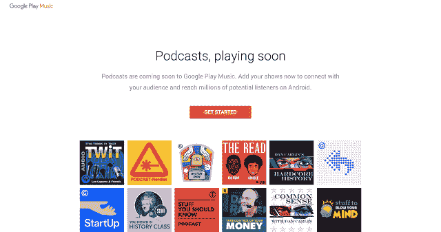
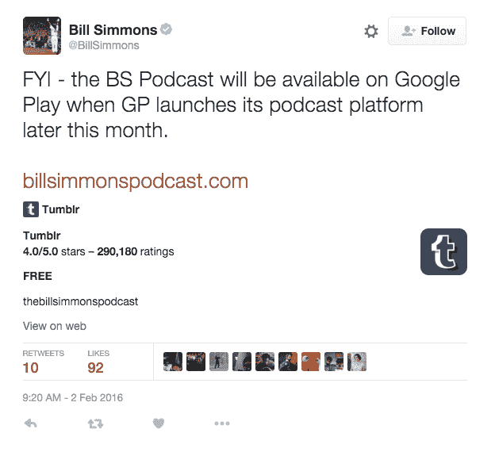

# Google Play 播客平台发布在即 

> 原文：<https://web.archive.org/web/https://techcrunch.com/2016/02/03/google-plays-podcast-platform-launch-appears-imminent/>

谷歌[去年 10 月宣布](https://web.archive.org/web/20221210000147/http://officialandroid.blogspot.com/2015/10/podcasters-welcome-to-google-play-music.html)计划在 Google Play 中支持播客，现在看来该功能已经准备好推出了。一些用户报告说，他们看到新的播客部分出现在他们的 Google Play 音乐应用程序的左侧导航菜单中，位于排行榜、新专辑和音乐库部分的下方。

这显然不是一个大规模的推广，因为大多数人还没有看到播客部分。此外，谷歌还没有正式宣布推出这项服务，这很可能是在播客支持对大多数用户开放或很快开启时。

然而，对于那些可以访问播客的人来说，他们形容它看起来很像 Play Music 应用程序的其他部分，具有卡片风格的布局和橙色配色方案。一位消息人士告诉 [Android Police 博客](https://web.archive.org/web/20221210000147/http://www.androidpolice.com/2016/02/03/google-play-musics-podcasts-interface-and-functionality-is-live-for-some-users/)，该剧的页面还包括他们的作品，一个可点击的“播放”按钮，以及订阅、分享该剧或查看剧集列表的选项。

他们还分享了一些该部分的图片:

[gallery ids="1272382，1272383，1272385"]

*图片来源:[安卓警察](https://web.archive.org/web/20221210000147/http://www.androidpolice.com/2016/02/03/google-play-musics-podcasts-interface-and-functionality-is-live-for-some-users/)*

用户说，当你订阅时，系统会问你是否要下载最后五集，并通知你有新的发布。

同时，在收听节目时，你可以选择点击按钮，将节目倒回 30 秒或向前跳过。

一个明显缺失的功能是改变播客速度的选项，这是高级用户在收听教育音频节目时经常依赖的工具，它更多的是吸收信息，而不是悠闲地欣赏节目。

令人有点难以置信的是，谷歌花了这么长时间才在其音乐服务中支持流行娱乐类型，这是苹果 iTunes 的竞争对手。

然而，谷歌[确实向](https://web.archive.org/web/20221210000147/http://officialandroid.blogspot.com/2015/10/podcasters-welcome-to-google-play-music.html)承诺，它将提供独特的播客推荐。去年秋天，该公司表示，它将根据新听众正在做的事情、他们的感受或其他兴趣，将新听众与节目联系起来，类似于其音乐的上下文播放列表。

不清楚用户现在看到的部分是否或如何实现了这一点，因为界面本身似乎是一个非常基本的两个标签的事情——一个部分用于特色播客，另一个部分用于你的播客。

用户也可以搜索或浏览找到其他标题。

对于一些人来说，该部分上线的消息是在关于播客平台推出时间的意外泄露之后发布的。

根据现已被删除的《格兰地》杂志前主编比尔·西蒙斯的推文，Google Play 将于本月晚些时候推出播客。他昨天在宣传他自己的节目《比尔·西蒙斯播客》时这样说道。Droid-life 设法在推特消失前截屏:

鉴于这些报告，我们已经询问谷歌是否可以对推出的状态进行评论，如果提供声明，我们将更新。

**更新**:谷歌拒绝置评。然而，我们现在已经确认，谷歌尚未正式推出播客，尽管在野外发现了什么。