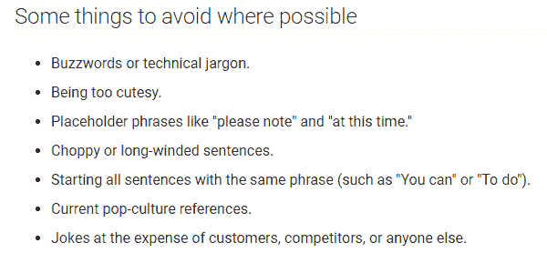
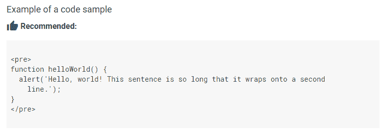

# 谷歌为开发者发布文档风格指南

> 原文：<https://web.archive.org/web/https://techcrunch.com/2017/09/07/google-publishes-its-documentation-style-guide-for-developers/>

# Google 为开发者发布了文档风格指南

文档通常是事后才想到的——尤其是对于开源项目。举例来说，这会让新人更难加入一个项目，有时写得不好的文档比根本没有文档更糟糕。为了帮助开发者写出更好的文档，谷歌本周[开放了](https://web.archive.org/web/20230315095320/https://developers.googleblog.com/2017/09/making-google-developers-documentation.html)它自己的[开发者文档风格指南](https://web.archive.org/web/20230315095320/https://developers.google.com/style/)。

 这是谷歌内部使用的风格指南，用于编写自己的项目文档，如 Kubernetes 和 Dart。

该指南本身包括从单词列表到确保行业术语拼写一致的所有内容(例如，它是“数据中心”，而不是“数据中心”)，如何使用连字符(以及何时不使用)，为什么应该使用主动语态和其他基础知识。然而，开发人员可能更关心的是，该指南还谈到如何编写好的 [API 代码注释](https://web.archive.org/web/20230315095320/https://developers.google.com/style/api-reference-comments)以及如何最好地记录[命令行语法](https://web.archive.org/web/20230315095320/https://developers.google.com/style/code-syntax)。

包括 [Atlassian](https://web.archive.org/web/20230315095320/https://developer.atlassian.com/about/style-guide-for-the-atlassian-developer-documentation) 、 [WordPress](https://web.archive.org/web/20230315095320/https://developer.wordpress.com/themes/documentation-style-guide/) 和 [Salesforce、](https://web.archive.org/web/20230315095320/https://developer.salesforce.com/docs/atlas.en-us.salesforce_pubs_style_guide.meta/salesforce_pubs_style_guide/overview.htm)在内的其他公司也公开了他们的风格指南，尽管很少有公司像谷歌这样深入，尤其是在基本方面。

风格指南背后的团队指出，这是一个活的文档，它会随着时间的推移而改变。它还强调，这只是做事的一种方式——在这个世界上，MLA 指南的支持者仍然经常与芝加哥风格的派系和 AP Stylebook 的粉丝(我们在 TC 这里有点追随)发生争斗，这是一件值得记住的好事情。

