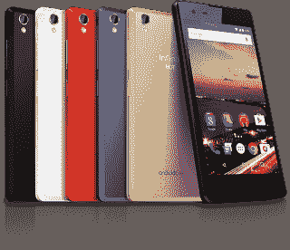

# 谷歌将 Android One 推向非洲

> 原文：<https://web.archive.org/web/https://techcrunch.com/2015/08/18/google-pushes-android-one-to-africa/>

谷歌正在扩大其 Android One 平价智能手机计划，向非洲进军。该地区的首款 Android One 智能手机由 OEM Infinix 制造，今天将在尼日利亚推出，埃及、加纳、科特迪瓦、肯尼亚和摩洛哥将在“未来几周”获得该设备。

这款手机名为 Infinix HOT 2(如下图)，发布时运行 Android 5.1(棒棒糖)，但谷歌表示，一旦发布，它将获得新的 [Android 棉花糖口味](https://web.archive.org/web/20230405094827/https://techcrunch.com/2015/08/17/googles-next-version-of-android-is-called-marshmallow/#.kw0eyn:99Ap)。用户还将通过当地移动服务提供商 MTN 获得免费更新——因为谷歌正在努力简化(和挤压)区域数据计划，使设备对其目标更具吸引力。这款设备的建议零售价为 17500 奈拉(约合 88 美元)。

就规格而言，有一个四核联发科技处理器，1GB 的内存，以及高达 2GB 的内存。还支持双 SIM 卡和一系列颜色:黑色、白色、红色、蓝色和金色。是的，金子。Android One 并没有在奢侈品上吝啬。

作为该计划的一部分，谷歌致力于通过确定将要使用的组件和预先确定零件供应商来降低智能手机硬件成本。在软件方面，它允许原始设备制造商访问其 Play Store，帮助他们将本地相关的应用程序添加到设备中，并像 Nexus 设备一样自动进行软件更新。

这里更广泛的推动当然是谷歌对下一波移动互联网用户的抢占——那些被广泛讨论的“下几十亿人”，他们可能生活在连接不畅的地区，或者被无限移动数据计划的价格所限制。因此，有必要压缩成本以降低进入门槛。(脸书通过其[Internet.org 倡议](https://web.archive.org/web/20230405094827/https://techcrunch.com/2015/05/04/facebooks-internet-org-project-is-now-a-platform/)在传播连接接入方面有类似和平行的推动——尽管[因限制用户可以接入的服务而受到抨击](https://web.archive.org/web/20230405094827/https://techcrunch.com/2015/04/20/internet-dot-org-indonesia/)。

在[的一篇博客文章](https://web.archive.org/web/20230405094827/http://officialandroid.blogspot.co.uk/2015/08/a-step-toward-better-mobile-experiences.html)中，谷歌产品管理副总裁凯撒·森古普塔宣布了其 Android One Africa 计划，他说:

> 大约一年前，谷歌[在印度推出了 Android One 程序](https://web.archive.org/web/20230405094827/http://googleblog.blogspot.com/2014/09/for-next-five-billion-android-one.html)和 YouTube 离线版。今天，非洲有 6 个国家——总人口达 3.79 亿——加入了 Android One 手机销售地的行列。我们为取得的进展感到激动，也为剩下的工作感到谦卑。但我们期待着继续与合作伙伴合作，确保人们有一个很好的方式来访问互联网，以相关和有用的方式使用它。

谷歌去年夏天推出了 Android One 可负担性推广活动，目标是专门为新兴市场制造手机的原始设备制造商——并瞄准“[下一个 50 亿](https://web.archive.org/web/20230405094827/http://officialandroid.blogspot.co.uk/2014/09/for-next-five-billion-android-one.html)”智能手机用户，以继续扩大 Android 的市场份额(Android 的市场份额通常徘徊在全球 80%左右)。

首款 Android One 智能手机于 2014 年 9 月在印度推出，到 12 月份将在另外三个亚洲市场(孟加拉国、尼泊尔和斯里兰卡)推出。那里制造 Android One 设备的 OEM 厂商包括 Micromax、Karbonn 和 Spice。

对于其非洲 Android One 推送，谷歌表示，它还将在“未来几个月”将 YouTube 离线扩展到尼日利亚、肯尼亚、加纳和埃及。该功能允许用户将视频存储在 YouTube 应用程序中长达 48 小时，以便他们可以在没有连接或可以访问的网络太慢而无法播放时观看视频。

谷歌还宣布推出简化版的谷歌搜索，针对低内存手机(如 512MB 的手机)的更快体验进行了调整，声称该功能可以将结果页面的数据使用量减少多达 90%，并将加载时间减少多达三分之一。

其他追逐新兴市场的手机厂商包括中国的安卓 OEM 厂商小米，该公司在中国以外使用谷歌服务，目前更专注于中高端智能手机市场，尽管其手机定价极具竞争力。

还有一个王牌是[芬兰的 Jolla](https://web.archive.org/web/20230405094827/https://techcrunch.com/2015/05/28/jolla-pushes-brics-partnerships-to-target-android-in-emerging-markets/) ，这是[现在完全专注于其替代移动平台 Sailfish 的许可业务](https://web.archive.org/web/20230405094827/https://techcrunch.com/2015/07/07/mobile-maker-jolla-splits-in-two-with-sailfish-os-its-first-order-of-business/)，这是一个与 Android 应用程序兼容的操作系统。今年夏天，该公司宣布与印度原始设备制造商 Intex 签订了第一份许可协议。即将推出的旗鱼供电手机 Intex Aqua Fish 定价低于 1 万卢比(150 美元)。