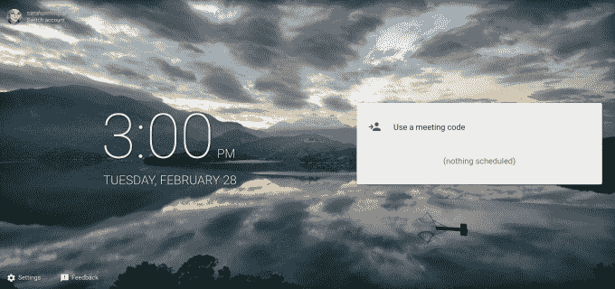

# 谷歌悄悄推出 Meet，这是一个对企业友好的 Hangouts TechCrunch 版本

> 原文：<https://web.archive.org/web/https://techcrunch.com/2017/02/28/google-quietly-launches-meet-an-enterprise-friendly-version-of-hangouts/>

谷歌已经悄然推出了一款新的视频会议应用，名为 [Meet by Google Hangouts](https://web.archive.org/web/20221122124248/https://itunes.apple.com/US/app/id1013231476) ，专为高清视频会议设计。网络和移动应用似乎是谷歌称为 G Suite 的商业产品系列的最新成员，尽管在应用商店的应用描述页面中列出的在 [G Suite 网站上的产品页面尚未上线。【更新:app 拉了。]](https://web.archive.org/web/20221122124248/https://gsuite.google.com/products/meet)

然而，meet.google.com[的网址已经开始运行了。该网站类似于 Hangouts 的登录页面，但没有打电话或开始文本聊天的选项。相反，Meet 的页面允许您输入会议代码以加入会议，并查看您已安排的会议。到目前为止，似乎还没有办法从网站上安排新的呼叫。](https://web.archive.org/web/20221122124248/https://meet.google.com/)

根据截图和 App Store 的详细页面，Meet 旨在成为 Hangouts 的商业友好型替代产品，Hangouts 是该公司以消费者为中心的消息、语音和视频聊天应用。

像 Hangouts 一样，Meet 也提供群组视频通话，不仅仅是视频聊天，而且功能更强大。

在 Hangouts 限制为 10 人的地方，Meet 表示它支持多达 30 人的高清视频会议。

[gallery ids="1458472，1458473，1458474，1458475"]

它还包括其他功能，旨在方便在旅途中拨打这些电话，包括为旅行者提供的拨号号码，只需点击一下即可加入的链接，以及为 G Suite 用户提供的与 Gmail 和日历的集成。

该应用程序的主屏幕显示了您安排的会议列表，以及时间、地点、主题、与会者等其他详细信息。您可以点击绿色的“加入”按钮，从您的电话参加会议，这将启动视频聊天界面。按钮可以让你静音或关闭视频。

与此同时，在大型会议中，顶部有一个主窗口，你可以看到谁在发言，下面是一长串与会者的屏幕、姓名和电子邮件。

拨入号码只对 G Suite Enterprise Edition 用户可用，但这是目前唯一的限制。

谷歌还没有正式宣布推出 Meet，尽管它在 9 月份已经注意到团队友好版的 Hangouts 正在开发中。然而，这款应用当时没有 Meet 品牌，也没有像现在这样公开发布。

目前，Meet 的移动应用暂时在 iTunes 应用商店上线。根据应用智能公司 Sensor Tower 的数据，这款产品于昨天推出，刚刚在美国排名第 1，177 位。它目前的最高排名是在爱尔兰，排在第 375 位，也是在同一类别中。

Meet 的到来正值谷歌重新关注视频聊天服务之际。公司[在一月份关闭了它的 Google+ Hangouts API，](https://web.archive.org/web/20221122124248/https://beta.techcrunch.com/2017/01/06/hangouts-api-shut-down/)在给开发者的一条消息中指出，Hangouts 正在“转向关注企业用例”同月，[还收购了一家名为 Limes Audio 的初创公司，](https://web.archive.org/web/20221122124248/https://beta.techcrunch.com/2017/01/05/google-acquires-limes-audio/)，称该公司将提高谷歌视频聊天服务的语音质量。

根据在 gsuite.google.com[找到的谷歌在线商务应用程序的主网页，截至本文撰写之时，Meet 还没有正式取代 G Suite 系列产品中的 Hangouts。尚不清楚 Hangouts 最终是否会被关闭，或者它是否仍将是谷歌视频聊天服务面向消费者的版本。(嗯，除了 Duo。)](https://web.archive.org/web/20221122124248/https://gsuite.google.com/)

谷歌尚未回复置评请求。

更新:在我们的报道之后，谷歌从 iTunes 应用商店下架了这款应用。