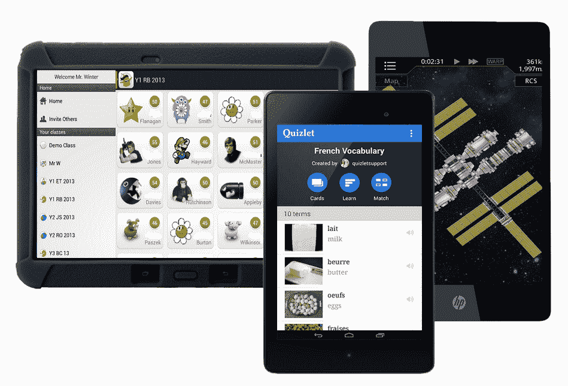

# 谷歌悄然关闭教育游戏 

> 原文：<https://web.archive.org/web/https://techcrunch.com/2016/02/16/google-quietly-shutters-play-for-education/>

早在 2013 年，谷歌[推出了](https://web.archive.org/web/20221005183024/http://android-developers.blogspot.com/2013/11/bring-your-apps-into-classroom-with.html) Play for Education，该计划让教育工作者更容易购买应用和书籍，并将其分发到学生的安卓平板电脑上。现在，这个节目即将结束。正如 CRN 最先[报道的，我们今天也证实了，谷歌将于 3 月 14 日停止销售 Play for Education 许可证。](https://web.archive.org/web/20221005183024/http://www.crn.com/news/mobility/300079688/crn-exclusive-google-terminating-play-for-education-in-a-small-scale-retreat-from-androids-educational-market.htm)

据我们所知，谷歌将继续支持现有的 Play for Education 用户，直到他们的平板电脑停产，教师将继续访问 Play for Education，以找到内容并将其推送给他们的学生。

“自 3 月 14 日或之后，谷歌将不再销售 Google Play 教育许可证。我们致力于为学校提供一流的课堂工具，包括 Chromebooks，这是美国 K-12 教育中最畅销的设备，以及一个强大且不断增长的教育应用生态系统，”谷歌发言人告诉我们。“我们将继续支持我们的 Google Play 教育客户和他们购买的设备。”

Play for Education 首先在美国推出，但谷歌去年推动将其引入加拿大的[和英国的](https://web.archive.org/web/20221005183024/https://www.google.com/url?sa=t&rct=j&q=&esrc=s&source=newssearch&cd=4&cad=rja&uact=8&ved=0ahUKEwjFhtrB_PzKAhUG0GMKHcLfBpoQqQIIJCgAMAM&url=http%3A%2F%2Fmobilesyrup.com%2F2015%2F04%2F11%2Fgoogle-play-for-education-launches-in-canada%2F&usg=AFQjCNFO98JQjyWlhBrfpVezu3LjroP6Jg&sig2=kxuL5LS8ePzw8VJYL77jDw&bvm=bv.114195076,d.cGc)。

虽然谷歌停止了 Play for Education，但教师和管理员仍然可以使用谷歌及其合作伙伴的其他设备管理服务，将教育应用从 Play Store 推送到平板电脑上。与谷歌的 Play for Education 计划(仅支持少量平板电脑)不同，这些管理解决方案还支持市场上几乎所有的 Android 平板电脑。

同样重要的是要记住，谷歌的 chrome book——包括那些带触摸屏的——已经强势进入教育市场。另一方面，安卓平板电脑并没有受到管理员和教师的青睐。在很大程度上，Chromebooks 也更便宜，而且它们的键盘可能更适合放在教室里。

[https://web.archive.org/web/20221005183024if_/https://www.youtube.com/embed/vzvpcEffvaE?feature=oembed](https://web.archive.org/web/20221005183024if_/https://www.youtube.com/embed/vzvpcEffvaE?feature=oembed)

视频