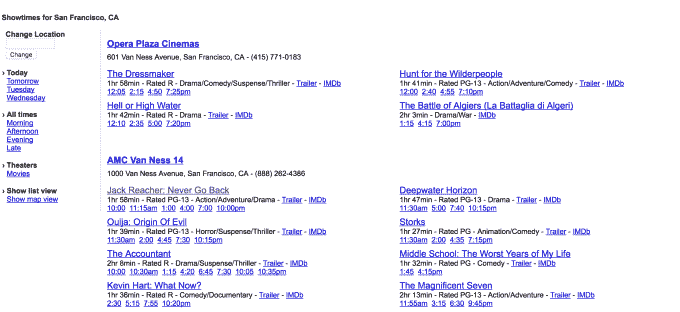
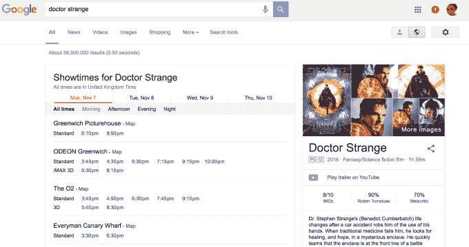

# 谷歌悄然关闭独立的谷歌电影网站

> 原文：<https://web.archive.org/web/https://techcrunch.com/2016/11/07/google-quietly-shutters-standalone-google-showtimes-movie-site/>

这看起来像是谷歌努力扩展到更详细的垂直搜索页面的最后一次展示。在没有太多通知的情况下，搜索巨头关闭了其独立的电影网站，人们可以在那里搜索特定日期和特定地点附近的电影院、电影和放映时间，将一些功能直接纳入其主要搜索门户。这项服务被称为“Google Showtimes ”,如果你试图访问它的主页，就会出现一个 [404 错误](https://web.archive.org/web/20230404191730/https://www.google.com/movies/)。

但是，上面链接的“关于”描述提供了以下信息:

> “谷歌 Showtimes 已于 2016 年 11 月 1 日停售。现在，您可以在搜索结果页面上通过搜索您想看的电影的名称来查找放映时间，或者尝试搜索“电影”一词来查找电影院上映的电影。”

一位发言人拒绝进一步评论此次关闭，以及这是否是谷歌反复进行的[春季大扫除](https://web.archive.org/web/20230404191730/https://techcrunch.com/2015/04/07/dont-cry-for-google-moderator/)(或[秋季大扫除](https://web.archive.org/web/20230404191730/https://techcrunch.com/2012/09/28/googles-spring-cleaning-in-fall-adsense-for-feeds-classic-plus-spreadsheet-gadgets-get-the-axe/)服务关闭的一部分。

目前还不清楚谷歌为什么决定关闭这个独立的门户，但有一些迹象表明，谷歌展示了对该公司来说并不算什么的重磅炸弹，甚至可能与谷歌如何看待其在搜索和媒体领域的一些更大发展背道而驰。

谷歌的电影门户网站看起来像是在 2005 年秋天以某种形式首次上线的，正如你从下面 2016 年 10 月的截图中看到的那样，除了基于谷歌原始搜索体验中原始、非常简单、精简的美学的界面外，它从未进行太多更新。

这看起来实际上是一件好事，因为谷歌产品论坛、 [Reddit](https://web.archive.org/web/20230404191730/https://www.reddit.com/r/movies/comments/5ayx5f/google_shutdown_google_showtimes_as_of_november/) 和其他地方上抱怨关闭的用户群体(现在是前用户)注意到了与类似 [Fandango](https://web.archive.org/web/20230404191730/http://fandango.com/) 和 [Movietickets](https://web.archive.org/web/20230404191730/http://movietickets.com/) 的竞争服务的对比——这些服务可能看起来更快，但对于根据特定地点和时间找到电影院和电影却不太有用，而这些地点和时间可能不是你在那个精确的时间。

这些用户现在似乎准备向谷歌扔爆米花，因为谷歌取消了谷歌放映时间，并将一些功能引入 Google.com，当我在谷歌网站上搜索英国的一家剧院或电影时，会出现如下基本结果:

看起来谷歌在针对 Showtimes 销售广告方面做得并不多，这意味着它带来的流量并不一定会转化为公司的收入。

谷歌放映时间在某种程度上违背了电影行业的大趋势，就电影院而言，电影行业正准备迎接又一个艰难的一年。据[名利场](https://web.archive.org/web/20230404191730/http://www.vanityfair.com/hollywood/2016/06/hollywood-movie-ticket-sales)报道，2016 年的票房收入将是一个世纪以来最差的。

谷歌 Showtimes 也独立于流媒体的更广泛行业趋势和谷歌自己成为分发和消费视频平台的雄心，因为它在收购 YouTube 之前整整一年就这样做了(在像 T2 安卓电视这样的服务之前许多年)。

相反，谷歌 Showtimes 似乎更多地源于该公司向更垂直的搜索类别扩张的战略，为人们上网寻找特定信息和选择特定门户网站提供登陆点，而不是谷歌的无所不包的 Google.com，这一趋势随着智能手机使用的增加而增长，人们希望在寻找东西和找到答案之间减少步骤。

这一努力的结果是建立了一个广泛的地图产品，[谷歌地图](https://web.archive.org/web/20230404191730/http://google.com/maps)，以及像[谷歌航班](https://web.archive.org/web/20230404191730/https://www.google.com/flights/)用于机票搜索和[谷歌金融](https://web.archive.org/web/20230404191730/https://www.google.com/finance)用于金融新闻和数据的门户网站。虽然谷歌仍在 Google.com 之外开发新的搜索体验，但与谷歌最初的设想相比，它们更有可能基于其他垂直定义(如移动、位置等)。

事实上，谷歌 Showtimes 并不是谷歌关闭的第一个垂直门户网站。谷歌的酒店搜索器现在存在于地图中，而不是作为一个独立的网站。