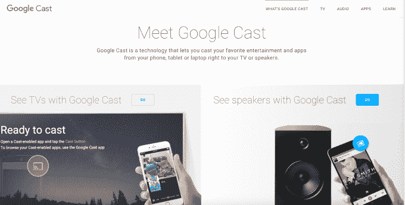

# 谷歌将其 Chromecast 应用更名为 Google Cast，以反映向更多设备的扩展，包括扬声器 

> 原文：<https://web.archive.org/web/https://techcrunch.com/2016/03/22/google-rebrands-its-chromecast-app-to-google-cast-reflect-expansion-to-more-devices-including-speakers/>

# 谷歌将其 Chromecast 应用更名为 Google Cast，以反映对更多设备的扩展，包括扬声器

谷歌[今天早上宣布](https://web.archive.org/web/20230126165951/https://chrome.googleblog.com/2016/03/introducing-vizio-p-series-display-with.html)将把 Chromecast 应用程序重新命名为“Google Cast”，以更好地反映该技术在一系列设备上的工作方式，不仅包括 Chromecast 加密狗，还包括电视、显示器和扬声器。该公司表示，可用于 iOS 和 Android 的更新应用程序将于本周面向所有用户推出。

如你所知，Chromecast 最初是更先进的流媒体播放器的低成本竞争对手，例如 Roku、Fire TV、Apple TV，甚至谷歌自己的 Android TV。早在 2013 年推出的这款设备让你可以轻松地将内容“扔”到你的电视上——即使它不是智能电视。其易用性和低廉的成本使谷歌[销售了](https://web.archive.org/web/20230126165951/https://techcrunch.com/2015/09/29/how-successful-is-the-chromecast-google-has-sold-20-million-chromecasts/)约 2000 万+的原始 Chromecast 加密狗，使其成为[2015 年最受欢迎的流媒体设备](https://web.archive.org/web/20230126165951/http://variety.com/2016/digital/news/chromecast-2015-best-seller-1201726371/)。

然而，最近几个月，谷歌一直在扩大原有的产品线和技术平台。去年 9 月，它[推出了 Chromecast](https://web.archive.org/web/20230126165951/https://techcrunch.com/2015/09/29/google-invades-your-home-with-new-chromecast/) 的第二个版本——Chromecast 2——它也公布了硬件的重新设计，将 chrome cast 从一个棍子变成了一个新的圆形设备，更容易插入电视。它还同时推出了 Chromecast Audio ，这可以将任何带有 AUX 输入的扬声器变成联网设备。

此外，该公司一直在与合作伙伴合作，将其铸造技术内置于产品中，例如，包括索尼、LG、B & O Play、Harman Kardon、安桥、飞利浦、先锋、Raumfeld、Frontier Silicon 和 StreamUnlimited，这些公司都提供 Chromecast 音频软件和硬件。Vizio、夏普和索尼等电视制造商也在特定电视上支持谷歌 Cast 技术(无加密狗)。

与此相关的是，谷歌今天还宣布，VIZIO 的新 SmartCast P 系列显示器和 VIZIO soundbars 和扬声器现在也将支持谷歌 Cast 技术。这意味着用户可以从智能手机或平板电脑上使用网飞或谷歌 Play Music 等服务，也可以在笔记本电脑上使用 Chrome 浏览器在大屏幕上镜像网站。此外，谷歌指出，P 系列将支持超高清(高达 4K)和杜比视觉高动态范围内容，以获得明亮清晰的颜色。

品牌重塑正在进行中，但并不是所有人都能看到更新后的应用。

除了新的应用程序，谷歌还推出了一个更新的[谷歌演员表网站](https://web.archive.org/web/20230126165951/http://www.google.com/cast/)，该网站现在包括了一系列无需额外附件即可支持演员表的扬声器和电视。