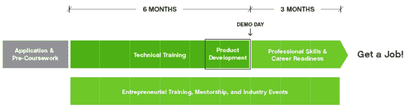

# 谷歌、Reddit 的亚历克西斯·奥哈尼安向 Queens TechCrunch 的技术培训非营利联盟捐赠 175 万美元

> 原文：<https://web.archive.org/web/https://techcrunch.com/2015/03/11/google-reddits-alexis-ohanian-donate-1-75m-to-tech-training-non-profit-coalition-for-queens/>

# 谷歌、Reddit 的亚历克西斯·奥哈尼安向皇后区技术培训非营利联盟捐赠 175 万美元

关于技术缺乏多样性的老生常谈是，这是一个“管道”问题。

至少当被问及为什么他们的排名不够包容时，科技领袖和公司经常这么说。

是诚实的回答吗？算是吧。

这是否也将解决问题的责任推给了其他所有人？是的。

你如何修理它？这并不容易，因为从初级教育开始，然后向上进入科技行业文化本身的所谓“管道”有很多环节。

但是某些公司和领导者正在一步步帮助解决这个问题。

罗宾汉基金会、谷歌企业家、黑石慈善基金会、Capital One dFUND、阿伯兄弟、纽约社区信托、威瑞森、[reddit.com](https://web.archive.org/web/20230125125334/http://reddit.com/)创始人亚历克西斯·奥哈尼安以及伯纳德·f .&阿尔瓦·b·金贝尔基金会将向皇后联盟捐赠 175 万美元。

皇后联盟是一个向纽约人教授科技技能的非营利组织。他们为来自低收入和代表性不足背景的成年人开设了超过九个月的[编程课程。该组织的创始人 Jukay Hsu 表示，他的非营利组织已经能够将毕业生的平均收入从 26，000 美元提高到 73，000 美元。](https://web.archive.org/web/20230125125334/http://c4q.nyc/jobs)

“当你谈论建立一个更具包容性的科技生态系统时，其实皇后区已经有一个科技社区在成长，”纽约人徐说，他从美国军队退役后开始从事劳动力发展。

该计划是免费的，针对的群体至少有 50%的妇女，50%的代表不足的少数民族和 50%的移民。没有编程背景是必要的，参与者的年薪不能超过 45，000 美元。

他们开设了两套教授 iOS 和 Android 开发的课程。(安卓是新课程。)一周大概 22 个小时的课，上面还有作业。Hsu 计划将这批学生中的 60 名作为目标。他希望，如果他能继续证明这种模式的可行性，他将与城市大学系统合作，该系统为 50 万学生提供服务。

除了许的计画，在西岸也有许多类似的努力。但是他们有不同的目标年龄范围、收入和技能水平。例如，YearUp 的硅谷分部针对 18-24 岁的年轻人，他们可能没有机会进入著名的四年制大学，但有动力和能力在当地的科技公司工作。SamaUSA 正在[开展一个项目，向更广泛年龄段的低收入员工教授更多基本的数字技能](https://web.archive.org/web/20230125125334/https://techcrunch.com/2015/02/26/samausa/)，以便他们能够在线处理简历和社交媒体。还有一些针对[青少年的项目，比如东帕洛阿尔托的 Streetcode](https://web.archive.org/web/20230125125334/http://peninsulapress.com/2015/02/19/streetcode-academy-east-palo-alto/) 或者奥克兰的 Hack the Hood 。

“我不认为这是一个教育非营利组织，”他说。“这是关于整个教育系统的工作。还有其他编码程序，但它们不一定谈论城市政策问题或宽带接入。”