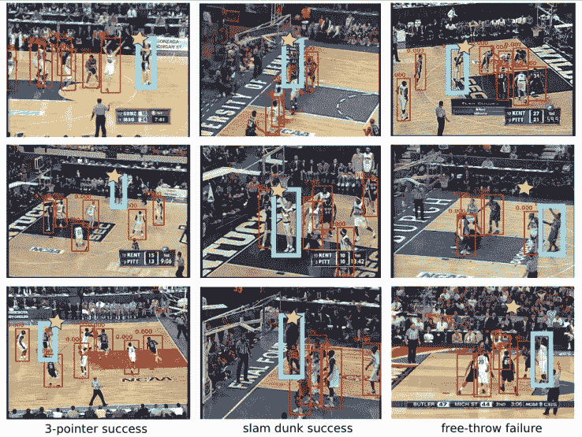
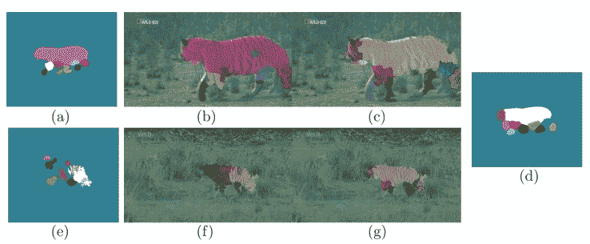

# 谷歌研究人员教会人工智能看到图像的重要部分，并告诉你它们

> 原文：<https://web.archive.org/web/https://techcrunch.com/2016/06/28/google-researchers-teach-ais-to-see-the-important-parts-of-images-and-tell-you-about-them/>

本周是在拉斯韦加斯举行的[计算机视觉和模式识别会议](https://web.archive.org/web/20221210051233/http://cvpr2016.thecvf.com/)，谷歌研究人员[有几项成果要展示](https://web.archive.org/web/20221210051233/https://research.googleblog.com/2016/06/cvpr-2016-research-at-google.html)。他们已经教会计算机视觉系统检测场景中最重要的人物，挑选并跟踪个体身体部位，并以不留任何想象空间的语言描述他们看到的东西。

首先，让我们考虑在视频中找到“事件和关键演员”的能力——这是谷歌和斯坦福大学之间的一项合作。像篮球比赛这样的场景镜头，包含了几十人甚至上百人，但只有少数人值得关注。[本文描述的 CV 系统](https://web.archive.org/web/20221210051233/http://www.cv-foundation.org/openaccess/content_cvpr_2016/papers/Ramanathan_Detecting_Events_and_CVPR_2016_paper.pdf)使用递归神经网络为每一帧创建“注意力掩模”，然后随着时间的推移跟踪每个对象的相关性。

随着时间的推移，该系统不仅能够挑选出最重要的演员，而且能够挑选出潜在的重要演员，以及与他们相关联的事件。你可以这样想:它可以告诉你，某个准备上篮的人*可能*很重要，但是*最重要的球员*却是提供否认的人。智能整理拥挤的镜头(想想机场，繁忙的街道)的意义是重大的。

接下来是一篇更异想天开的论文:研究人员为发现老虎的腿创建了一个 CV 系统。嗯……事情远不止如此。

老虎(和一些马)只是作为系统观察和理解的“关节对象类”——本质上是具有连续移动部件的对象。通过识别独立运动的部分及其相对于动物其余部分的运动和位置，可以逐帧识别肢体。这里的进步是，该程序能够在许多视频中进行识别，即使动物以不同的方式移动。

这并不是说我们迫切需要关于老虎左前腿的数据，但同样，找到并跟踪任意人、动物或机器(或树、或衣服、或……)的单个部分的能力是一种强大的能力。想象一下，能够只为被标记的动物、手里拿着手机的人或带着驮篮的自行车抓取视频。自然，监视方面可能会令人毛骨悚然，但从学术角度来说，这项工作很有趣。论文由爱丁堡大学和谷歌合作完成。

最后一个是计算机视觉的新能力，可能更适合日常使用。CV 系统很早就能够对它们看到的物体进行分类:一个人、一张桌子或一个表面、一辆汽车。但是在描述它们时，它们可能不总是像我们希望的那样精确。在一桌子的酒杯上，哪一个是你的？在一群人中，哪一个是你的朋友？

【T2

谷歌、加州大学洛杉矶分校、牛津大学和约翰霍普金斯大学的研究人员发表的这篇论文描述了一种新方法，通过这种方法，计算机可以毫无混淆地指定物体。它将一些基本逻辑与图像字幕背后的强大系统相结合——这些系统可以为或多或少符合描述的照片生成类似“一个穿红色衣服的人正坐着吃冰淇淋”的内容。

计算机通过查找可用于所讨论的对象的描述符，并找到它们的组合，这些组合一起只能应用于一个对象。因此，在一组笔记本电脑中，它可以说“打开的灰色笔记本电脑”，或者如果几台都打开了，它可以添加“打开的灰色笔记本电脑，显示一个穿着蓝色裙子的女人”，等等。

这是人们经常不假思索地做的事情之一——当然，我们也可以指出来——但事实上这对计算机来说相当困难。当然，能够准确地向你描述某样东西是有用的，但它会反过来:有一天你可能会对你的机器人管家说:“给我拿西红柿后面的琥珀色啤酒。”

自然，所有这三篇论文(以及谷歌正在提交的许多论文中的更多)都使用了深度学习和/或某种神经网络——这几乎是最近计算机视觉研究中的一个既定事实，因为它们已经变得更加强大、灵活和易于部署。然而，要了解每个网络的具体情况，请查阅相关论文。