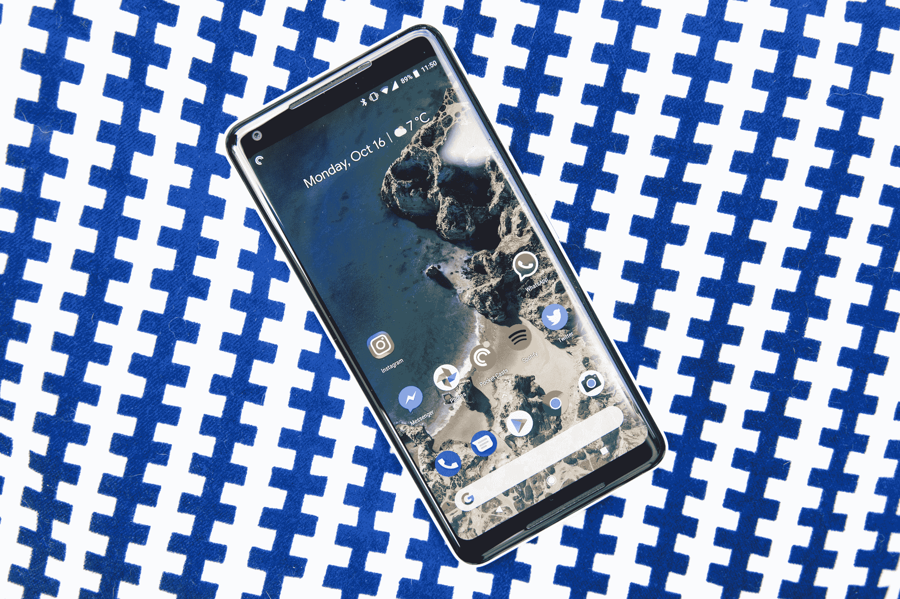

# 谷歌回应 Pixel 2 XL 显示屏投诉，承诺修复 Pixel 2 的“点击”噪音

> 原文：<https://web.archive.org/web/https://techcrunch.com/2017/10/26/google-responds-to-pixel-2-xl-display-complaints-promises-fix-for-clicking-noise-on-the-pixel-2/>

# 谷歌回应 Pixel 2 XL 显示屏投诉，承诺修复 Pixel 2 的“点击”噪音

在谷歌新的 Pixel 2 和 Pixel 2 XL 开始发货后不久，一些用户注意到这些设备似乎有一些…怪癖。

一些用户报告说，XL 的屏幕颜色似乎变淡了。当切换屏幕时，以前显示的图像的证据有时似乎挥之不去(好像它们被烧进了屏幕)。其他人报告说，根据你的视角，屏幕似乎会变成奇怪的蓝色。与此同时，Pixel 2 用户报告称在通话时听到了高音调的“咔嗒”声。

谷歌[周一](https://web.archive.org/web/20230326081748/https://techcrunch.com/2017/10/23/google-actively-investigating-reports-of-oled-burn-in-issues-on-pixel-2-xl-displays/)表示，他们正在调查这些报道，并刚刚分享了他们的第一批调查结果。

你可以在这里找到[完整版，但简短版:他们认为事情基本上如预期那样工作，但他们正在进行一些软件更改，并延长设备的保修期。](https://web.archive.org/web/20230326081748/https://productforums.google.com/forum/#!topic/phone-by-google/y1FWSMFcDgA;context-place=forum/phone-by-google)

关于显示器的颜色，谷歌工程副总裁 Seang Chau 写道:

> 我们已经收到一些反馈，关于 Pixel 2 XL 显示器看起来不像其他手机那样饱和。我们将这种感觉归因于我们选择校准 Pixel 2 XL，以提供自然、准确的颜色，利用 Android 8.0 Oreo 中新的颜色管理支持。
> 
> …
> 
> 根据我们自宣布 Pixel 2 和 Pixel 2 XL 以来收到的反馈，我们了解到一些用户确实想要更鲜艳的颜色。因此，通过对 Pixel 2 和 Pixel 2 XL 的软件更新，我们将很快添加一个新的“饱和”颜色模式。

换句话说:他们喜欢设备上的颜色，但他们将通过软件更新的方式添加一个“饱和”模式。该设备已经有一个“生动”模式，可以稍微调整显示颜色，但听起来“饱和”模式将会更进一步。

以及“老化”效应:

> 我们已经收到 Pixel 2 XL 设备在屏幕上显示图像残留的报告，并一直在积极调查这些问题。对 Pixel 2 XL 显示屏的广泛测试表明，其衰减特性可与其他高端智能手机中使用的有机发光二极管面板相媲美。

尽管如此，他们仍在对屏幕的工作方式进行一些改变:

*   不使用时，屏幕底部的导航栏按钮会淡出

*   他们将显示器的最大亮度降低了 50 尼特——他们说这个量“几乎检测不到”，但这应该会“显著”减少显示器的压力

与此同时，他们将所有 Pixel 2/Pixel 2 XL 设备的保修期从一年提高到两年。

谷歌表示，这些变化的更新将在未来几周内推广到 Pixel 2 XL。

至于一些 Pixel 2 用户在通话中听到的咔嗒声，用户论坛上的一个单独的[线程](//web.archive.org/web/20230326081748/https://productforums.google.com/forum/#!topic/phone-by-google/XuQgtm5dK8I;context-place=forum/phone-by-google%E2%80%9D)表明，谷歌已经确定了 NFC 功能中的一个软件错误，并承诺修复工作正在进行中。与此同时，关闭 NFC 将停止点击。

*【为[安德鲁·马托尼克](https://web.archive.org/web/20230326081748/https://twitter.com/andrewmartonik)发现这些干杯】*