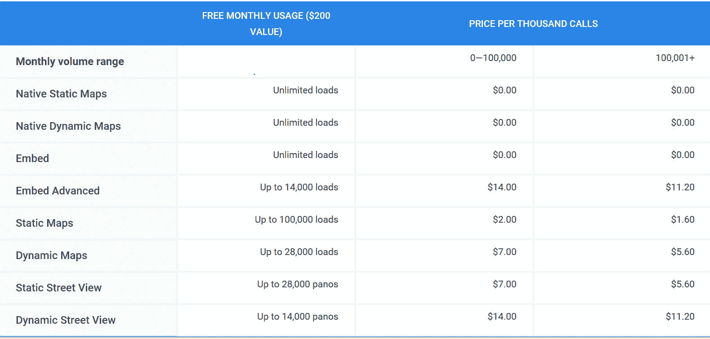

# 谷歌改进其谷歌地图开发者平台

> 原文：<https://web.archive.org/web/https://techcrunch.com/2018/05/02/google-revamps-its-google-maps-developer-platform/>

谷歌今天为开发者发布了谷歌地图 API 平台的重大更新——并且给它起了一个新名字:谷歌地图平台。

这是该平台近年来最大的变化之一，它将大大简化谷歌地图开发者的产品以及谷歌对这些 API 的收费方式，尽管从 6 月 11 日开始，所有谷歌地图开发者都必须拥有有效的 API 密钥和谷歌云平台计费账户。

作为这项新举措的一部分，谷歌正在将该公司目前提供的 18 个独立地图 API 整合为三个核心产品:地图、路线和地点。对开发者来说，好消息是谷歌承诺他们现有的代码将继续工作，无需任何修改。

作为此次更新的一部分，谷歌还改变了访问这些 API 的收费方式。它现在为[提供了一个可以获得免费支持的单一定价计划](https://web.archive.org/web/20230316002801/https://cloud.google.com/maps-platform/pricing/)。目前，谷歌提供了一个[标准和一个](https://web.archive.org/web/20230316002801/https://developers.google.com/maps/pricing-and-plans/)(例如，其中的高级计划包括访问支持)，但未来，它将只提供一个，这也为开发者提供了价值 200 美元的免费月使用。像往常一样，也有为企业客户定制的定价计划。

谷歌今天也宣布，该公司计划继续推出各种以地图为中心的行业特定解决方案。例如，今年早些时候，该公司为希望在地图数据上构建现实世界游戏的游戏开发者推出了一个项目，今天它宣布了类似的资产跟踪和拼车解决方案。Lyft 去年已经开始在应用程序中使用拼车产品[。](https://web.archive.org/web/20230316002801/https://blog.lyft.com/posts/announcing-lyft-navigation)

“我们的资产跟踪产品通过实时定位车辆和资产，可视化资产的行驶位置，以及在复杂的行程中安排车辆路线，帮助企业提高效率，”Maps 团队在今天的公告中写道。“我们希望在未来将新的解决方案推向市场，在我们定位于提供见解和专业知识的领域。”

总体而言，谷歌地图团队似乎正朝着正确的方向前进。谷歌地图 API 访问偶尔会成为一个引起分歧的问题，尤其是在谷歌改变免费使用水平的时候。今天的改变可能不会引起开发人员社区的这种反应，因为从长远来看，它可能会使开发人员的生活更容易。