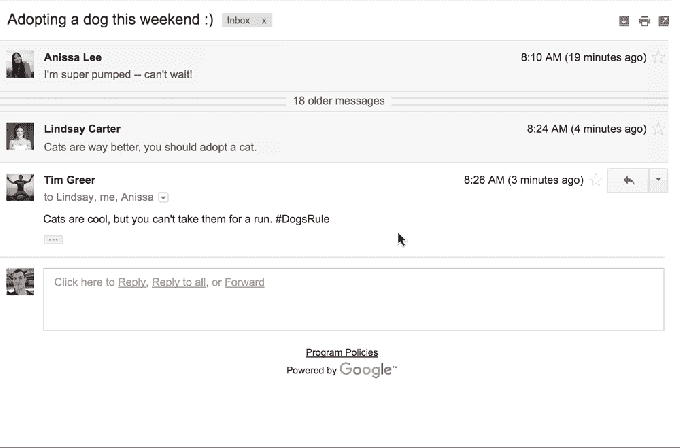
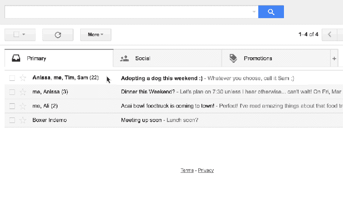
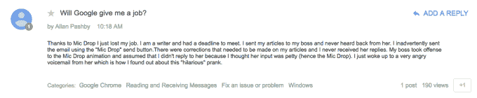
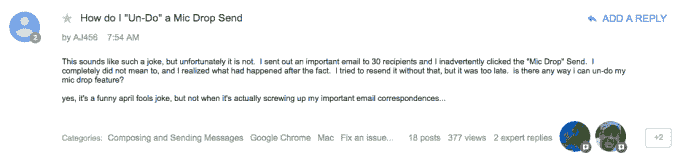
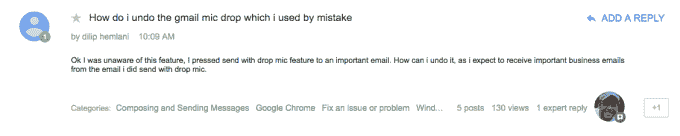
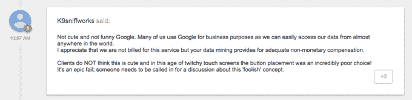
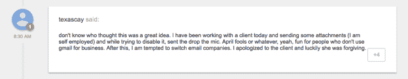

# 谷歌撤销 Gmail 月 1 日的恶作剧，原因是用户误将 gif 图片放入重要邮件中

> 原文：<https://web.archive.org/web/https://techcrunch.com/2016/04/01/google-reverses-gmail-april-1-prank-after-users-mistakently-put-gifs-into-important-emails/>

谷歌撤销了愚人节的一个恶作剧，此前该恶作剧导致一些 Gmail 用户无意中将 gif 图片插入商业电子邮件和其他重要通信中。

美国互联网巨头通常因其富有创意的愚人节玩笑而闻名于世——有些是[的](https://web.archive.org/web/20230404001155/http://google-au.blogspot.com/2016/04/google-search-for-your-socks.html)有些是[的](https://web.archive.org/web/20230404001155/https://www.youtube.com/watch?v=LSZPNwZex9s)今天的[很有趣](https://web.archive.org/web/20230404001155/http://googlejapan.blogspot.com/2016/04/furikku.html)——但是这个大 G 试图通过[一个在 Gmail 信息中插入 Minions GIF 的“麦克风放下”按钮](https://web.archive.org/web/20230404001155/https://gmail.googleblog.com/2016/03/introducing-gmail-mic-drop.html)将幽默注入电子邮件，结果适得其反。

“如今，Gmail 让任何带有麦克风的电子邮件更容易获得最后决定权。只需使用新的“Send + Mic Drop”按钮回复任何电子邮件。每个人都会收到你的信息，但这是你听到的最后一条消息。是的，即使人们试图回应，你也不会看到，”谷歌在 4 月 1 日推出该按钮时解释道。

当然，理论上听起来很有趣，但是当你的电子邮件服务拥有超过 10 亿活跃用户时，其中许多人依靠它进行商业和专业交流，那么事情就有点危险了。(重要的是，该功能似乎没有为付费使用谷歌商务套件(包括公司电子邮件)的谷歌应用套件客户提供，但使用常规服务的其他人却有。)

然后，按钮位置有问题。谷歌用“发送和存档”取代了“MicDrop”，这是许多人习惯性使用并不假思索地点击的一种方式，这对许多人来说是一种灾难。

最初的警告确实出现了，但是任何没有注意到的人都会大吃一惊。

以下是发送邮件的简单程度:

这是结果:

前 Kickstarter 首席技术官和 XOXO 节创始人安迪·拜奥(Andy Baio)是许多在重要邮件上误按按钮的用户之一。

除了扰乱电子邮件的语气，放下麦克风还会让所有回复静音——这是不可逆转的:

似乎还有很多其他 Gmail 爱好者受到了影响。正如 Baio 指出的，[谷歌的 Gmail 支持页面](https://web.archive.org/web/20230404001155/https://productforums.google.com/forum/#!topicsearchin/gmail/%22mic%2420drop%22%7Csort:date)引来了大量的抱怨。

一位用户声称，由于这个恶作剧，他失去了生意:

此人错误地将麦克风与一些重要的联系人丢在一起:

另一个人也这么做了:

一位企业用户警告了潜在的问题:

一位 Gmail 用户表示，这个按钮足以诱使他们改变电子邮件提供商:

这些人只是花时间抱怨的人。

是的，谷歌的确有一个撤销按钮，用于召回出错的电子邮件，但在这种情况下，对按钮位置的熟悉可能会让许多 Gmail 常客产生一种错误的安全感。

值得称赞的是，谷歌一直对反馈持开放态度，并迅速采取行动删除该功能。

这是公司声明，包括表情符号，我们被告知:

> 好吧，看起来我们今年捉弄了自己。😟由于一个错误，MicDrop 功能无意中引起了更多的头痛而不是笑声。我们真的很抱歉。该功能已被关闭。如果您仍然看到它，请重新加载您的 Gmail 页面。

我们就“bug”向谷歌施压，一位发言人解释说，“在极少数情况下”，即使用户没有特别按下按钮，MicDrop 功能也可能出现在未来的电子邮件中。

对于想要恶作剧的人，尤其是资源有限的小公司，这里的教训是:把你的时间花在打造你的产品上，而不是插科打诨，因为即使是业内最优秀的人有时也会犯可怕的错误。