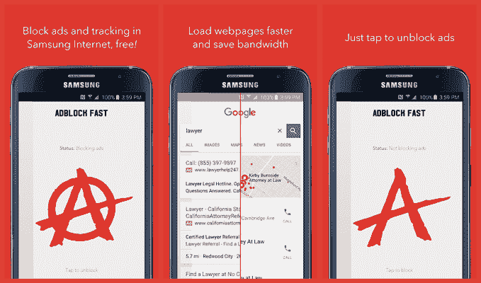

# 谷歌撤销禁止谷歌 Play 商店 TechCrunch 广告拦截应用的决定

> 原文：<https://web.archive.org/web/https://techcrunch.com/2016/02/09/google-reverses-its-decision-to-ban-ad-blocking-apps-from-the-google-play-store/>

谷歌似乎已经改变了早先禁止 Google Play 商店广告拦截器的决定——这一举动使得该公司[迅速撤出 Adblock 等应用程序，并停止其他应用程序的更新](https://web.archive.org/web/20221209170725/https://beta.techcrunch.com/2016/02/03/google-boots-ad-blockers-from-google-play/),如 Crystal 的广告拦截器。现在，在 Adblock Fast 的开发者 Rocketship 的呼吁下，谷歌重新批准并将其应用程序重新发布到 Google Play。

这一决定代表着谷歌的路线发生了变化，即谷歌将在其 Android 设备应用商店中允许何种应用。

从知情人士处，TechCrunch 在最初的决定时了解到[谷歌计划只支持可以屏蔽广告的移动浏览器——包括内置广告屏蔽功能的浏览器，如 Adblock Plus 浏览器，以及通过扩展支持广告屏蔽的浏览器，如 Firefox、Javelin 和 Dolphin 浏览器。](https://web.archive.org/web/20221209170725/https://beta.techcrunch.com/2016/02/03/google-boots-ad-blockers-from-google-play/)

然而，谷歌已经决定，根据其新的指导方针，不允许通过 APKs 分发独立的广告拦截应用程序，如 Crystal 和 Adblock Fast。

继[三星于二月初在其移动网络浏览器中引入广告拦截支持](https://web.archive.org/web/20221209170725/https://beta.techcrunch.com/2016/02/01/following-apples-move-samsung-rolls-out-ad-blocking-to-android-devices/#.s2agxy:3qI0)之后，这些应用和其他应用应运而生。该功能的工作原理很像苹果的 Safari 支持广告拦截。也就是说，第三方开发者可以利用三星新的内容拦截器 API，让他们可以开发应用程序，让浏览器拦截广告和其他不想要的内容，比如跟踪器。

但已经有一些迹象表明，在 Adblock Fast 恢复之前，谷歌可能已经就其决定进行了辩论，因为谷歌的政策没有得到一致应用。

虽然 Adblock Fast 被撤下，但 Crystal 只是被拖慢了——例如，谷歌阻止了其应用程序更新，理由是同样“违反”了其 Android [开发者分发协议](https://web.archive.org/web/20221209170725/https://play.google.com/about/developer-distribution-agreement.html#prohibited)。

在第 4.4 节中，该公司通知第三方开发者，他们不能干涉“任何第三方的设备、服务器、网络或其他财产或服务，包括但不限于安卓用户、谷歌或任何移动网络运营商。”

由于没有提供进一步的指导，受影响的开发者表示，他们理解谷歌的要求是指他们不应该干扰三星的网络浏览器。

这个决定显然没有意义，因为三星发布的广告拦截 API 表明这正是该公司希望第三方开发者做的事情*。*

 *TechCrunch 从一位熟悉谷歌情况的人士处了解到，谷歌现在将允许那些通过 API 等授权渠道与其他应用集成的应用，但将继续禁止 Google Play 上以未经授权的方式干扰其他应用功能的应用。

Rocketship 表示，它于上周一提交了上诉——当天其应用程序更新被拒绝——这是在应用程序本身于周二从商店下架之前。

今天， [Rocketship 解释了自](https://web.archive.org/web/20221209170725/https://log.rocketshipapps.com/adblock-fast-for-android-relaunches-b7a650212ee0#.q5keas9vu)以来发生的事情。该公司表示，周五收到一封电子邮件，称谷歌已接受其上诉，然后该应用程序于今天上午重新发布。

除了回到 Google Play，Rocketship 还能够将应用程序更新到 1.1.0 版本，现在支持 Android 4.0，并为那些尚未安装三星网络浏览器的用户澄清了入职体验。

随着谷歌改变决定，其他广告拦截器制造商或多或少没有受到政策变化的影响。例如，Adblock Plus 为三星浏览器发布了一个广告拦截器版本，它告诉我们，他们从未收到谷歌的消息，也没有撤下他们的应用程序。

Crystal 也保持在线。它的开发者迪恩·墨菲告诉我们，他也上诉过几次，谷歌刚刚接受了他的更新。

谷歌拒绝置评。

*更新时间:2016 年 2 月 9 日，太平洋时间上午 9:30，注意 Crystal 的更新已经完成，注意谷歌的回应。**