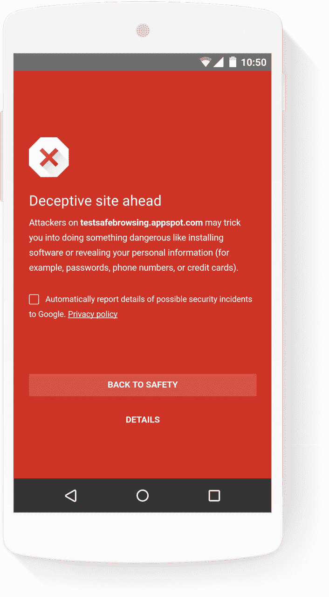

# 谷歌称其安全浏览工具现在保护超过 30 亿台设备

> 原文：<https://web.archive.org/web/https://techcrunch.com/2017/09/11/google-says-its-safe-browsing-tools-now-protects-over-3-billion-devices/>

# 谷歌称其安全浏览工具现在保护超过 30 亿台设备

 谷歌今天宣布，其[安全浏览服务](https://web.archive.org/web/20221229012509/https://safebrowsing.google.com/)，防止桌面和移动设备上的 Chrome、Safari 和 Firefox 用户访问潜在的危险网站，现在保护着超过 30 亿台设备。这比 2013 年的[10 亿美元](https://web.archive.org/web/20221229012509/https://googlesystem.blogspot.com/2013/06/1-billion-google-safe-browsing-users.html#gsc.tab=0)和 2016 年 5 月该公司开始引用的 20 亿美元有所增加。

这项服务是谷歌首次尝试的反恶意软件工具之一，于 2007 年作为该公司桌面旗舰搜索引擎的一项功能首次推出。自那以后，Safari 和 Firefox 都采用了这项服务，此外还有许多网络和应用开发者(包括 Snapchat 之类的)。

尽管如此，安全浏览背后的一般理念始终保持不变:告诉用户他们正在浏览的网站何时可能是欺骗性的或恶意软件的宿主。

值得注意的是，直到 2015 年谷歌才默认开启了 Android 版 Chrome 的安全浏览，这当然使得该服务的使用数量在 2016 年初飙升。

谷歌还指出，今天的安全浏览功能使用机器学习来检测“更多的不良行为”，并“不断评估和整合尖端的新方法，以改善安全 浏览。”