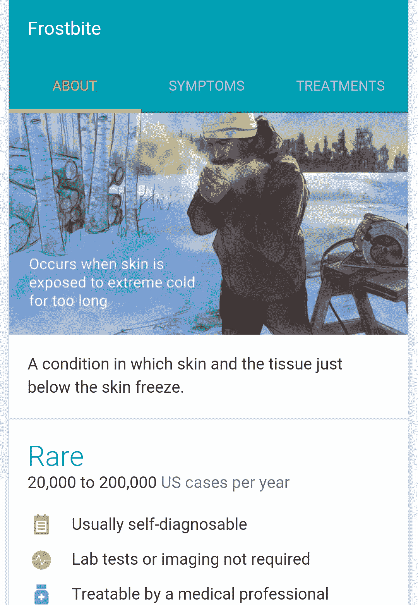

# 谷歌搜索将显示更多健康状况信息 

> 原文：<https://web.archive.org/web/https://techcrunch.com/2015/09/03/google-search-is-now-even-better-for-hypochondriacs/>

# 谷歌搜索将会显示更多健康状况的信息

谷歌表示，谷歌搜索上 20 次搜索中就有一次是关于健康相关的信息，自今年 2 月以来，谷歌一直在使用其知识图表，当它发现一个关于常见健康状况的查询时，就会快速调出医疗事实。当时，它显示了大约 400 种条件下的这些改进结果，但从今天开始，它将推出[更新](https://web.archive.org/web/20221001213356/http://insidesearch.blogspot.com/2015/09/now-google-can-help-with-updated-health.html)，使这个数字接近 900，包括一些[被忽视的热带疾病](https://web.archive.org/web/20221001213356/http://www.who.int/neglected_diseases/diseases/en/)。

谷歌也在更新该功能的设计，并对触发的方式和时间做了一些改变。该公司指出，例如，当你现在搜索“冻伤症状”时，它会直接带你到症状选项卡。

该公司表示，它与一个医生团队密切合作，以“管理和验证”它表面的信息。

医生们显然也要求该公司让他们的病人更容易打印他们从搜索结果页面获得的信息，这样他们就可以带着这些信息去预约。在这次更新中，Google 现在增加了下载包含知识图表信息的 PDF 的功能。

目前，该功能仅在美国英语中可用，但谷歌表示，计划将其扩展到更多语言和地区。