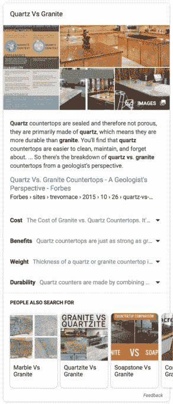

# 谷歌搜索的新特色片段面板为您节省了更多点击次数 

> 原文：<https://web.archive.org/web/https://techcrunch.com/2018/08/16/google-searchs-new-featured-snippet-panel-saves-you-more-clicks/>

# 谷歌搜索的新特色片段面板节省了你更多的点击

今天，谷歌在其搜索结果中为[特色片段](https://web.archive.org/web/20221210044120/https://www.blog.google/products/search/reintroduction-googles-featured-snippets/)引入了一种额外的格式。多年来，这些片段一直出现在搜索结果页面的顶部，并以谷歌认为与你的查询相关的图像和文本为特色。它们都是关于谷歌节省你点击。今天，谷歌超越了对一些问题的单一回答，并[推出了](https://web.archive.org/web/20221210044120/https://www.blog.google/products/search/helping-you-find-useful-information-fast-search/)一个面板，也有相关的副主题，为你节省更多的点击。

谷歌触发这个新面板的典型例子是“[石英对花岗岩](https://web.archive.org/web/20221210044120/https://www.google.com/search?q=quartz+vs+granite)”这个查询带来了通常的片段，加上子主题，如成本、收益、重量和耐用性。这些话题是根据谷歌的算法对这个话题的理解自动选择的。

不过，您不需要通过[vs.]查询来触发这一点。如果你寻找类似“应急基金”的东西，你也会看到一个类似的面板。

目前，我只能在手机上触发这些新的面板，但谷歌表示，它将在未来几天推出这一功能，所以你可能需要一段时间才能在野外发现一个。我也没有成功地用我尝试过的任何其他查询来触发它们，但是也许你比我幸运。

谷歌指出，今天的声明是为你的问题提供更全面结果的持续努力的一部分。例如，今年 2 月，当系统认为一个查询有多种解释时，谷歌开始显示多个特色片段。