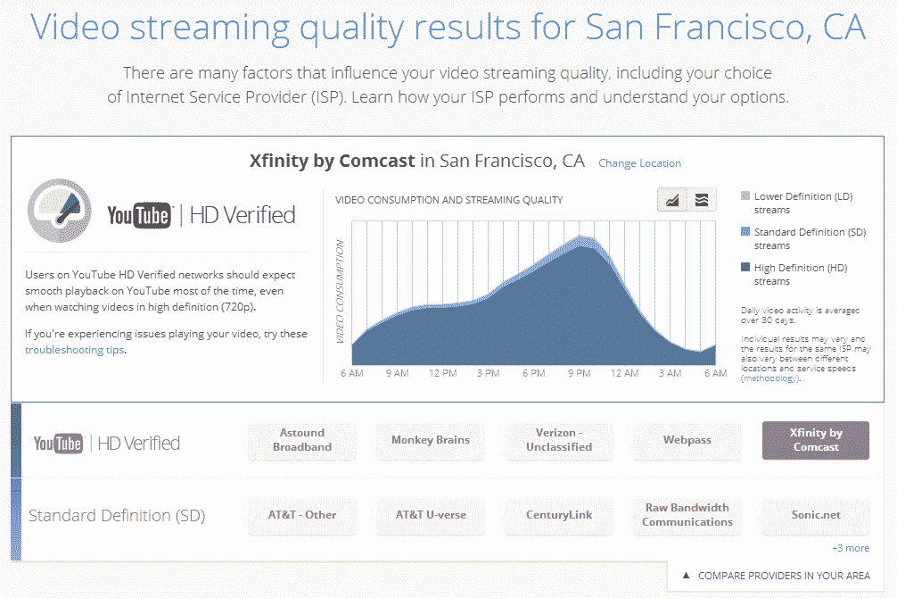

# 谷歌以其新的 YouTube 视频质量报告 TechCrunch 羞辱了缓慢的美国互联网服务提供商

> 原文：<https://web.archive.org/web/https://techcrunch.com/2014/05/29/google-shames-slow-u-s-isps-with-its-new-youtube-video-quality-report/>

# 谷歌用其新的 YouTube 视频质量报告羞辱了缓慢的美国互联网服务提供商

互联网服务提供商和大型内容提供商如网飞、Hulu 和 YouTube 之间的关系最近变得很有争议。为了增加互联网服务提供商提供视频内容的透明度，网飞不久前发布了其[互联网服务提供商速度指数](https://web.archive.org/web/20221208171512/http://ispspeedindex.netflix.com/usa)，今天，YouTube [将向美国发布](https://web.archive.org/web/20221208171512/http://youtube-global.blogspot.com/2014/05/find-out-if-your-internet-service.html)类似的报告

[谷歌视频质量报告](https://web.archive.org/web/20221208171512/http://www.google.com/get/videoqualityreport/)将显示你所在地区的哪些互联网服务提供商可以支持高清 YouTube 视频，哪些只能让你观看没有缓冲的标清 360p 视频。

要成为“高清认证”，ISP 必须能够显示过去 30 天内 90%以上的流的高清内容。谷歌告诉我，这需要的吞吐量大约是 2.5 Mbps。

此外，该报告还向你提供了一些关于你所在城市的人们何时观看 YouTube 视频的细节，以及其中有多少人正在观看高清和标清视频。

这是旧金山的报告:

谷歌在一月份首次公布了加拿大的数据，并承诺将很快提供其他国家的报告。

虽然谷歌向 YouTube 用户提供了一些改善连接的技巧，但除了转向为视频内容提供更好带宽的 ISP 之外，你真的没什么可做的。这也是谷歌发布这份报告的原因。在很大程度上，这相当于公开羞辱，毕竟，谷歌希望所有的互联网服务提供商都站出来，成为高清认证。视频看起来越好，你看的就越多，YouTube 能提供的广告就越多。

https://www.youtube.com/watch?v=XH863XXRZEQ