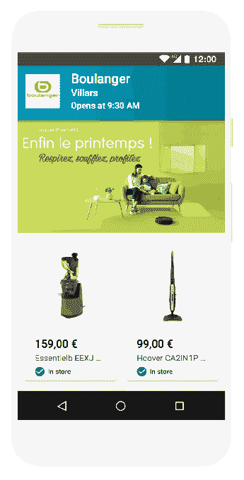

# 谷歌为实体店增加工具以提高网上购物者的兴趣 

> 原文：<https://web.archive.org/web/https://techcrunch.com/2018/06/12/google-shopping-adds-new-tools-for-physical-merchants-to-boost-interest-from-online-shoppers/>

尽管亚马逊和其他电子商务巨头的增长，线下商务——从实体店购买商品——仍然占所有零售支出的 90%左右。因此，为了弥合在线和店内商务之间的鸿沟，并有可能获得更大的份额，谷歌宣布了针对实体和本地商家的谷歌购物的许多新功能。

该公司今天推出了一项名为“查看商店里有什么”的新功能，该功能将让实体店免费在其知识面板(出现在特定企业搜索结果右侧栏中的方框)和谷歌地图上提供库存清单。

这项新功能是与其他几项增强功能同时宣布的:谷歌现在将在 YouTube 上的视频活动中提供位置扩展功能；增强的本地目录展示广告将让商家展示更大的“英雄”图像以及其他店内库存的完整列表，以及库存和定价信息。

本地目录广告和库存清单将通过一些新的合作关系来实现:谷歌将与 Pointy、Cayan、Linx 和 yReceipts 等销售点和库存数据提供商合作，这些提供商直接与商家合作，向谷歌提供数据。

作为这种工作方式的一个例子，[Pointy](https://web.archive.org/web/20221208042950/http://pointy.com/)——马克·卡明斯的创业公司，他在 is [第一次在英国被收购](https://web.archive.org/web/20221208042950/https://techcrunch.com/2010/04/12/google-buys-mobile-visual-search-startup-plink/)——是基于一个集成了像 Square 这样的 POS 服务的应用程序，或一个 499 美元的独立设备，商家使用这些扫描商品的条形码，以便在最少的额外劳动和数据输入的情况下轻松地将它们上传到他们的网站或其他在线门户网站；商家现在可以选择将这些数据直接移植到谷歌。

为商家和谷歌的搜索和广告门户提供更多的桥梁对谷歌来说有几个不同的目的。首先，它为公司提供了另一个跳板，可以向这些商家出售更多广告，因为当购物者知道他们已经看到潜在买家的流量时，他们可能更倾向于加强他们的在线存在。

根据谷歌购物产品负责人 Surojit Chatterjee 关于这项新服务的博客文章，大约 80%的购物者会去商店，如果他们知道他们会在那里找到他们想要的东西，所以理论上提供库存清单可以增加企业的罢工率(或者至少减少人们在去商店时发现产品不在那里时的挫折感)。

其次，它为谷歌提供了另一种方式，为所谓的“全商业”世界提供相关平台，或者有些人可能会称之为线上到线下商业，这反过来可以推动更多的广告销售。查特吉说，早期零售商布朗热试用新版目录广告(见上图)，吸引了超过 2 万人光顾其商店，销售增长源于“带来了 42 倍的广告支出投资回报”

这也是非常及时的，因为据报道，亚马逊正在努力扩大其在第三方网站和应用程序中提供的广告种类:据说，这家电子商务巨头正在测试新的显示广告，这些广告将绕过谷歌，帮助通过亚马逊销售的商家推广产品。鉴于亚马逊也在不断寻求与实体商家合作，这给谷歌基于广告的收入模式带来了又一个威胁。这并不是谷歌拓展电子商务领域的唯一举措。作为对 WholeFoods 和亚马逊的回应，它已经开始与杂货店合作，在网上销售他们的产品。这项服务的最新客户是法国的[家乐福。](https://web.archive.org/web/20221208042950/https://www.bloomberg.com/news/articles/2018-06-11/google-enters-deal-with-carrefour-to-sell-food-online-in-france)

对于商家来说，通过谷歌维持在线业务也是有帮助的。虽然有些人仍然会寻找公司自己的网站或应用程序，但在许多情况下——尤其是对小型企业而言——维护这些网站或应用程序既费时又费钱；这还是在考虑他们可能会收到多少流量之前。当然，谷歌提供了一个搜索一切的一站式门户，所以这给了用户更大的在线可见性的潜在命中率。

库存也将出现在地图上的事实也非常有趣:它针对的是移动消费者，最终可能会解决当客户想紧急购买某样东西时，从一个地方跑到另一个地方或花大量时间打电话的问题。

今天宣布的其他购物功能包括一个新的竞争定价功能，这将让商家检查其他零售商出售的类似商品的价格，如果他们知道自己的商店有更好的交易，就会提高广告出价。

谷歌还提供了购物行动的更新，这是一项于 3 月份推出的计划，客户可以直接从谷歌应用程序的搜索、助理或语音查询中购买商品。谷歌表示，目前有 70 多家零售商在使用该程序，该程序也作为一个广告单元出售，并作为更基本的购物广告的结合体。

一些人认为，这里为改善实体商家在网上的形象所做的努力可能只是为了吸引更多的顾客离开他们的商店，当他们比较价格并发现网上故事中相同商品的价格更低时。我认为，这些实体商家可能仍有很大的市场，特别是那些仍然喜欢在购买前亲自看到商品的人，或者希望旅行购买商品而不是等待商品送货上门的人。