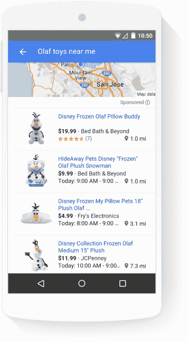

# 谷歌购物进行移动改造，重点关注本地商务 

> 原文：<https://web.archive.org/web/https://techcrunch.com/2015/11/19/google-shopping-gets-a-mobile-makeover-with-a-focus-on-local-commerce/>

随着假日购物季开始全面展开，谷歌今天上午宣布了其购物垂直领域的全新设计，即谷歌购物搜索引擎。谷歌表示，这是该服务迄今为止最大的移动重新设计，它提供了各种新元素，旨在帮助消费者更好地发现和定位他们感兴趣的产品。这也包括更容易地查看附近商店的商品供应情况。

根据谷歌的说法，重新设计是由该公司在购物相关搜索方面的转变引起的——也就是说，从今年秋天开始，更多的购物相关搜索发生在移动设备上，而不是台式电脑上。

为了更好地解决当今消费者的购物方式——在智能手机上进行更短的购物，[而不是更长的黑色星期五周末马拉松](https://web.archive.org/web/20221208195902/http://adwords.blogspot.com/2015/10/2015-holiday-trends-shopping-moments.html)——谷歌更新了其购物移动体验，使其更像一个移动应用程序，让你可以点击和滑动来浏览其众多页面。

首先，谷歌购物现在将帮助购物者在输入宽泛的搜索词时缩小搜索范围，因为如今 40%的购物搜索都涉及到这个词。类似于 Google Images 将向您显示与给定搜索词相关的子类别，以便您可以更好地找到合适的照片，Google Shopping 现在将通过向消费者显示与他们的搜索查询相关的最常搜索的类别来做类似的事情。

例如，如果你输入“机器人”，谷歌购物将返回“收藏品”或“玩偶、玩具组和玩具”等选项，作为你可以进一步探索的子类别。

此外，谷歌表示，当你搜索某个项目时，比如“儿童三轮车”，谷歌购物现在可以让你根据人们通常购买的属性来过滤列表，比如功能(“折叠”、“横卧”)、品牌和价格。

对于消费者来说，这种体验是缩小搜索范围的一种更好的方式，但对于商家来说，这意味着那些点击进入他们网站的人更有可能以他们想要的价格找到他们想要的商品，因为他们已经进行了比较购物。

这种比较购物也是由另一个增加的功能实现的，它可以让你浏览缩小范围的选项，而不必加载新的页面来查看更多的产品信息。

相反，购物者可以点击产品，浏览图片，浏览评论，阅读产品描述，而不必访问零售商的网站。然后，他们可以滑动鼠标查看列表中的下一个产品，或者在使用谷歌购物的同时，通过阅读规格或观看视频进行更深入的研究。

当购物者准备购买时，他们可以点击在线商店或在当地找到产品。该服务还将通过应用“附近可用”过滤器，更好地突出显示附近哪些商店有库存产品。这样做之后，谷歌购物将切换到地图视图，显示所有最近的有该产品的商店，以及它们离你的距离。

过去，谷歌购物已经能够通过桌面和手机上的产品列表广告[向用户指出当地的供货情况，](https://web.archive.org/web/20221208195902/http://adwords.blogspot.com/2015/10/2015-holiday-trends-shopping-moments.html)，后来它将这一供货功能[集成到了 Google Now](https://web.archive.org/web/20221208195902/https://plus.google.com/u/0/+google/posts/gqipsEeLcvg) 。但谷歌表示，现在查看当地零售商库存的选项已经浮出水面。这一变化发生在谷歌看到购物者使用智能手机作为当地商店的指南的时候，这就是为什么它想利用这一行为——自 2011 年以来，带有“附近”一词的移动搜索增加了 34 倍，该公司在相关的商户指南中指出。

新的谷歌购物体验正在移动网络上推出。