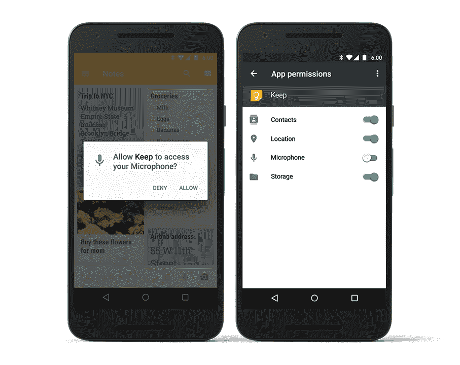
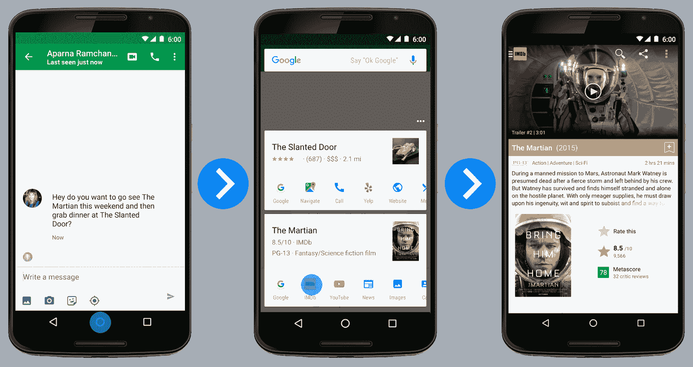

# 谷歌开始向 Nexus 设备推出安卓棉花糖 

> 原文：<https://web.archive.org/web/http://techcrunch.com/2015/10/05/google-starts-rolling-out-android-marshmallow-to-nexus-devices/>

# 谷歌开始向 Nexus 设备推出安卓棉花糖

上周，谷歌[承诺](https://web.archive.org/web/20230128091300/https://techcrunch.com/2015/09/29/googles-android-marshmallow-will-officially-launch-next-week/)将在本周某个时候向 Nexus 设备发布其移动操作系统的最新版本 Android 6.0 棉花糖。正如[公司今天早上宣布的](https://web.archive.org/web/20230128091300/http://officialandroid.blogspot.com/)，推出工作正在进行中，所以如果你拥有一台 Nexus 5、Nexus 6、Nexus 9、Nexus 7 (2013)或一台 Nexus 播放器，你可以期待在不久的将来看到你的更新通知。

谷歌新的 [Nexus 5X 和 6P 手机](https://web.archive.org/web/20230128091300/https://techcrunch.com/2015/09/29/hands-on-with-googles-new-nexus-5x-and-6p-phones/)将预装安卓棉花糖。虽然新手机将于本月开始发货，但具体时间仍不清楚。

在很大程度上，Android 6.0 没有任何革命性的新功能，但该公司还是做了一些有用的更新。内置指纹扫描仪支持将主要是那些预购新 Nexus 手机的人感兴趣的，但待机时间的改善和简化的权限模型可能会使手机和平板电脑的日常使用更容易。

Marshmallow 的标志性功能可能是“ [Google Now on Tap](https://web.archive.org/web/20230128091300/http://insidesearch.blogspot.com/2015/10/got-nexus-phone-look-out-for-now-on-tap.html) ”，它可以通过点击并按住 home 键来提供关于屏幕上任何内容的附加信息。这项功能在日常使用中有多大用处还有待观察，但它肯定会成为谷歌机器学习智能的一个令人印象深刻的演示。

