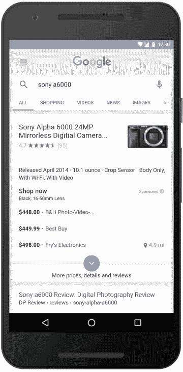

# 谷歌开始在野外测试即时应用

> 原文：<https://web.archive.org/web/https://techcrunch.com/2017/01/23/google-starts-testing-instant-apps-in-the-wild/>

# 谷歌开始在野外测试即时应用

去年谷歌 I/O 开发者大会上最大的惊喜之一是安卓即时应用的发布。这些新型应用旨在帮助填补网络应用和本地应用之间的空白。这里的想法是将本地应用程序分成非常小的数据包，因为它们非常小，所以当您点击一个网址时，几乎可以立即运行，而不必去应用商店。

现在，在该公司首次发布该功能半年多后，第一批即时应用[已经准备好进行有限测试](https://web.archive.org/web/20221208194932/https://android-developers.googleblog.com/2017/01/android-instant-apps-starts-initial.html)。

 谷歌表示，在过去几个月里，它一直在与少数开发者合作测试用户和开发者体验。结果是一个有限的测试，包括来自 BuzzFeed、Wish、潜望镜和 Viki 的应用程序。

“即时应用实际上是重新思考应用的发展方向，”谷歌负责安卓工程的副总裁戴夫·伯克在公司去年宣布即时应用时告诉我。“网页是短暂的。它们会出现，你会使用它们，永远不再去想它们。”另一方面，安装应用程序会带来很多摩擦，用户通常只想执行一个动作或获取一条特定信息(比如，在一个你不常去的城市用应用程序支付停车费)。理想情况下，即时应用程序可以给你一个轻量级网页的速度，同时具备本地应用程序的所有优点。

不过，对开发人员来说，支持即时应用并不像在网站上添加 AMP 支持那么简单。他们首先必须模块化他们的应用程序，以便较小的包可以尽可能快地运行(并且不能访问完整的应用程序)。在未来几个月内，将会有完整的 SDK 在 Android 上启用即时应用程序，但是那些想为发布做好准备的开发者应该看看谷歌推荐的为发布做准备的应用程序。

遗憾的是，关于如何实际试用即时应用的细节仍然很少。我们已经向 Google 询问了更多的细节(也许还有一些要测试的 URL ),一旦我们了解到更多，我们会更新这篇文章。

[https://web.archive.org/web/20221208194932if_/https://www.youtube.com/embed/9oaaecd7NpI?feature=oembed](https://web.archive.org/web/20221208194932if_/https://www.youtube.com/embed/9oaaecd7NpI?feature=oembed)

视频