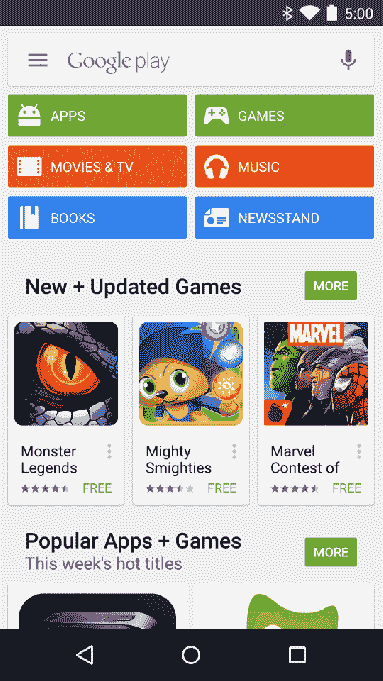

# 谷歌开始在谷歌 Play 商店测试移动应用广告

> 原文：<https://web.archive.org/web/https://techcrunch.com/2015/02/26/google-starts-testing-mobile-app-ads-in-the-google-play-store/>

谷歌今天上午宣布推出一项试点计划，该计划将允许移动应用程序开发者直接在 Google Play 商店中为他们的应用程序做广告。这些广告最初将提供给已经在 Google.com 上运行搜索广告的广告商，也将只在 Google Play 搜索结果中显示。也就是说，它们不会随机出现在 Google Play 的其他部分，比如分类页面或 Google Play 排行榜的中间。

相反，广告商将能够对匹配特定搜索查询的广告进行竞价，例如“酒店应用”或“优惠券应用”。

他们的移动应用程序将出现在 Google Play 商店返回的排名搜索结果的顶部，在那里它看起来与任何其他结果完全一样，只是它将通过应用程序名称下的小“广告”按钮被标记为广告。

正如该公司在今天早上的一篇博客文章中解释的那样，其每月超过 1000 亿次的 Google.com 搜索改善了用户和广告商的内容发现，现在 Google Play 上的搜索广告也将为应用出版商提供同样的服务。

具体来说，该计划将更好地让新来者和较小的开发者有机会在应用商店中竞争并获得知名度，谷歌表示，目前应用商店超过 100 万个。

## 搜索广告客户是最先测试的

关于这个项目的具体细节，目前提供的信息很少，因为它现在才进入试点测试。目前，广告将只在 Android 智能手机上的最新版本的 Play Store 移动应用程序中运行，而不是在平板电脑、移动或桌面网络上运行。最初只有一小部分消费者会真正看到新广告。

我们知道，潜在的广告客户会被自动识别并通过电子邮件邀请参与该计划，而那些选择这样做的人目前实际上并没有为他们的广告付费。相反，试行期是为了让应用发行商和用户有时间测试和提供对一些事情的反馈，包括广告的组合，关键词如何定位，搜索结果中显示多少广告，以及这些 Google Play 广告活动将在多大程度上影响未来的排行榜算法等。

后一项需要特别注意，因为购买应用商店广告的应用制造商可以非常容易地提高他们的下载量，否则他们的应用就会登上商店排行榜的榜首。但这并不一定意味着他们的应用程序越来越受用户欢迎，而是他们为曝光率和点击量付费。观察谷歌如何解决新商店中的点击欺诈也将是有趣的，因为竞争对手可能会试图吃掉对方的广告预算。

我们也明白，目前广告商或用户没有办法选择参加这些试验。谷歌没有透露该项目将进行多长时间的试点测试，也没有给出公开测试或公开发布的更广泛的时间表。它也不会确认最初的试点中有多少广告客户。

此外，除了作为选择广告客户进行试验的手段，目前 Google.com 和 Google Play 上的搜索广告之间没有联系。然而，尚不清楚未来当 Google Play 广告计划向更多参与者开放时，当前的搜索广告客户是否会优先加入该计划。

## 谷歌在移动应用时代的角色

鉴于其核心业务的性质，谷歌先于竞争对手苹果将移动应用广告引入其应用商店并不奇怪。在一个移动性日益增强的世界里，这实际上是该公司合乎逻辑的下一步。毕竟，向移动领域的转移正对谷歌的广告业务构成威胁。根据 Flurry 的[数据，2014 年，用户花在智能手机上的时间只有 14%是在网络浏览器上，低于上年的 20%。网络是谷歌广告传统出现的地方。](https://web.archive.org/web/20230303124201/http://www.flurry.com/bid/109749/Apps-Solidify-Leadership-Six-Years-into-the-Mobile-Revolution#.VO58DlPF83Y)

许多科技公司，如脸书、推特和雅虎，以及谷歌，一直在针对他们的移动用户群投放广告，提示用户[下载应用程序或重新使用他们已经安装的应用程序](https://web.archive.org/web/20230303124201/https://techcrunch.com/2014/04/22/google-to-offer-mobile-app-install-ads-in-search-and-youtube-expands-app-deep-linking-to-adwords/)。但谷歌现在将成为第一家允许应用发行商直接在其应用商店搜索结果中做广告的主要操作系统制造商。

也就是说，值得注意的是，苹果也在这一领域进行了一定程度的尝试。它已经测试了“广告”——如果你可以这么称呼它们的话——在它的 iOS 应用商店中的特定搜索词下出现的广告。过去的这些广告[推广了苹果自己的产品或功能](https://web.archive.org/web/20230303124201/https://techcrunch.com/2014/03/25/apple-improves-app-store-with-related-search-suggestions-full-rollout-to-complete-this-week/)。例如，搜索“音乐”曾经在其他结果之前显示 iTunes Radio 的搜索结果卡，而今天在 App Store 上搜索“地图”则指向苹果地图应用的编辑集合。虽然与谷歌推出的“广告”类型不同，但很明显，苹果也明白处于第一位置的价值。

现在的问题是，他们是否也愿意像谷歌一样出售那个位置的使用权。

同样令人感兴趣的是，谷歌利用今天宣布的 Google Play 广告试点向 Android 应用程序开发者提供了最新的支付信息。在去年的 I/O 大会上，谷歌表示，它已经在一年前向应用程序开发者支付了 50 亿美元。今天，据说这个数字已经攀升到 70 亿美元。虽然这仍然低于苹果最近宣布的 100 亿美元的，但它确实表明谷歌正在迅速缩小收入差距。