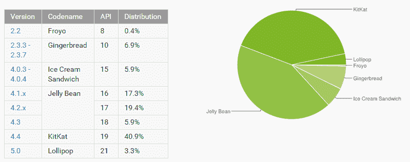

# 谷歌停止为 Android 4.0 更新 Chrome 

> 原文：<https://web.archive.org/web/http://techcrunch.com/2015/03/03/google-stops-updating-chrome-for-android-4-0/>

谷歌今天[宣布](https://web.archive.org/web/20230129230013/http://blog.chromium.org/2015/03/freezing-chrome-for-ice-cream-sandwich_3.html)Chrome 42 将是[在仍然使用](https://web.archive.org/web/20230129230013/http://www.chromium.org/Home/ice-cream-sandwich-support-deprecation-faq) [Android 4.0 冰淇淋三明治](https://web.archive.org/web/20230129230013/https://developer.android.com/about/versions/android-4.0-highlights.html) (ICS)的设备上运行的最后一个版本，该版本[于 2011 年](https://web.archive.org/web/20230129230013/https://techcrunch.com/2011/10/19/in-depth-hands-on-video-galaxy-nexus-and-ice-cream-sandwich-android-4-0/)推出。

Chrome 仍将继续在这些设备上运行，但谷歌将冻结开发，Android 4.0 用户将不会收到 Chrome 42 以外的任何更新，Chrome 42 定于 2015 年 4 月中旬发布。版本 42 在一段时间内仍会收到安全更新，但一旦 Chrome 43 在 5 月上市，这些也将结束。

Chrome 仍将继续在这些设备上运行，但谷歌将冻结开发，Android 4.0 用户将不会收到 Chrome 42 以外的任何更新，Chrome 42 计划于 2015 年 4 月中旬发布。版本 42 在一段时间内仍会收到安全更新，但一旦 Chrome 43 在 5 月上市，这些也将结束。

正如谷歌指出的，ICS 上的 Chrome 用户数量下降了 30%。虽然用户转向 ICS 需要一段时间，但谷歌的[最新数据](https://web.archive.org/web/20230129230013/https://developer.android.com/about/dashboards/index.html)显示，只有约 5.9%的 Android 用户仍在使用这一旧版本的 Android。超过 80%的人现在使用 Android 4.1 或 4.4(3.3%的人使用 5.0 Lollipop)。仍然运行姜饼(Android 2.3)的旧设备仍然占 6.9%，但 Chrome 从来没有运行过这些设备，所以它们不会受到今天声明的影响。

为了让 Chrome 在 ICS 上运行，谷歌的开发人员不得不创建变通办法，让新的网络功能在这个较旧的操作系统上运行。该公司认为，这“增加了代码的复杂性，降低了性能，并增加了开发时间。”

“ICS 设备的数量现在已经足够少了，我们可以通过逐步淘汰对早期设备的支持，专注于在更现代的设备上为绝大多数用户提供更好的 Chrome 来更好地服务我们的用户，”谷歌[写道](https://web.archive.org/web/20230129230013/http://www.chromium.org/Home/ice-cream-sandwich-support-deprecation-faq)。